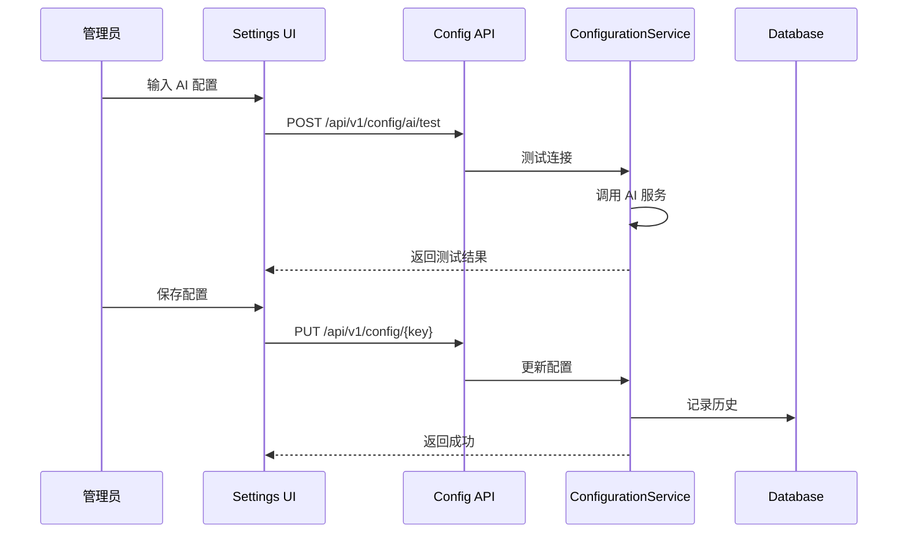
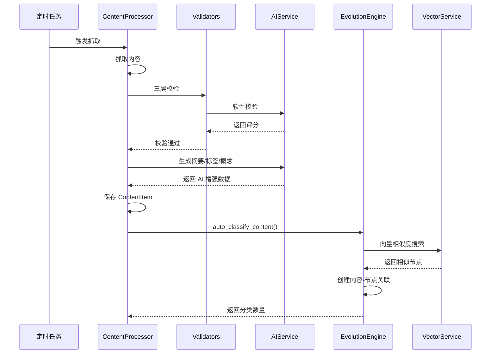
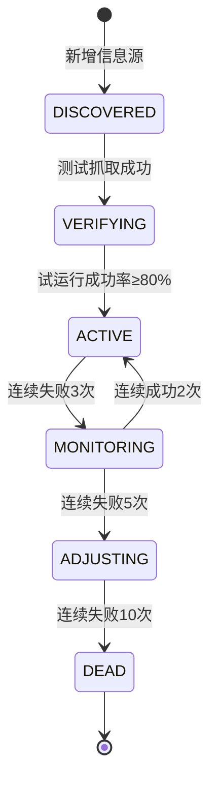

# AI 能力补全 - 设计文档

## 概述

本设计文档描述了 AI Radar 系统中 5 个关键缺失能力的技术实现方案：

1. **AI 模型配置系统（P0）** - 提供 UI 和 API 配置大模型服务参数，使 AI 功能可用
2. **内容自动分类（P1）** - 在内容处理完成后自动触发向量相似度分类
3. **批量分类 API（P1）** - 提供批量处理历史未分类内容的能力
4. **信息源生命周期管理（P2）** - 实现状态机管理信息源从发现到淘汰的完整流程
5. **快照回滚（P2）** - 实现金字塔结构的版本回滚能力

### 设计原则

- **最小侵入**：在现有架构上扩展，避免大规模重构
- **向后兼容**：AI 功能禁用时系统其他功能正常运行
- **配置驱动**：所有 AI 参数可动态配置，无需重启服务
- **渐进式增强**：优先实现核心流程，后续可扩展高级功能

## 架构

### 系统分层

```
┌─────────────────────────────────────────────────────────┐
│                    前端层 (Next.js)                      │
│  Settings Page │ Pyramid Detail Page │ Dashboard        │
└─────────────────────────────────────────────────────────┘
                            │
                            ▼
┌─────────────────────────────────────────────────────────┐
│                   API 层 (FastAPI)                       │
│  /config/* │ /evolution/* │ /pyramids/* │ /sources/*    │
└─────────────────────────────────────────────────────────┘
                            │
                            ▼
┌─────────────────────────────────────────────────────────┐
│                  服务层 (Services)                       │
│  ConfigurationService │ AIService │ ContentProcessor    │
│  EvolutionEngine │ SnapshotService │ LifecycleManager   │
└─────────────────────────────────────────────────────────┘
                            │
                            ▼
┌─────────────────────────────────────────────────────────┐
│              数据层 (SQLAlchemy + PostgreSQL)            │
│  Config │ ConfigHistory │ ContentItem │ PyramidNode     │
│  InformationSource │ Snapshot │ CrawlJob                │
└─────────────────────────────────────────────────────────┘
```

### 核心交互流程

#### 1. AI 配置流程


#### 2. 内容自动分类流程



#### 3. 信息源生命周期流程


## 组件和接口

### 1. ConfigurationService 扩展

**职责**：管理系统配置，支持 AI 相关配置项的注册、验证、脱敏和历史记录。

**现有实现**：
- 已有基础配置管理能力
- 支持配置历史记录（ConfigHistory 表）
- 支持订阅者模式通知配置变更

**新增功能**：

```python
class ConfigurationService:
    def _get_defaults(self) -> Dict[str, Any]:
        # 新增 AI 配置项
        return {
            # ... 现有配置 ...
            "ai.api_key": "",
            "ai.base_url": "https://api.siliconflow.cn/v1",
            "ai.model": "deepseek-ai/DeepSeek-V3",
            "ai.temperature": 0.3,
            "ai.max_retries": 3,
            "ai.enabled": False,
        }
    
    def _validate(self, key: str, value: Any):
        # 新增 AI 配置验证
        if key == "ai.base_url":
            # 验证 URL 格式
            pass
        elif key == "ai.temperature":
            # 验证范围 0.0-2.0
            pass
        elif key == "ai.max_retries":
            # 验证正整数
            pass
    
    def get_masked(self, key: str) -> Any:
        """获取脱敏后的配置值"""
        value = self.get(key)
        if key == "ai.api_key" and isinstance(value, str) and len(value) > 8:
            return value[:4] + "***" + value[-4:]
        return value
    
    async def set(self, key: str, value: Any, user_id: str = "system"):
        """设置配置，支持 API Key 脱敏跳过"""
        if key == "ai.api_key" and "***" in str(value):
            # 跳过更新，保持原值
            return
        # ... 原有逻辑 ...
```

**接口**：
- `get(key: str) -> Any` - 获取配置值
- `get_masked(key: str) -> Any` - 获取脱敏后的配置值
- `set(key: str, value: Any, user_id: str)` - 设置配置值
- `get_all() -> Dict[str, Any]` - 获取所有配置
- `get_history(key: Optional[str], limit: int) -> List[ConfigHistory]` - 获取配置历史


### 2. AIService 改造

**职责**：提供 AI 能力，支持动态配置和降级处理。

**现有实现**：
- 在 `__init__` 中从环境变量读取 API Key 和 Base URL
- 硬编码模型名和温度参数
- 不支持运行时配置变更

**改造方案**：

```python
class AIService:
    def __init__(self):
        self.config_service = configuration_service
        self.prompt_manager = PromptManager()
        self._client = None
        self._initialize_client()
    
    def _initialize_client(self):
        """根据配置初始化客户端"""
        enabled = self.config_service.get("ai.enabled", False)
        if not enabled:
            self._client = None
            logger.info("AI Service disabled by configuration")
            return
        
        api_key = self.config_service.get("ai.api_key", "")
        base_url = self.config_service.get("ai.base_url", "")
        
        if not api_key:
            self._client = None
            logger.warning("AI API Key not configured")
            return
        
        self._client = AsyncOpenAI(api_key=api_key, base_url=base_url)
        logger.info("AI Service initialized")
    
    @property
    def client(self):
        """动态获取客户端，支持配置热更新"""
        # 检查配置是否变更
        enabled = self.config_service.get("ai.enabled", False)
        if not enabled:
            return None
        
        api_key = self.config_service.get("ai.api_key", "")
        if not api_key:
            return None
        
        # 如果配置变更，重新初始化
        if self._client is None:
            self._initialize_client()
        
        return self._client
    
    async def chat_completion(
        self, 
        messages: List[Dict[str, str]], 
        model: Optional[str] = None,
        temperature: Optional[float] = None,
        max_retries: Optional[int] = None
    ) -> Optional[str]:
        """发送聊天请求，参数从配置读取"""
        if not self.client:
            logger.warning("AI Service not available")
            return None
        
        # 从配置读取参数
        model = model or self.config_service.get("ai.model", "deepseek-ai/DeepSeek-V3")
        temperature = temperature or self.config_service.get("ai.temperature", 0.3)
        max_retries = max_retries or self.config_service.get("ai.max_retries", 3)
        
        # ... 原有重试逻辑 ...
```

**降级处理**：

```python
# 在各个 AI 调用点添加降级逻辑
async def validate_content_soft(self, title: str, content: str) -> Dict[str, Any]:
    if not self.client:
        return {"score": 100, "reason": "Skipped (AI disabled)"}
    # ... 原有逻辑 ...

async def generate_summary(self, title: str, content: str) -> Dict[str, Any]:
    if not self.client:
        return {"summary": "", "key_points": []}
    # ... 原有逻辑 ...
```

**接口**：
- `chat_completion(messages, model?, temperature?, max_retries?) -> Optional[str]`
- `validate_content_soft(title, content) -> Dict[str, Any]`
- `generate_summary(title, content) -> Dict[str, Any]`
- `extract_concepts(title, content) -> List[Dict[str, str]]`
- `generate_tags(title, content) -> List[str]`


### 3. AI 连通性测试服务

**职责**：测试 AI 配置是否正确可用。

**实现**：

```python
class AITestService:
    def __init__(self):
        self.config_service = configuration_service
    
    async def test_connection(self) -> Dict[str, Any]:
        """测试 AI 服务连通性"""
        import time
        
        enabled = self.config_service.get("ai.enabled", False)
        if not enabled:
            return {
                "success": False,
                "error": "AI 功能未启用",
                "message": "AI 服务连接失败"
            }
        
        api_key = self.config_service.get("ai.api_key", "")
        if not api_key:
            return {
                "success": False,
                "error": "API Key 未配置",
                "message": "AI 服务连接失败"
            }
        
        base_url = self.config_service.get("ai.base_url", "")
        model = self.config_service.get("ai.model", "")
        
        try:
            start_time = time.time()
            
            client = AsyncOpenAI(api_key=api_key, base_url=base_url)
            response = await asyncio.wait_for(
                client.chat.completions.create(
                    model=model,
                    messages=[{"role": "user", "content": "Hello"}],
                    temperature=0.1,
                    max_tokens=10
                ),
                timeout=10.0
            )
            
            latency_ms = int((time.time() - start_time) * 1000)
            
            return {
                "success": True,
                "latency_ms": latency_ms,
                "model": model,
                "message": "AI 服务连接成功"
            }
        
        except asyncio.TimeoutError:
            return {
                "success": False,
                "error": "请求超时",
                "message": "AI 服务连接失败"
            }
        except Exception as e:
            return {
                "success": False,
                "error": str(e),
                "message": "AI 服务连接失败"
            }

ai_test_service = AITestService()
```

**接口**：
- `test_connection() -> Dict[str, Any]` - 测试 AI 服务连通性


### 4. ContentProcessor 集成自动分类

**职责**：在内容处理完成后自动触发分类。

**改造方案**：

```python
class ContentProcessor:
    async def process_source(
        self, 
        source: InformationSource, 
        session: AsyncSession, 
        job: CrawlJob = None
    ) -> CrawlJob:
        # ... 现有抓取和校验逻辑 ...
        
        new_items_count = 0
        failed_count = 0
        duplicate_count = 0
        classified_count = 0  # 新增：记录分类数量
        
        for item_data in items:
            # ... 现有校验和保存逻辑 ...
            
            # 保存 ContentItem
            content = ContentItem(...)
            session.add(content)
            await session.flush()
            
            # 新增：自动分类
            try:
                evolution_engine = EvolutionEngine(session)
                linked = await evolution_engine.auto_classify_content(content)
                if linked > 0:
                    classified_count += 1
                    logger.info(f"Content {content.id} auto-classified to {linked} nodes")
            except Exception as e:
                logger.error(f"Auto-classification failed for {content.id}: {e}")
                # 不影响整体流程
            
            # ... 现有自动发现逻辑 ...
            
            new_items_count += 1
        
        # 更新 Job 记录
        job.items_new = new_items_count
        job.items_duplicate = duplicate_count
        job.items_failed = failed_count
        job.items_classified = classified_count  # 新增字段
        job.status = "COMPLETED"
        
        await session.commit()
        logger.info(
            f"Job {job.id} completed. "
            f"New: {new_items_count}, Classified: {classified_count}, "
            f"Dupe: {duplicate_count}, Failed: {failed_count}"
        )
```

**数据模型变更**：

```python
# models/crawl_job.py
class CrawlJob(Base):
    # ... 现有字段 ...
    items_classified = Column(Integer, default=0)  # 新增：自动分类数量
```

**接口**：
- `process_source(source, session, job?) -> CrawlJob` - 处理信息源（已有，扩展功能）


### 5. 批量分类服务

**职责**：批量处理历史未分类内容。

**实现**：

```python
class BatchClassificationService:
    def __init__(self, db: AsyncSession):
        self.db = db
        self._running_tasks: Set[str] = set()  # 防止重复任务
    
    async def start_batch_classification(
        self,
        pyramid_id: Optional[UUID] = None,
        limit: int = 100
    ) -> Dict[str, Any]:
        """启动批量分类任务"""
        task_key = f"batch_classify_{pyramid_id or 'all'}"
        
        if task_key in self._running_tasks:
            return {
                "status": "rejected",
                "message": "批量分类任务已在运行中",
                "total_items": 0
            }
        
        # 查询未分类内容
        from app.models.content import ContentNodeRelation
        
        linked_ids_subq = select(ContentNodeRelation.content_id).subquery()
        query = select(ContentItem).where(
            ContentItem.id.notin_(select(linked_ids_subq.c.content_id))
        )
        
        if pyramid_id:
            # 如果指定金字塔，只处理该金字塔相关的内容
            # 这里需要根据业务逻辑确定如何关联
            # 暂时简化为处理所有未分类内容
            pass
        
        query = query.limit(limit)
        result = await self.db.execute(query)
        unclassified_items = list(result.scalars().all())
        
        total = len(unclassified_items)
        
        if total == 0:
            return {
                "status": "completed",
                "message": "没有待分类的内容",
                "total_items": 0
            }
        
        # 标记任务运行中
        self._running_tasks.add(task_key)
        
        # 启动后台任务
        import asyncio
        asyncio.create_task(
            self._execute_batch_classification(
                task_key, unclassified_items, pyramid_id
            )
        )
        
        return {
            "status": "accepted",
            "message": "批量分类任务已启动",
            "total_items": total
        }
    
    async def _execute_batch_classification(
        self,
        task_key: str,
        items: List[ContentItem],
        pyramid_id: Optional[UUID]
    ):
        """执行批量分类（后台任务）"""
        try:
            success_count = 0
            failed_count = 0
            
            async with AsyncSessionLocal() as session:
                evolution_engine = EvolutionEngine(session)
                
                for item in items:
                    try:
                        linked = await evolution_engine.auto_classify_content(item)
                        if linked > 0:
                            success_count += 1
                        await session.commit()
                    except Exception as e:
                        logger.error(f"Failed to classify content {item.id}: {e}")
                        failed_count += 1
                        await session.rollback()
            
            logger.info(
                f"Batch classification completed. "
                f"Total: {len(items)}, Success: {success_count}, Failed: {failed_count}"
            )
        
        except Exception as e:
            logger.error(f"Batch classification task failed: {e}")
        
        finally:
            self._running_tasks.discard(task_key)

batch_classification_service = BatchClassificationService(None)  # 需要在路由中传入 db
```

**接口**：
- `start_batch_classification(pyramid_id?, limit?) -> Dict[str, Any]` - 启动批量分类任务


### 6. 信息源生命周期管理器

**职责**：管理信息源的状态转换和健康监测。

**实现**：

```python
class SourceLifecycleManager:
    def __init__(self, db: AsyncSession):
        self.db = db
        self.config_service = configuration_service
    
    async def verify_source(self, source_id: UUID) -> bool:
        """验证新信息源"""
        source = await self._get_source(source_id)
        if not source or source.status != "DISCOVERED":
            return False
        
        # 执行测试抓取
        try:
            from app.services.crawl_engine import crawl_engine
            items = await crawl_engine.crawl_source(source)
            
            if len(items) > 0:
                # 测试成功，进入试运行阶段
                source.status = "VERIFYING"
                source.trial_runs = 0
                source.trial_successes = 0
                await self.db.commit()
                logger.info(f"Source {source_id} verification successful, entering trial phase")
                return True
            else:
                logger.warning(f"Source {source_id} verification failed: no items")
                return False
        
        except Exception as e:
            logger.error(f"Source {source_id} verification failed: {e}")
            return False
    
    async def on_crawl_success(self, source_id: UUID):
        """抓取成功回调"""
        source = await self._get_source(source_id)
        if not source:
            return
        
        # 重置错误计数
        source.error_count = 0
        
        # 状态转换逻辑
        if source.status == "VERIFYING":
            source.trial_runs = (source.trial_runs or 0) + 1
            source.trial_successes = (source.trial_successes or 0) + 1
            
            # 试运行 3 次，成功率 >= 80% 则激活
            if source.trial_runs >= 3:
                success_rate = source.trial_successes / source.trial_runs
                if success_rate >= 0.8:
                    source.status = "ACTIVE"
                    logger.info(f"Source {source_id} activated (success rate: {success_rate:.2%})")
        
        elif source.status == "MONITORING":
            source.recovery_count = (source.recovery_count or 0) + 1
            
            # 连续成功 2 次则恢复
            if source.recovery_count >= 2:
                source.status = "ACTIVE"
                source.recovery_count = 0
                logger.info(f"Source {source_id} recovered to ACTIVE")
        
        await self.db.commit()
    
    async def on_crawl_failure(self, source_id: UUID, error: str):
        """抓取失败回调"""
        source = await self._get_source(source_id)
        if not source:
            return
        
        # 增加错误计数
        source.error_count = (source.error_count or 0) + 1
        source.recovery_count = 0  # 重置恢复计数
        
        # 状态转换逻辑
        if source.status == "ACTIVE":
            if source.error_count >= 3:
                source.status = "MONITORING"
                await self._record_state_change(
                    source, "ACTIVE", "MONITORING",
                    f"连续失败 {source.error_count} 次"
                )
                logger.warning(f"Source {source_id} moved to MONITORING")
        
        elif source.status == "MONITORING":
            if source.error_count >= 5:
                source.status = "ADJUSTING"
                await self._record_state_change(
                    source, "MONITORING", "ADJUSTING",
                    f"连续失败 {source.error_count} 次"
                )
                logger.warning(f"Source {source_id} moved to ADJUSTING")
                # TODO: 生成策略调整提案
        
        elif source.status == "ADJUSTING":
            if source.error_count >= 10:
                source.status = "DEAD"
                await self._record_state_change(
                    source, "ADJUSTING", "DEAD",
                    f"连续失败 {source.error_count} 次"
                )
                logger.error(f"Source {source_id} marked as DEAD")
        
        await self.db.commit()
    
    async def _get_source(self, source_id: UUID) -> Optional[InformationSource]:
        result = await self.db.execute(
            select(InformationSource).where(InformationSource.id == source_id)
        )
        return result.scalar_one_or_none()
    
    async def _record_state_change(
        self, 
        source: InformationSource, 
        old_status: str, 
        new_status: str, 
        reason: str
    ):
        """记录状态变更历史"""
        # TODO: 创建 SourceStateHistory 模型并记录
        logger.info(
            f"Source {source.id} state changed: {old_status} -> {new_status}. "
            f"Reason: {reason}"
        )

source_lifecycle_manager = SourceLifecycleManager(None)  # 需要在使用时传入 db
```

**数据模型变更**：

```python
# models/source.py
class InformationSource(Base):
    # ... 现有字段 ...
    status = Column(String, default="DISCOVERED")  # 已有，确保默认值
    error_count = Column(Integer, default=0)  # 新增
    trial_runs = Column(Integer, default=0)  # 新增
    trial_successes = Column(Integer, default=0)  # 新增
    recovery_count = Column(Integer, default=0)  # 新增
```

**接口**：
- `verify_source(source_id) -> bool` - 验证新信息源
- `on_crawl_success(source_id)` - 抓取成功回调
- `on_crawl_failure(source_id, error)` - 抓取失败回调


### 7. 快照回滚服务

**职责**：实现金字塔结构的快照创建和回滚。

**实现**：

```python
class SnapshotService:
    def __init__(self, db: AsyncSession):
        self.db = db
    
    async def create_snapshot(
        self, 
        pyramid_id: UUID, 
        reason: str = "Manual snapshot"
    ) -> Snapshot:
        """创建金字塔快照"""
        # 查询所有节点
        result = await self.db.execute(
            select(PyramidNode)
            .where(PyramidNode.pyramid_id == pyramid_id)
            .where(PyramidNode.is_deleted == False)
        )
        nodes = list(result.scalars().all())
        
        # 查询所有内容关联
        from app.models.content import ContentNodeRelation
        result = await self.db.execute(
            select(ContentNodeRelation)
            .join(PyramidNode, PyramidNode.id == ContentNodeRelation.node_id)
            .where(PyramidNode.pyramid_id == pyramid_id)
        )
        relations = list(result.scalars().all())
        
        # 构建快照数据
        snapshot_data = {
            "nodes": [
                {
                    "id": str(node.id),
                    "name": node.name,
                    "description": node.description,
                    "level": node.level,
                    "parent_id": str(node.parent_id) if node.parent_id else None,
                }
                for node in nodes
            ],
            "relations": [
                {
                    "node_id": str(rel.node_id),
                    "content_id": str(rel.content_id),
                    "source": rel.source,
                    "confidence": rel.confidence,
                }
                for rel in relations
            ],
            "created_at": datetime.now(timezone.utc).isoformat(),
            "reason": reason,
        }
        
        # 保存快照
        snapshot = Snapshot(
            pyramid_id=pyramid_id,
            data=snapshot_data,
            reason=reason,
            node_count=len(nodes),
        )
        self.db.add(snapshot)
        await self.db.commit()
        await self.db.refresh(snapshot)
        
        logger.info(f"Created snapshot {snapshot.id} for pyramid {pyramid_id}")
        return snapshot
    
    async def rollback(
        self, 
        pyramid_id: UUID, 
        snapshot_id: UUID
    ) -> Dict[str, Any]:
        """回滚到指定快照"""
        # 1. 获取快照
        result = await self.db.execute(
            select(Snapshot).where(Snapshot.id == snapshot_id)
        )
        snapshot = result.scalar_one_or_none()
        
        if not snapshot or snapshot.pyramid_id != pyramid_id:
            raise ValueError("Snapshot not found or pyramid mismatch")
        
        # 2. 验证快照数据
        if not self._validate_snapshot_data(snapshot.data):
            raise ValueError("Invalid snapshot data")
        
        try:
            # 3. 创建回滚前备份
            backup = await self.create_snapshot(
                pyramid_id, 
                reason=f"Backup before rollback to {snapshot_id}"
            )
            
            # 4. 软删除当前所有节点
            await self.db.execute(
                update(PyramidNode)
                .where(PyramidNode.pyramid_id == pyramid_id)
                .values(is_deleted=True)
            )
            
            # 5. 从快照重建节点
            node_id_map = {}  # 旧 ID -> 新 ID 映射
            
            for node_data in snapshot.data["nodes"]:
                old_id = UUID(node_data["id"])
                new_node = PyramidNode(
                    pyramid_id=pyramid_id,
                    name=node_data["name"],
                    description=node_data["description"],
                    level=node_data["level"],
                    parent_id=None,  # 先不设置父节点
                )
                self.db.add(new_node)
                await self.db.flush()
                node_id_map[old_id] = new_node.id
            
            # 6. 设置父子关系
            for node_data in snapshot.data["nodes"]:
                if node_data["parent_id"]:
                    old_id = UUID(node_data["id"])
                    old_parent_id = UUID(node_data["parent_id"])
                    new_id = node_id_map[old_id]
                    new_parent_id = node_id_map.get(old_parent_id)
                    
                    if new_parent_id:
                        await self.db.execute(
                            update(PyramidNode)
                            .where(PyramidNode.id == new_id)
                            .values(parent_id=new_parent_id)
                        )
            
            # 7. 恢复内容关联
            from app.models.content import ContentNodeRelation
            
            # 删除旧关联
            await self.db.execute(
                delete(ContentNodeRelation)
                .where(ContentNodeRelation.node_id.in_(
                    select(PyramidNode.id)
                    .where(PyramidNode.pyramid_id == pyramid_id)
                    .where(PyramidNode.is_deleted == True)
                ))
            )
            
            # 创建新关联
            for rel_data in snapshot.data.get("relations", []):
                old_node_id = UUID(rel_data["node_id"])
                new_node_id = node_id_map.get(old_node_id)
                
                if new_node_id:
                    relation = ContentNodeRelation(
                        node_id=new_node_id,
                        content_id=UUID(rel_data["content_id"]),
                        source=rel_data.get("source", "rollback"),
                        confidence=rel_data.get("confidence", 1.0),
                    )
                    self.db.add(relation)
            
            await self.db.commit()
            
            logger.info(
                f"Rollback completed for pyramid {pyramid_id}. "
                f"Restored {len(node_id_map)} nodes"
            )
            
            return {
                "success": True,
                "message": "回滚成功",
                "restored_nodes": len(node_id_map),
                "backup_snapshot_id": str(backup.id),
            }
        
        except Exception as e:
            await self.db.rollback()
            logger.error(f"Rollback failed: {e}")
            raise
    
    def _validate_snapshot_data(self, data: Dict[str, Any]) -> bool:
        """验证快照数据完整性"""
        if not isinstance(data, dict):
            return False
        if "nodes" not in data or not isinstance(data["nodes"], list):
            return False
        # 可以添加更多验证逻辑
        return True

snapshot_service = SnapshotService(None)  # 需要在使用时传入 db
```

**数据模型**：

```python
# models/snapshot.py
class Snapshot(Base):
    __tablename__ = "snapshots"
    
    id = Column(UUID(as_uuid=True), primary_key=True, default=uuid4)
    pyramid_id = Column(UUID(as_uuid=True), ForeignKey("pyramids.id"), nullable=False)
    data = Column(JSON, nullable=False)  # 快照数据
    reason = Column(String, nullable=False)  # 创建原因
    node_count = Column(Integer, default=0)  # 节点数量
    created_at = Column(DateTime(timezone=True), default=lambda: datetime.now(timezone.utc))
```

**接口**：
- `create_snapshot(pyramid_id, reason) -> Snapshot` - 创建快照
- `rollback(pyramid_id, snapshot_id) -> Dict[str, Any]` - 回滚到快照


## 数据模型

### 新增模型

#### Snapshot（快照）

```python
class Snapshot(Base):
    __tablename__ = "snapshots"
    
    id = Column(UUID(as_uuid=True), primary_key=True, default=uuid4)
    pyramid_id = Column(UUID(as_uuid=True), ForeignKey("pyramids.id"), nullable=False)
    data = Column(JSON, nullable=False)
    reason = Column(String, nullable=False)
    node_count = Column(Integer, default=0)
    created_at = Column(DateTime(timezone=True), default=lambda: datetime.now(timezone.utc))
    
    # 关系
    pyramid = relationship("Pyramid", back_populates="snapshots")
```

### 扩展模型

#### InformationSource（信息源）

```python
# 新增字段
error_count = Column(Integer, default=0)
trial_runs = Column(Integer, default=0)
trial_successes = Column(Integer, default=0)
recovery_count = Column(Integer, default=0)
```

#### CrawlJob（抓取任务）

```python
# 新增字段
items_classified = Column(Integer, default=0)
```

### 配置项

在 ConfigurationService 中注册的 AI 配置项：

| 配置键 | 类型 | 默认值 | 说明 |
|--------|------|--------|------|
| `ai.api_key` | String | "" | API 密钥 |
| `ai.base_url` | String | "https://api.siliconflow.cn/v1" | API 基础 URL |
| `ai.model` | String | "deepseek-ai/DeepSeek-V3" | 模型名称 |
| `ai.temperature` | Float | 0.3 | 温度参数 |
| `ai.max_retries` | Integer | 3 | 最大重试次数 |
| `ai.enabled` | Boolean | false | AI 功能总开关 |


## 正确性属性

*属性（Property）是系统在所有有效执行中都应该保持为真的特征或行为——本质上是关于系统应该做什么的形式化陈述。属性是人类可读规范和机器可验证正确性保证之间的桥梁。*

### 属性反思

在将验收标准转换为属性之前，我们需要识别并消除冗余：

**冗余分析**：
1. 属性 9.5（error_count 达到阈值触发状态转换）与属性 8.5-8.8（具体的状态转换规则）逻辑重复，8.5-8.8 已经覆盖了所有状态转换场景
2. UI 测试（4.1-4.8, 5.1-5.4, 11.1-11.7）主要是示例测试，不需要转换为通用属性
3. 配置初始化（1.1, 2.1-2.3, 8.1）是一次性行为，适合示例测试而非属性测试

**保留的核心属性**：
- 配置管理：脱敏、验证、历史记录
- AI 服务：动态配置、降级处理
- 内容分类：自动触发、错误处理
- 批量处理：查询逻辑、并发控制
- 生命周期：状态转换规则、回调处理
- 快照回滚：数据完整性、事务安全


### 配置管理属性

**Property 1: API Key 脱敏一致性**
*对于任何* 长度大于 8 的 API Key 字符串，脱敏函数应该返回"前4位 + *** + 后4位"的格式
**验证需求：1.2**

**Property 2: 脱敏值更新拒绝**
*对于任何* 包含 "***" 的配置值，更新操作应该被跳过，原值保持不变
**验证需求：1.3**

**Property 3: 配置验证规则**
*对于任何* AI 配置更新：
- `ai.base_url` 必须是有效的 URL 格式
- `ai.temperature` 必须在 [0.0, 2.0] 范围内
- `ai.max_retries` 必须是正整数
无效值应该被拒绝并抛出验证错误
**验证需求：1.4**

**Property 4: 配置变更历史记录**
*对于任何* 配置变更操作，系统应该在 ConfigHistory 表中创建一条历史记录，包含旧值、新值、变更时间和操作者
**验证需求：1.5**

### AI 服务属性

**Property 5: AI 禁用时的降级行为**
*对于任何* AI 服务调用，当 `ai.enabled` 为 false 或 `ai.api_key` 为空时：
- `chat_completion` 应返回 None
- `validate_content_soft` 应返回 `{"score": 100, "reason": "Skipped (AI disabled)"}`
- `generate_summary` 应返回 `{"summary": "", "key_points": []}`
- `extract_concepts` 应返回空列表
- `generate_tags` 应返回空列表
**验证需求：2.2, 2.4, 2.7**

**Property 6: 动态配置读取**
*对于任何* `chat_completion` 调用，如果在调用前配置发生变更，下一次调用应该使用最新的配置参数（model, temperature, max_retries）
**验证需求：2.5, 2.6**

### 内容分类属性

**Property 7: 自动分类触发**
*对于任何* 通过三层校验并成功保存的 ContentItem，ContentProcessor 应该调用 `auto_classify_content` 进行自动分类
**验证需求：6.1**

**Property 8: 分类错误隔离**
*对于任何* 内容处理流程，即使自动分类失败，也不应该导致整个抓取任务失败，错误应该被记录但不影响其他内容的处理
**验证需求：6.3**

**Property 9: 批量分类查询正确性**
*对于任何* 批量分类请求，查询应该只返回未链接到任何金字塔节点的 ContentItem
**验证需求：7.1**

**Property 10: 批量分类限制遵守**
*对于任何* 批量分类请求，如果指定了 `limit` 参数，处理的内容数量不应超过该限制
**验证需求：7.5**

**Property 11: 批量分类并发控制**
*对于任何* 批量分类请求，如果相同的任务（相同 pyramid_id）已在运行中，新请求应该被拒绝并返回 "rejected" 状态
**验证需求：7.7**


### 信息源生命周期属性

**Property 12: 试运行成功率状态转换**
*对于任何* 处于 VERIFYING 状态的信息源，当试运行次数达到 3 次时：
- 如果成功率 >= 80%，状态应转换为 ACTIVE
- 如果成功率 < 80%，状态应保持 VERIFYING 或转换为其他状态
**验证需求：8.4**

**Property 13: ACTIVE 到 MONITORING 状态转换**
*对于任何* 处于 ACTIVE 状态的信息源，当连续失败次数达到 3 次时，状态应转换为 MONITORING
**验证需求：8.5**

**Property 14: MONITORING 恢复到 ACTIVE**
*对于任何* 处于 MONITORING 状态的信息源，当连续成功次数达到 2 次时，状态应恢复为 ACTIVE
**验证需求：8.6**

**Property 15: MONITORING 到 ADJUSTING 状态转换**
*对于任何* 处于 MONITORING 状态的信息源，当连续失败次数达到 5 次时，状态应转换为 ADJUSTING
**验证需求：8.7**

**Property 16: ADJUSTING 到 DEAD 状态转换**
*对于任何* 处于 ADJUSTING 状态的信息源，当连续失败次数达到 10 次时，状态应转换为 DEAD
**验证需求：8.8**

**Property 17: 状态变更历史记录**
*对于任何* 信息源状态转换，系统应该记录状态变更历史，包含旧状态、新状态、变更时间和变更原因
**验证需求：8.9**

**Property 18: 抓取成功回调**
*对于任何* 成功完成的抓取任务，ContentProcessor 应该调用 `on_crawl_success` 回调，并且该回调应该将 error_count 重置为 0
**验证需求：9.1, 9.3**

**Property 19: 抓取失败回调**
*对于任何* 失败的抓取任务，ContentProcessor 应该调用 `on_crawl_failure` 回调，并且该回调应该增加 error_count
**验证需求：9.2, 9.4**

**Property 20: 状态转换通知**
*对于任何* 状态转换到 MONITORING 或 ADJUSTING 的信息源，系统应该发送通知给管理员
**验证需求：9.6**

### 快照回滚属性

**Property 21: 快照数据完整性**
*对于任何* 创建的快照，JSON 数据应该包含：
- 所有节点的 id, name, description, level, parent_id
- 所有内容关联关系（node_id, content_id, source, confidence）
- 创建时间和原因
**验证需求：10.1**

**Property 22: 回滚前备份创建**
*对于任何* 回滚操作，在执行回滚前应该先创建当前状态的备份快照
**验证需求：10.3**

**Property 23: 回滚节点重建**
*对于任何* 回滚操作，应该：
1. 软删除所有当前节点（is_deleted=True）
2. 从快照 JSON 重建所有节点
3. 恢复父子关系
4. 恢复内容关联关系
重建后的节点数量应该等于快照中的节点数量
**验证需求：10.4**

**Property 24: 回滚事务安全**
*对于任何* 回滚操作，如果过程中发生错误，应该回滚数据库事务，确保数据库状态保持一致（要么全部成功，要么全部失败）
**验证需求：10.6**

**Property 25: 回滚前快照验证**
*对于任何* 回滚操作，在执行前应该验证快照数据的完整性（包含 nodes 数组且格式正确），无效快照应该被拒绝
**验证需求：10.7**

**Property 26: 回滚审计日志**
*对于任何* 回滚操作（成功或失败），系统应该记录审计日志，包含操作时间、操作者、目标快照 ID 和操作结果
**验证需求：10.8**


## 错误处理

### AI 服务错误处理

1. **连接失败**：
   - 使用指数退避重试（1s, 2s, 4s）
   - 速率限制错误使用更激进的退避（1s, 3s, 9s）
   - 最大重试次数从配置读取（默认 3 次）
   - 最终失败返回 None，调用方降级处理

2. **配置错误**：
   - API Key 缺失：client 设置为 None，所有调用返回降级结果
   - Base URL 无效：初始化失败，记录错误日志
   - 模型不存在：API 调用失败，重试后返回 None

3. **超时处理**：
   - 测试连接设置 10 秒超时
   - 正常调用使用默认超时（httpx 默认）
   - 超时视为可重试错误

### 配置服务错误处理

1. **验证失败**：
   - 抛出 ValueError 异常
   - 返回清晰的错误信息（如"温度必须在 0.0-2.0 之间"）
   - 不更新配置，保持原值

2. **文件操作失败**：
   - 记录错误日志
   - 不影响内存中的配置
   - 下次保存时重试

3. **历史记录失败**：
   - 记录错误日志
   - 不影响配置更新本身
   - 确保核心功能可用

### 内容处理错误处理

1. **自动分类失败**：
   - 捕获异常并记录错误日志
   - 不影响内容保存
   - 不影响其他内容的处理
   - 继续完成抓取任务

2. **向量服务不可用**：
   - auto_classify_content 返回 0
   - 记录警告日志
   - 内容仍然保存，可后续手动分类

### 生命周期管理错误处理

1. **状态转换失败**：
   - 回滚数据库事务
   - 记录错误日志
   - 保持原状态不变

2. **回调执行失败**：
   - 捕获异常并记录
   - 不影响抓取任务本身
   - 确保抓取结果正确保存

### 快照回滚错误处理

1. **快照数据无效**：
   - 验证失败抛出 ValueError
   - 拒绝回滚操作
   - 返回清晰的错误信息

2. **回滚过程失败**：
   - 立即回滚数据库事务
   - 恢复到回滚前状态
   - 记录详细错误日志
   - 返回错误响应给前端

3. **备份创建失败**：
   - 中止回滚操作
   - 不修改当前数据
   - 返回错误信息


## 测试策略

### 双重测试方法

本系统采用单元测试和基于属性的测试（Property-Based Testing, PBT）相结合的方法：

- **单元测试**：验证具体示例、边缘情况和错误条件
- **属性测试**：验证跨所有输入的通用属性
- 两者互补，共同确保全面覆盖

### 单元测试重点

单元测试应专注于：

1. **具体示例**：
   - AI 配置初始化（验证默认值）
   - 状态机特定转换（DISCOVERED → VERIFYING）
   - UI 组件渲染（设置页面包含所有字段）

2. **边缘情况**：
   - 空 API Key 处理
   - 快照数据为空
   - 批量分类无待处理内容

3. **集成点**：
   - ContentProcessor 调用 EvolutionEngine
   - ConfigurationService 通知订阅者
   - SnapshotService 创建备份

4. **错误条件**：
   - 配置验证失败
   - AI 服务超时
   - 回滚事务失败

### 属性测试配置

**测试库选择**：
- Python 后端：使用 `hypothesis` 库
- TypeScript 前端：使用 `fast-check` 库

**测试配置**：
- 每个属性测试最少运行 100 次迭代
- 使用随机生成的输入数据
- 每个测试必须引用设计文档中的属性

**标签格式**：
```python
# Feature: ai-capabilities-completion, Property 1: API Key 脱敏一致性
@given(st.text(min_size=9))
def test_api_key_masking_consistency(api_key):
    ...
```

### 属性测试覆盖

每个正确性属性都应该有对应的属性测试：

1. **配置管理**（Property 1-4）：
   - 生成随机 API Key 测试脱敏
   - 生成随机配置值测试验证
   - 生成随机配置变更测试历史记录

2. **AI 服务**（Property 5-6）：
   - 生成随机配置状态测试降级
   - 生成随机配置变更测试动态读取

3. **内容分类**（Property 7-11）：
   - 生成随机内容测试自动分类触发
   - 生成随机错误测试错误隔离
   - 生成随机批量请求测试并发控制

4. **生命周期**（Property 12-20）：
   - 生成随机失败序列测试状态转换
   - 生成随机成功/失败测试回调行为

5. **快照回滚**（Property 21-26）：
   - 生成随机金字塔结构测试快照完整性
   - 生成随机错误场景测试事务安全

### 测试数据生成策略

**Hypothesis 策略示例**：

```python
from hypothesis import strategies as st

# API Key 生成器
api_keys = st.text(
    alphabet=st.characters(whitelist_categories=('Lu', 'Ll', 'Nd')),
    min_size=16,
    max_size=64
)

# 配置值生成器
temperatures = st.floats(min_value=-1.0, max_value=3.0)  # 包含无效值
retry_counts = st.integers(min_value=-5, max_value=20)  # 包含无效值

# 信息源状态生成器
source_statuses = st.sampled_from([
    "DISCOVERED", "VERIFYING", "ACTIVE", 
    "MONITORING", "ADJUSTING", "DEAD"
])

# 失败序列生成器
failure_sequences = st.lists(
    st.booleans(),  # True=成功, False=失败
    min_size=1,
    max_size=15
)
```

### 测试执行

**本地开发**：
```bash
# 运行所有测试
pytest

# 只运行属性测试
pytest -m property

# 运行特定功能的测试
pytest tests/test_ai_service.py

# 增加属性测试迭代次数
pytest --hypothesis-iterations=1000
```

**CI/CD 集成**：
- 每次提交运行完整测试套件
- 属性测试使用默认 100 次迭代
- 失败时保存反例用于回归测试

### 性能测试

除了功能测试，还需要验证性能要求：

1. **AI 配置更新**：< 1 秒
2. **AI 连通性测试**：< 10 秒
3. **单个内容自动分类**：< 5 秒
4. **批量分类吞吐量**：>= 2 个/秒
5. **快照创建**（1000 节点）：< 10 秒
6. **快照回滚**（1000 节点）：< 30 秒

使用 `pytest-benchmark` 进行性能测试。

