# 实施计划：AI 能力补全

## 概述

本实施计划将 AI Radar 系统的 5 个关键缺失能力分解为可执行的编码任务。实施顺序按照优先级和依赖关系组织，确保每个步骤都能在前一步的基础上构建。

## 任务依赖关系图

```mermaid
graph TD
    %% 阶段 1: AI 配置系统
    T1[1. 扩展 ConfigurationService]
    T1_1[1.1 注册 AI 配置项]
    T1_2[1.2 实现 get_masked]
    T1_3[1.3 添加脱敏值跳过逻辑]
    T1_4[1.4 添加 AI 配置验证]
    T1_5[1.5 编写属性测试]
    
    T2[2. 改造 AIService]
    T2_1[2.1 重构 __init__]
    T2_2[2.2 实现 _initialize_client]
    T2_3[2.3 实现 client 属性]
    T2_4[2.4 修改 chat_completion]
    T2_5[2.5 添加降级处理]
    T2_6[2.6 编写属性测试]
    
    T3[3. AI 连通性测试服务]
    T3_1[3.1 创建 AITestService]
    T3_2[3.2 实现 test_connection]
    T3_3[3.3 创建测试 API 端点]
    T3_4[3.4 编写单元测试]
    
    T4[4. 扩展配置 API 端点]
    T4_1[4.1 创建配置路由文件]
    T4_2[4.2 实现 GET /config]
    T4_3[4.3 实现 PUT /config/key]
    T4_4[4.4 实现 GET /config/history]
    T4_5[4.5 编写单元测试]
    
    T5[5. 检查点 - 后端 AI 配置]
    
    %% 阶段 2: 前端 AI 配置界面
    T6[6. 前端 AI 配置界面]
    T6_1[6.1 创建 Settings 页面]
    T6_2[6.2 实现 AI 配置表单]
    T6_3[6.3 实现配置加载逻辑]
    T6_4[6.4 实现测试连接功能]
    T6_5[6.5 实现配置保存功能]
    T6_6[6.6 添加提示文本和验证]
    T6_7[6.7 编写前端单元测试]
    
    T7[7. 添加设置菜单到侧边栏]
    T7_1[7.1 修改侧边栏导航组件]
    T7_2[7.2 编写前端单元测试]
    
    T8[8. 检查点 - 前端 AI 配置]
    
    %% 阶段 3: 内容自动分类
    T9[9. 扩展 CrawlJob 模型]
    T9_1[9.1 创建数据库迁移]
    T9_2[9.2 更新 CrawlJob 模型]
    T9_3[9.3 运行数据库迁移]
    
    T10[10. 集成自动分类]
    T10_1[10.1 修改 process_source]
    T10_2[10.2 更新 CrawlJob 统计]
    T10_3[10.3 编写属性测试]
    
    T11[11. 批量分类服务]
    T11_1[11.1 创建 BatchClassificationService]
    T11_2[11.2 实现 start_batch_classification]
    T11_3[11.3 实现 _execute_batch_classification]
    T11_4[11.4 创建批量分类 API 端点]
    T11_5[11.5 编写属性测试]
    
    T12[12. 检查点 - 内容自动分类]
    
    %% 阶段 4: 信息源生命周期
    T13[13. 扩展 InformationSource 模型]
    T13_1[13.1 创建数据库迁移]
    T13_2[13.2 更新 InformationSource 模型]
    T13_3[13.3 运行数据库迁移]
    
    T14[14. SourceLifecycleManager 服务]
    T14_1[14.1 创建 SourceLifecycleManager]
    T14_2[14.2 实现 verify_source]
    T14_3[14.3 实现 on_crawl_success]
    T14_4[14.4 实现 on_crawl_failure]
    T14_5[14.5 实现 _record_state_change]
    T14_6[14.6 编写属性测试]
    
    T15[15. 集成生命周期管理]
    T15_1[15.1 添加成功回调]
    T15_2[15.2 添加失败回调]
    T15_3[15.3 编写集成测试]
    
    T16[16. 检查点 - 信息源生命周期]
    
    %% 阶段 5: 快照回滚
    T17[17. 创建 Snapshot 数据模型]
    T17_1[17.1 创建 Snapshot 模型]
    T17_2[17.2 创建数据库迁移]
    T17_3[17.3 运行数据库迁移]
    
    T18[18. 实现 SnapshotService]
    T18_1[18.1 创建 SnapshotService]
    T18_2[18.2 实现 create_snapshot]
    T18_3[18.3 实现 _validate_snapshot_data]
    T18_4[18.4 实现 rollback - 第一部分]
    T18_5[18.5 实现 rollback - 第二部分]
    T18_6[18.6 实现 rollback - 第三部分]
    T18_7[18.7 编写属性测试]
    
    %% 依赖关系 - 阶段 1
    T1 --> T1_1 --> T1_2 --> T1_3 --> T1_4 --> T1_5
    T1_1 --> T2
    T2 --> T2_1 --> T2_2 --> T2_3 --> T2_4 --> T2_5 --> T2_6
    T2_2 --> T3
    T3 --> T3_1 --> T3_2 --> T3_3 --> T3_4
    T1_2 --> T4
    T1_3 --> T4
    T1_4 --> T4
    T4 --> T4_1 --> T4_2 --> T4_3 --> T4_4 --> T4_5
    T1_5 --> T5
    T2_6 --> T5
    T3_4 --> T5
    T4_5 --> T5
    
    %% 依赖关系 - 阶段 2
    T5 --> T6
    T4_2 --> T6
    T4_3 --> T6
    T3_3 --> T6
    T6 --> T6_1 --> T6_2 --> T6_3 --> T6_4 --> T6_5 --> T6_6 --> T6_7
    T6_1 --> T7
    T7 --> T7_1 --> T7_2
    T6_7 --> T8
    T7_2 --> T8
    
    %% 依赖关系 - 阶段 3
    T8 --> T9
    T9 --> T9_1 --> T9_2 --> T9_3
    T9_3 --> T10
    T10 --> T10_1 --> T10_2 --> T10_3
    T10_3 --> T11
    T11 --> T11_1 --> T11_2 --> T11_3 --> T11_4 --> T11_5
    T10_3 --> T12
    T11_5 --> T12
    
    %% 依赖关系 - 阶段 4
    T12 --> T13
    T13 --> T13_1 --> T13_2 --> T13_3
    T13_3 --> T14
    T14 --> T14_1 --> T14_2 --> T14_3 --> T14_4 --> T14_5 --> T14_6
    T14_6 --> T15
    T15 --> T15_1 --> T15_2 --> T15_3
    T15_3 --> T16
    
    %% 依赖关系 - 阶段 5
    T16 --> T17
    T17 --> T17_1 --> T17_2 --> T17_3
    T17_3 --> T18
    T18 --> T18_1 --> T18_2 --> T18_3 --> T18_4 --> T18_5 --> T18_6 --> T18_7
    
    %% 样式
    classDef checkpoint fill:#ff9999,stroke:#cc0000,stroke-width:3px
    classDef phase fill:#99ccff,stroke:#0066cc,stroke-width:2px
    classDef subtask fill:#ccffcc,stroke:#009900,stroke-width:1px
    
    class T5,T8,T12,T16 checkpoint
    class T1,T2,T3,T4,T6,T7,T9,T10,T11,T13,T14,T15,T17,T18 phase
```

### 关键依赖路径说明

**🔴 关键路径（Critical Path）：**
1. T1.1 → T1.2 → T1.3 → T1.4 → T2 → T3 → T4 → T5 → T6 → T7 → T8 → T9 → T10 → T11 → T12 → T13 → T14 → T15 → T16 → T17 → T18

**📊 阶段划分：**

- **阶段 1: AI 配置系统（任务 1-5）** - 后端配置服务扩展、AI 服务改造、连通性测试、API 端点实现
- **阶段 2: 前端界面（任务 6-8）** - Settings 页面、侧边栏菜单（依赖阶段 1 完成）
- **阶段 3: 内容自动分类（任务 9-12）** - 数据模型扩展、自动分类集成、批量分类服务
- **阶段 4: 信息源生命周期（任务 13-16）** - 生命周期字段、状态机实现、ContentProcessor 集成
- **阶段 5: 快照回滚（任务 17-18）** - Snapshot 模型、快照服务实现

**⚡ 可并行执行的任务组：**
- 同一父任务下的测试任务可以在实现完成后并行执行
- 不同阶段之间有明确的检查点，必须顺序执行

## 任务

- [x] 1. 扩展 ConfigurationService 支持 AI 配置
  - [x] 1.1 在 `_get_defaults()` 中注册 AI 配置项
    - 添加 `ai.api_key`, `ai.base_url`, `ai.model`, `ai.temperature`, `ai.max_retries`, `ai.enabled` 配置项
    - 设置合理的默认值
    - _需求：1.1_
  
  - [x] 1.2 实现 `get_masked()` 方法用于 API Key 脱敏
    - 对于长度 > 8 的字符串，返回"前4位 + *** + 后4位"格式
    - 其他配置项直接返回原值
    - _需求：1.2_
  
  - [x] 1.3 在 `set()` 方法中添加脱敏值跳过逻辑
    - 检测值中是否包含 "***"
    - 如果包含，跳过更新并直接返回
    - _需求：1.3_
  
  - [x] 1.4 在 `_validate()` 方法中添加 AI 配置验证
    - 验证 `ai.base_url` 是有效的 URL（使用 urllib.parse）
    - 验证 `ai.temperature` 在 [0.0, 2.0] 范围内
    - 验证 `ai.max_retries` 是正整数
    - _需求：1.4_
  
  - [x] 1.5 编写属性测试验证配置管理
    - **Property 1: API Key 脱敏一致性**
    - **验证需求：1.2**
    - **Property 2: 脱敏值更新拒绝**
    - **验证需求：1.3**
    - **Property 3: 配置验证规则**
    - **验证需求：1.4**
    - **Property 4: 配置变更历史记录**
    - **验证需求：1.5**

- [x] 2. 改造 AIService 支持动态配置
  - [x] 2.1 重构 `__init__` 方法使用 ConfigurationService
    - 移除从环境变量读取配置的逻辑
    - 注入 `configuration_service` 依赖
    - 调用 `_initialize_client()` 初始化客户端
    - _需求：2.1_
  
  - [x] 2.2 实现 `_initialize_client()` 方法
    - 从配置读取 `ai.enabled`
    - 如果禁用，设置 `_client = None`
    - 如果启用，从配置读取 `ai.api_key` 和 `ai.base_url`
    - 初始化 AsyncOpenAI 客户端
    - _需求：2.2, 2.3_
  
  - [x] 2.3 实现 `client` 属性支持动态配置
    - 检查 `ai.enabled` 配置
    - 检查 `ai.api_key` 是否存在
    - 如果配置变更，重新初始化客户端
    - _需求：2.6_
  
  - [x] 2.4 修改 `chat_completion()` 方法从配置读取参数
    - 添加可选参数 `model`, `temperature`, `max_retries`
    - 如果未提供，从配置读取默认值
    - 添加 AI 禁用检查，返回 None
    - _需求：2.4, 2.5_
  
  - [x] 2.5 为所有 AI 方法添加降级处理
    - `validate_content_soft`: 返回 `{"score": 100, "reason": "Skipped (AI disabled)"}`
    - `generate_summary`: 返回 `{"summary": "", "key_points": []}`
    - `extract_concepts`: 返回空列表
    - `generate_tags`: 返回空列表
    - _需求：2.7_
  
  - [x] 2.6 编写属性测试验证 AI 服务
    - **Property 5: AI 禁用时的降级行为**
    - **验证需求：2.2, 2.4, 2.7**
    - **Property 6: 动态配置读取**
    - **验证需求：2.5, 2.6**

- [~] 3. 实现 AI 连通性测试服务
  - [~] 3.1 创建 `AITestService` 类
    - 在 `backend/app/services/ai_test_service.py` 创建文件
    - 实现 `__init__` 方法注入 ConfigurationService
    - _需求：3.1_
  
  - [~] 3.2 实现 `test_connection()` 方法
    - 检查 `ai.enabled` 和 `ai.api_key`
    - 使用当前配置创建临时 AsyncOpenAI 客户端
    - 发送简单测试请求（"Hello"，max_tokens=10）
    - 设置 10 秒超时
    - 返回成功/失败响应（包含延迟、模型名、错误信息）
    - _需求：3.1, 3.2, 3.3, 3.5_
  
  - [~] 3.3 创建 AI 配置测试 API 端点
    - 在 `backend/app/routers/config.py` 添加 `POST /api/v1/config/ai/test` 路由
    - 调用 `AITestService.test_connection()`
    - 返回测试结果
    - _需求：3.1_
  
  - [~] 3.4 编写单元测试验证测试服务
    - 测试成功场景
    - 测试失败场景（无效 API Key、超时）
    - 测试禁用场景

- [~] 4. 扩展配置 API 端点
  - [~] 4.1 创建配置路由文件（如果不存在）
    - 在 `backend/app/routers/config.py` 创建路由
    - 定义 APIRouter 前缀 `/api/v1/config`
    - _需求：1.2, 1.3, 1.4_
  
  - [~] 4.2 实现 `GET /api/v1/config` 端点
    - 调用 `configuration_service.get_all()`
    - 对 `ai.api_key` 调用 `get_masked()` 进行脱敏
    - 返回所有配置项
    - _需求：1.2_
  
  - [~] 4.3 实现 `PUT /api/v1/config/{key}` 端点
    - 接收配置键和新值
    - 调用 `configuration_service.set(key, value, user_id)`
    - 处理验证错误并返回 422 状态码
    - 返回更新后的配置值
    - _需求：1.3, 1.4_
  
  - [~] 4.4 实现 `GET /api/v1/config/history` 端点
    - 支持可选的 `key` 查询参数
    - 调用 `configuration_service.get_history(key, limit)`
    - 返回配置历史记录
    - _需求：1.5_
  
  - [~] 4.5 编写单元测试验证配置 API
    - 测试获取所有配置
    - 测试 API Key 脱敏
    - 测试配置更新
    - 测试验证错误处理

- [~] 5. 检查点 - 后端 AI 配置功能
  - 确保所有测试通过
  - 手动测试配置更新和 AI 连通性测试
  - 如有问题，询问用户

- [~] 6. 实现前端 AI 配置界面
  - [~] 6.1 创建 Settings 页面组件
    - 在 `frontend/app/settings/page.tsx` 创建页面
    - 使用 Tabs 组件创建标签页布局
    - 添加"AI 模型配置"标签页
    - _需求：4.1, 4.2_
  
  - [~] 6.2 实现 AI 配置表单
    - API Key 输入框（type="password"，显示脱敏值）
    - Base URL 输入框
    - 模型名称输入框
    - 温度滑块（范围 0.0-2.0）
    - 最大重试次数输入框（范围 1-10）
    - 启用 AI 功能复选框
    - _需求：4.2_
  
  - [~] 6.3 实现配置加载逻辑
    - 调用 `GET /api/v1/config` 获取当前配置
    - 填充表单字段
    - 显示 API Key 脱敏值
    - _需求：4.2_
  
  - [~] 6.4 实现测试连接功能
    - 添加"测试连接"按钮
    - 调用 `POST /api/v1/config/ai/test`
    - 显示测试结果（成功：绿色提示 + 延迟；失败：红色提示 + 错误）
    - _需求：4.3, 4.4, 4.5_
  
  - [~] 6.5 实现配置保存功能
    - 添加"保存"按钮
    - 依次调用 `PUT /api/v1/config/{key}` 更新所有配置项
    - 显示保存成功/失败提示
    - 刷新配置数据
    - _需求：4.6, 4.7_
  
  - [~] 6.6 添加提示文本和验证
    - 在 API Key 输入框旁显示"留空则禁用 AI 功能"
    - 添加客户端验证（温度范围、重试次数范围）
    - _需求：4.8_
  
  - [~] 6.7 编写前端单元测试
    - 测试表单渲染
    - 测试配置加载
    - 测试保存流程

- [~] 7. 添加设置菜单到侧边栏
  - [~] 7.1 修改侧边栏导航组件
    - 在 `frontend/components/dashboard-layout.tsx` 或类似文件中添加设置菜单项
    - 使用 Settings 图标（lucide-react）
    - 链接到 `/settings` 路径
    - 放置在导航列表底部
    - _需求：5.1, 5.2, 5.3, 5.4_
  
  - [~] 7.2 编写前端单元测试
    - 测试设置菜单项存在
    - 测试链接正确

- [~] 8. 检查点 - 前端 AI 配置功能
  - 确保所有测试通过
  - 手动测试完整的配置流程
  - 如有问题，询问用户

- [~] 9. 扩展 CrawlJob 模型添加分类字段
  - [~] 9.1 创建数据库迁移
    - 在 `backend/alembic/versions/` 创建新迁移文件
    - 添加 `items_classified` 字段到 `crawl_jobs` 表（Integer, default=0）
    - _需求：6.4_
  
  - [~] 9.2 更新 CrawlJob 模型
    - 在 `backend/app/models/crawl_job.py` 添加 `items_classified` 字段
    - _需求：6.4_
  
  - [~] 9.3 运行数据库迁移
    - 执行 `alembic upgrade head`
    - _需求：6.4_

- [~] 10. 集成自动分类到 ContentProcessor
  - [~] 10.1 修改 `process_source()` 方法
    - 在保存 ContentItem 后，调用 `EvolutionEngine.auto_classify_content()`
    - 使用 try-except 捕获分类错误，记录日志但不影响流程
    - 统计成功分类的内容数量
    - _需求：6.1, 6.3_
  
  - [~] 10.2 更新 CrawlJob 统计信息
    - 设置 `job.items_classified` 为成功分类的数量
    - 更新日志输出格式，包含分类统计
    - _需求：6.2, 6.5_
  
  - [~] 10.3 编写属性测试验证自动分类
    - **Property 7: 自动分类触发**
    - **验证需求：6.1**
    - **Property 8: 分类错误隔离**
    - **验证需求：6.3**

- [~] 11. 实现批量分类服务
  - [~] 11.1 创建 `BatchClassificationService` 类
    - 在 `backend/app/services/batch_classification_service.py` 创建文件
    - 实现 `__init__` 方法接收 AsyncSession
    - 添加 `_running_tasks` 集合用于并发控制
    - _需求：7.1, 7.7_
  
  - [~] 11.2 实现 `start_batch_classification()` 方法
    - 检查任务是否已在运行中
    - 查询未链接到任何节点的 ContentItem
    - 支持 `pyramid_id` 和 `limit` 参数
    - 启动后台任务
    - 立即返回任务状态
    - _需求：7.1, 7.3, 7.5, 7.6, 7.7_
  
  - [~] 11.3 实现 `_execute_batch_classification()` 后台任务
    - 循环处理每个未分类内容
    - 调用 `EvolutionEngine.auto_classify_content()`
    - 统计成功和失败数量
    - 记录完成日志
    - 清理运行标记
    - _需求：7.2, 7.4_
  
  - [~] 11.4 创建批量分类 API 端点
    - 在 `backend/app/routers/evolution.py` 添加 `POST /api/v1/evolution/classify/batch` 路由
    - 接收可选的 `pyramid_id` 和 `limit` 参数
    - 调用 `BatchClassificationService.start_batch_classification()`
    - 返回任务状态
    - _需求：7.1, 7.3_
  
  - [~] 11.5 编写属性测试验证批量分类
    - **Property 9: 批量分类查询正确性**
    - **验证需求：7.1**
    - **Property 10: 批量分类限制遵守**
    - **验证需求：7.5**
    - **Property 11: 批量分类并发控制**
    - **验证需求：7.7**

- [~] 12. 检查点 - 内容自动分类功能
  - 确保所有测试通过
  - 手动触发抓取任务，验证自动分类
  - 手动调用批量分类 API，验证批量处理
  - 如有问题，询问用户

- [~] 13. 扩展 InformationSource 模型添加生命周期字段
  - [~] 13.1 创建数据库迁移
    - 在 `backend/alembic/versions/` 创建新迁移文件
    - 添加字段到 `information_sources` 表：
      - `error_count` (Integer, default=0)
      - `trial_runs` (Integer, default=0)
      - `trial_successes` (Integer, default=0)
      - `recovery_count` (Integer, default=0)
    - _需求：8.1, 8.2, 8.3, 8.4, 8.5, 8.6_
  
  - [~] 13.2 更新 InformationSource 模型
    - 在 `backend/app/models/source.py` 添加新字段
    - 确保 `status` 字段默认值为 "DISCOVERED"
    - _需求：8.1_
  
  - [~] 13.3 运行数据库迁移
    - 执行 `alembic upgrade head`

- [~] 14. 实现 SourceLifecycleManager 服务
  - [~] 14.1 创建 `SourceLifecycleManager` 类
    - 在 `backend/app/services/source_lifecycle_manager.py` 创建文件
    - 实现 `__init__` 方法接收 AsyncSession
    - 注入 ConfigurationService 依赖
    - _需求：8.2_
  
  - [~] 14.2 实现 `verify_source()` 方法
    - 检查信息源状态是否为 DISCOVERED
    - 执行测试抓取
    - 成功则更新状态为 VERIFYING，初始化试运行计数
    - _需求：8.2, 8.3_
  
  - [~] 14.3 实现 `on_crawl_success()` 方法
    - 重置 error_count 为 0
    - 处理 VERIFYING 状态：增加试运行计数，检查成功率
    - 处理 MONITORING 状态：增加恢复计数，检查是否恢复
    - _需求：8.4, 8.6, 9.1, 9.3_
  
  - [~] 14.4 实现 `on_crawl_failure()` 方法
    - 增加 error_count
    - 重置 recovery_count
    - 处理 ACTIVE → MONITORING 转换（3次失败）
    - 处理 MONITORING → ADJUSTING 转换（5次失败）
    - 处理 ADJUSTING → DEAD 转换（10次失败）
    - _需求：8.5, 8.7, 8.8, 9.2, 9.4_
  
  - [~] 14.5 实现 `_record_state_change()` 方法
    - 记录状态变更历史（可以先用日志，后续扩展为数据库表）
    - 发送通知（MONITORING 和 ADJUSTING 状态）
    - _需求：8.9, 9.6_
  
  - [~] 14.6 编写属性测试验证生命周期管理
    - **Property 12: 试运行成功率状态转换**
    - **验证需求：8.4**
    - **Property 13-16: 状态转换规则**
    - **验证需求：8.5, 8.6, 8.7, 8.8**
    - **Property 17: 状态变更历史记录**
    - **验证需求：8.9**
    - **Property 18-19: 抓取回调**
    - **验证需求：9.1, 9.2, 9.3, 9.4**
    - **Property 20: 状态转换通知**
    - **验证需求：9.6**

- [~] 15. 集成生命周期管理到 ContentProcessor
  - [~] 15.1 修改 `process_source()` 方法添加成功回调
    - 在任务成功完成后，调用 `SourceLifecycleManager.on_crawl_success(source.id)`
    - _需求：9.1_
  
  - [~] 15.2 修改 `process_source()` 方法添加失败回调
    - 在任务失败时，调用 `SourceLifecycleManager.on_crawl_failure(source.id, error)`
    - _需求：9.2_
  
  - [~] 15.3 编写集成测试验证回调
    - 测试成功抓取触发 on_crawl_success
    - 测试失败抓取触发 on_crawl_failure

- [~] 16. 检查点 - 信息源生命周期功能
  - 确保所有测试通过
  - 手动创建信息源，验证状态转换
  - 模拟连续失败，验证状态流转
  - 如有问题，询问用户

- [~] 17. 创建 Snapshot 数据模型
  - [~] 17.1 创建 Snapshot 模型
    - 在 `backend/app/models/snapshot.py` 创建文件
    - 定义字段：id, pyramid_id, data (JSON), reason, node_count, created_at
    - 添加与 Pyramid 的关系
    - _需求：10.1_
  
  - [~] 17.2 创建数据库迁移
    - 在 `backend/alembic/versions/` 创建新迁移文件
    - 创建 `snapshots` 表
    - _需求：10.1_
  
  - [~] 17.3 运行数据库迁移
    - 执行 `alembic upgrade head`

- [~] 18. 实现 SnapshotService
  - [~] 18.1 创建 `SnapshotService` 类
    - 在 `backend/app/services/snapshot_service.py` 创建文件
    - 实现 `__init__` 方法接收 AsyncSession
    - _需求：10.1_
  
  - [~] 18.2 实现 `create_snapshot()` 方法
    - 查询金字塔的所有节点（未删除）
    - 查询所有内容关联关系
    - 构建 JSON 数据结构（nodes, relations, created_at, reason）
    - 保存到 Snapshot 表
    - _需求：10.1_
  
  - [~] 18.3 实现 `_validate_snapshot_data()` 方法
    - 验证 JSON 结构完整性
    - 检查必需字段存在
    - _需求：10.7_
  
  - [~] 18.4 实现 `rollback()` 方法 - 第一部分
    - 获取并验证快照
    - 创建回滚前备份快照
    - _需求：10.2, 10.3, 10.7_
  
  - [~] 18.5 实现 `rollback()` 方法 - 第二部分
    - 软删除当前所有节点
    - 从快照重建节点（不设置父节点）
    - 建立节点 ID 映射（旧 ID → 新 ID）
    - _需求：10.4_
  
  - [~] 18.6 实现 `rollback()` 方法 - 第三部分
    - 设置父子关系
    - 删除旧的内容关联
    - 创建新的内容关联
    - 提交事务或回滚
    - 记录审计日志
    - _需求：10.4, 10.6, 10.8_
  
  - [~] 18.7 编写属性测试验证快照服务
    - **Property 21: 快照数据完整性**
    - **验证需求：10.1**
    - **Property 22: 回滚前备份创建**
    - **验证需求：10.3**
    - **Property 23: 回滚节点重建**
    - **验证需求：10.4**
    - **Property 24: 回滚事务安全**
    - **验证需求：10.6**
    - **Property 25: 回滚前快照验证**
    - **验证需求：10.7**
    - **Property 26: 回滚审计日志**
    - **验证需求：10.8**

- [ ] 19. 创建快照和回滚 API 端点
  - [ ] 19.1 添加创建快照端点
    - 在 `backend/app/routers/pyramids.py` 添加 `POST /api/v1/pyramids/{pyramid_id}/snapshots` 路由
    - 接收 `reason` 参数
    - 调用 `SnapshotService.create_snapshot()`
    - 返回创建的快照信息
    - _需求：10.1_
  
  - [ ] 19.2 添加获取快照列表端点
    - 添加 `GET /api/v1/pyramids/{pyramid_id}/snapshots` 路由
    - 查询该金字塔的所有快照
    - 按创建时间倒序排列
    - 返回快照列表
    - _需求：11.2_
  
  - [ ] 19.3 添加获取快照详情端点
    - 添加 `GET /api/v1/pyramids/{pyramid_id}/snapshots/{snapshot_id}` 路由
    - 返回快照的完整数据（包括节点结构）
    - _需求：11.3_
  
  - [ ] 19.4 添加回滚端点
    - 添加 `POST /api/v1/pyramids/{pyramid_id}/rollback/{snapshot_id}` 路由
    - 调用 `SnapshotService.rollback()`
    - 处理错误并返回适当的状态码
    - 返回回滚结果
    - _需求：10.2, 10.5, 10.6_
  
  - [ ] 19.5 编写单元测试验证快照 API
    - 测试创建快照
    - 测试获取快照列表
    - 测试回滚成功场景
    - 测试回滚失败场景

- [ ] 20. 实现前端快照历史界面
  - [ ] 20.1 在金字塔详情页添加快照标签
    - 修改金字塔详情页组件，添加"历史快照"标签页
    - _需求：11.1_
  
  - [ ] 20.2 实现快照列表组件
    - 调用 `GET /api/v1/pyramids/{pyramid_id}/snapshots` 获取快照列表
    - 显示表格：创建时间、创建原因、节点数量、操作按钮
    - _需求：11.2_
  
  - [ ] 20.3 实现快照详情对话框
    - 点击"查看详情"按钮打开对话框
    - 调用 `GET /api/v1/pyramids/{pyramid_id}/snapshots/{snapshot_id}` 获取详情
    - 显示节点结构预览
    - _需求：11.3_
  
  - [ ] 20.4 实现回滚确认对话框
    - 点击"回滚"按钮打开确认对话框
    - 显示警告信息
    - 提供确认和取消按钮
    - _需求：11.4_
  
  - [ ] 20.5 实现回滚执行逻辑
    - 确认后调用 `POST /api/v1/pyramids/{pyramid_id}/rollback/{snapshot_id}`
    - 显示加载状态
    - 成功后显示成功提示并刷新金字塔数据
    - 失败后显示错误信息
    - _需求：11.5, 11.6, 11.7_
  
  - [ ] 20.6 编写前端单元测试
    - 测试快照列表渲染
    - 测试回滚确认流程

- [ ] 21. 检查点 - 快照回滚功能
  - 确保所有测试通过
  - 手动创建快照，验证快照数据
  - 手动执行回滚，验证结构恢复
  - 如有问题，询问用户

- [ ] 22. 端到端测试和文档
  - [ ] 22.1 编写端到端测试场景 1：首次配置 AI 服务
    - 访问设置页面
    - 配置 AI 参数
    - 测试连接
    - 保存配置
    - 触发抓取验证 AI 功能
    - _需求：验收场景 1_
  
  - [ ] 22.2 编写端到端测试场景 2：内容自动分类
    - 触发抓取任务
    - 验证内容通过校验
    - 验证 AI 增强数据生成
    - 验证自动分类执行
    - 验证内容出现在金字塔节点中
    - _需求：验收场景 2_
  
  - [ ] 22.3 编写端到端测试场景 3：批量处理历史内容
    - 调用批量分类 API
    - 验证任务启动
    - 等待任务完成
    - 验证处理结果
    - 验证内容已归类
    - _需求：验收场景 3_
  
  - [ ] 22.4 编写端到端测试场景 4：信息源生命周期
    - 创建新信息源
    - 验证状态为 DISCOVERED
    - 执行验证，验证状态转换
    - 模拟失败序列，验证状态流转
    - 验证恢复流程
    - _需求：验收场景 4_
  
  - [ ] 22.5 编写端到端测试场景 5：快照回滚
    - 创建金字塔结构
    - 创建快照
    - 修改结构
    - 执行回滚
    - 验证结构恢复
    - _需求：验收场景 5_
  
  - [ ] 22.6 更新 API 文档
    - 更新 OpenAPI/Swagger 文档
    - 添加新端点的描述和示例
    - 更新配置项说明
  
  - [ ] 22.7 更新用户文档
    - 编写 AI 配置指南
    - 编写快照回滚使用说明
    - 更新系统架构文档

- [ ] 23. 最终检查点
  - 运行完整测试套件
  - 验证所有功能正常工作
  - 检查性能指标是否满足要求
  - 如有问题，询问用户

## 注意事项

- 标记为 `*` 的任务是可选的测试任务，可以跳过以加快 MVP 交付
- 每个任务都引用了具体的需求编号，便于追溯
- 检查点任务确保增量验证，及时发现问题
- 属性测试使用 `hypothesis` 库，每个测试至少运行 100 次迭代
- 所有数据库变更都通过 Alembic 迁移管理
- 前端使用 Next.js App Router 和 TypeScript
- 后端使用 FastAPI 和 SQLAlchemy 2.0 异步模式

