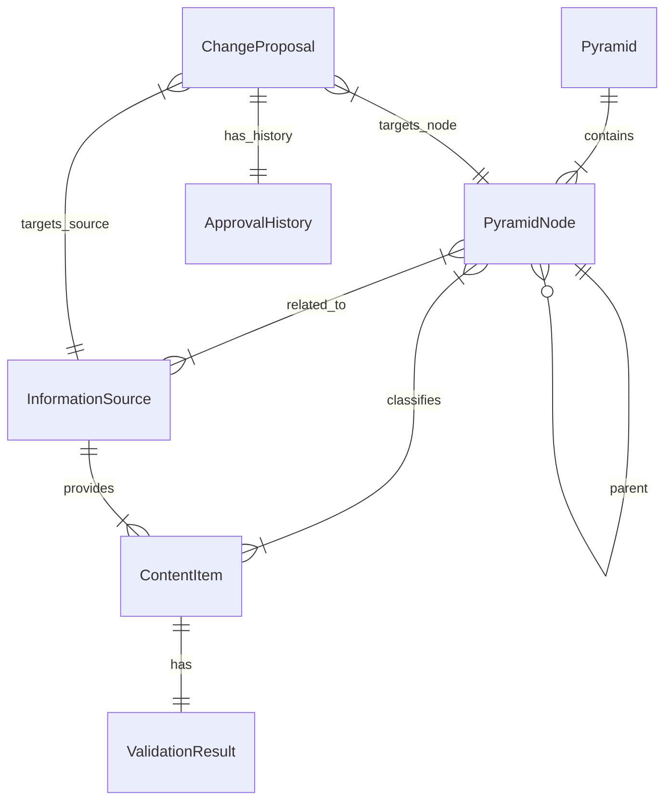

# 数据库设计

## 概述

本项目使用 **PostgreSQL** 作为主数据库，使用 **SQLAlchemy 2.0** 进行 ORM 映射。设计遵循第三范式，并针对层级查询和 JSON 存储进行了优化。

## ER 图

## 表结构定义

### 1. 知识金字塔模块

#### `pyramids` (知识金字塔)
| 字段名 | 类型 | 约束 | 说明 |
|--------|------|------|------|
| id | UUID | PK | 唯一标识 |
| name | VARCHAR(100) | NOT NULL | 金字塔名称 |
| description | TEXT | | 描述 |
| created_at | TIMESTAMP | DEFAULT NOW() | 创建时间 |
| updated_at | TIMESTAMP | DEFAULT NOW() | 更新时间 |

#### `pyramid_nodes` (金字塔节点)
| 字段名 | 类型 | 约束 | 说明 |
|--------|------|------|------|
| id | UUID | PK | 唯一标识 |
| pyramid_id | UUID | FK(pyramids) | 所属金字塔 |
| parent_id | UUID | FK(pyramid_nodes) | 父节点ID (根节点为空) |
| name | VARCHAR(100) | NOT NULL | 节点名称 |
| description | TEXT | | 描述 |
| level | INTEGER | NOT NULL | 层级深度 (0为根) |
| sort_order | INTEGER | DEFAULT 0 | 排序权重 |
| path | VARCHAR(255) | INDEX | 物化路径 (例如 /root_id/child_id/) 用于高效查询 |
| health_score | INTEGER | DEFAULT 100 | 健康度评分 |

### 2. 信息源模块

#### `information_sources` (信息源)
| 字段名 | 类型 | 约束 | 说明 |
|--------|------|------|------|
| id | UUID | PK | 唯一标识 |
| name | VARCHAR(100) | NOT NULL | 信息源名称 |
| type | VARCHAR(20) | NOT NULL | 类型: RSS, API, WEB, USER |
| url | VARCHAR(500) | NOT NULL | 基础URL |
| config | JSONB | | 抓取配置 (选择器, API参数等) |
| status | VARCHAR(20) | DEFAULT 'DISCOVERED' | 状态: DISCOVERED, VERIFYING, ACTIVE, MONITORING, ADJUSTING, DEAD |
| health_score | INTEGER | DEFAULT 100 | 健康度评分 |
| last_crawled_at | TIMESTAMP | | 最后抓取时间 |
| check_interval | INTEGER | DEFAULT 3600 | 检查间隔(秒) |

#### `source_node_relations` (源-节点关联)
| 字段名 | 类型 | 约束 | 说明 |
|--------|------|------|------|
| source_id | UUID | FK(information_sources) | 信息源ID |
| node_id | UUID | FK(pyramid_nodes) | 节点ID |
| weight | FLOAT | DEFAULT 1.0 | 关联权重 |
| PRIMARY KEY | (source_id, node_id) | | 联合主键 |

### 3. 内容模块

#### `content_items` (内容条目)
| 字段名 | 类型 | 约束 | 说明 |
|--------|------|------|------|
| id | UUID | PK | 唯一标识 |
| source_id | UUID | FK(information_sources) | 来源信息源 |
| original_id | VARCHAR(255) | | 来源方原始ID |
| url | VARCHAR(500) | NOT NULL | 原文链接 |
| title | VARCHAR(255) | NOT NULL | 标题 |
| summary | TEXT | | AI生成的摘要 |
| content_text | TEXT | | 正文文本 (或快照路径) |
| publish_time | TIMESTAMP | | 发布时间 |
| content_hash | VARCHAR(64) | INDEX | 内容指纹 (用于去重) |
| status | VARCHAR(20) | DEFAULT 'PENDING' | 状态: PENDING, VERIFIED, REJECTED, ARCHIVED |
| tags | ARRAY[VARCHAR] | | 标签列表 |

#### `content_node_relations` (内容-节点关联)
| 字段名 | 类型 | 约束 | 说明 |
|--------|------|------|------|
| content_id | UUID | FK(content_items) | 内容ID |
| node_id | UUID | FK(pyramid_nodes) | 节点ID |
| confidence | FLOAT | | AI分类置信度 |
| is_manual | BOOLEAN | DEFAULT FALSE | 是否人工指定 |
| PRIMARY KEY | (content_id, node_id) | | 联合主键 |

#### `validation_results` (校验结果)
| 字段名 | 类型 | 约束 | 说明 |
|--------|------|------|------|
| content_id | UUID | PK, FK(content_items) | 对应内容 |
| hard_result | JSONB | | 硬性校验详情 |
| soft_result | JSONB | | 软性校验详情 (AI评估) |
| cross_result | JSONB | | 交叉验证详情 |
| overall_score | INTEGER | | 综合质量分 |
| verified_at | TIMESTAMP | DEFAULT NOW() | 校验时间 |

### 4. 进化与审批模块

#### `change_proposals` (变更提案)
| 字段名 | 类型 | 约束 | 说明 |
|--------|------|------|------|
| id | UUID | PK | 唯一标识 |
| type | VARCHAR(50) | NOT NULL | 提案类型: ADD_NODE, MERGE_NODE, ADD_SOURCE, UPDATE_STRATEGY... |
| target_id | UUID | | 目标对象ID (可能是Node或Source) |
| content | JSONB | NOT NULL | 变更详情 (新值/参数) |
| reason | TEXT | | AI生成的理由 |
| impact_analysis | JSONB | | 影响分析报告 |
| priority | INTEGER | DEFAULT 0 | 优先级 |
| status | VARCHAR(20) | DEFAULT 'PENDING' | 状态: PENDING, APPROVED, REJECTED, EXECUTED, FAILED |
| created_at | TIMESTAMP | DEFAULT NOW() | 提交时间 |

#### `approval_history` (审批历史)
| 字段名 | 类型 | 约束 | 说明 |
|--------|------|------|------|
| id | UUID | PK | 唯一标识 |
| proposal_id | UUID | FK(change_proposals) | 对应提案 |
| operator | VARCHAR(50) | | 操作者 (USER or SYSTEM) |
| action | VARCHAR(20) | | 动作: APPROVE, REJECT, MODIFY |
| comment | TEXT | | 审批意见 |
| created_at | TIMESTAMP | DEFAULT NOW() | 操作时间 |

### 5. 其他

#### `hotspots` (热点话题)
| 字段名 | 类型 | 约束 | 说明 |
|--------|------|------|------|
| id | UUID | PK | 唯一标识 |
| name | VARCHAR(100) | NOT NULL | 话题名称 |
| status | VARCHAR(20) | | 状态: EMERGING, HOT, MATURE, COOLING, ARCHIVED |
| score | FLOAT | | 热度分 |
| first_seen_at | TIMESTAMP | | 首次发现时间 |

#### `system_logs` (系统日志)
| 字段名 | 类型 | 约束 | 说明 |
|--------|------|------|------|
| id | UUID | PK | 唯一标识 |
| level | VARCHAR(10) | | INFO, WARNING, ERROR |
| module | VARCHAR(50) | | 来源模块 |
| message | TEXT | | 日志消息 |
| context | JSONB | | 上下文数据 |
| created_at | TIMESTAMP | DEFAULT NOW() | 记录时间 |

## 索引策略

1. **唯一索引**: `content_items(content_hash)` 防止重复抓取
2. **复合索引**: `pyramid_nodes(pyramid_id, level, sort_order)` 优化树形展示
3. **全文索引**: `content_items(title, summary)` (使用 pg_trgm 或 tsvector) 支持搜索
4. **状态索引**: `change_proposals(status, priority)` 优化审批队列查询
