# 实现计划：AI Radar 迭代 1 - 骨架搭建

## 概述

本任务列表描述 AI Radar 系统迭代 1 的实现步骤。目标是搭建系统骨架，包括前后端基础架构、核心数据模型、基本 UI 框架。

## 任务依赖关系图

> 说明：同一行的任务可并行执行，箭头表示串行依赖。

```mermaid
graph LR
  subgraph 阶段1: 后端基础
    T1[Task 1: 项目初始化]
    T2[Task 2: 数据模型]
    T3[Task 3: Checkpoint-模型]
  end
  subgraph 阶段2: 核心服务
    T4[Task 4: Schema定义]
    T5[Task 5: 金字塔服务]
    T6[Task 6: 节点服务]
    T7[Task 7: Checkpoint-服务]
  end
  subgraph 阶段3: 业务服务
    T8[Task 8: 信息源服务]
    T9[Task 9: 事务处理]
    T10[Task 10: API路由]
    T11[Task 11: Checkpoint-API]
  end
  subgraph 阶段4: 前端基础
    T12[Task 12: 前端初始化]
    T13[Task 13: 金字塔UI]
    T14[Task 14: 信息流UI]
    T15[Task 15: 信息源UI]
    T16[Task 16: Checkpoint-前端]
  end
  subgraph 阶段5: 交付
    T17[Task 17: 文档与脚本]
    T18[Task 18: 最终Checkpoint]
  end

  T1 --> T2
  T2 --> T3
  T3 --> T4
  T4 --> T5
  T4 --> T6
  T5 --> T7
  T6 --> T7
  T7 --> T8
  T8 --> T9
  T9 --> T10
  T10 --> T11
  T11 --> T12
  T12 --> T13
  T12 --> T14
  T12 --> T15
  T13 --> T16
  T14 --> T16
  T15 --> T16
  T16 --> T17
  T17 --> T18
```

### 依赖关系速查表

| 任务 | 前置依赖 | 可并行 |
|------|----------|--------|
| Task 1: 项目初始化 | 无 | - |
| Task 2: 数据模型 | Task 1 | - |
| Task 4: Schema定义 | Task 3 | - |
| Task 5: 金字塔服务 | Task 4 | ✅ 与 Task 6 |
| Task 6: 节点服务 | Task 4 | ✅ 与 Task 5 |
| Task 8: 信息源服务 | Task 7 | - |
| Task 9: 事务处理 | Task 8 | - |
| Task 10: API路由 | Task 9 | - |
| Task 12: 前端初始化 | Task 11 | - |
| Task 13: 金字塔UI | Task 12 | ✅ 与 Task 14, 15 |
| Task 14: 信息流UI | Task 12 | ✅ 与 Task 13, 15 |
| Task 15: 信息源UI | Task 12 | ✅ 与 Task 13, 14 |

## 任务

- [x] 1. 后端项目初始化
  - [x] 1.1 创建 FastAPI 项目结构
    - 创建 backend 目录和基础文件结构（app/, api/, models/, schemas/, services/, repositories/, db/）
    - 配置 requirements.txt（fastapi, uvicorn, sqlalchemy, alembic, pydantic, hypothesis）
    - 创建 main.py 入口文件和 config.py 配置文件
    - 确保配置项支持环境变量注入，且有明确的默认值
    - _Requirements: 31.1, 32.6_
  
  - [x] 1.2 配置数据库连接
    - 创建 db/database.py 配置 SQLAlchemy 异步引擎
    - 支持 SQLite（开发）和 PostgreSQL（生产）通过环境变量切换
    - 配置 Alembic 数据库迁移（alembic.ini 和 migrations/）
    - _Requirements: 27.1, 27.7_

- [x] 2. 核心数据模型实现
  - [x] 2.1 实现金字塔和节点模型
    - 创建 models/pyramid.py（Pyramid 模型：id, name, description, created_at, updated_at, is_deleted）
    - 创建 models/node.py（PyramidNode 模型：id, pyramid_id, parent_id, name, description, level, sort_order, created_at, updated_at, is_deleted）
    - 实现节点自引用关系（parent_id -> id）
    - 创建数据库迁移脚本
    - _Requirements: 1.1, 2.1, 27.3_
  
  - [x] 2.2 编写金字塔模型属性测试
    - **Property 1: 金字塔创建完整性** - 验证创建返回包含唯一 ID、正确名称、描述、时间戳的对象
    - **Property 5: 节点创建层级正确性** - 验证子节点层级 = 父节点层级 + 1，根节点层级 = 0
    - **Validates: Requirements 1.1, 2.1**
  
  - [x] 2.3 实现信息源和内容模型
    - 创建 models/source.py（InformationSource 模型：id, name, source_type, config, status, health_score, created_at, updated_at, last_crawled_at, is_deleted）
    - 创建 models/content.py（ContentItem 模型：id, source_id, title, url, summary, raw_content, tags, quality_score, validation_status, published_at, created_at, updated_at, is_deleted）
    - 创建 models/source_node_mapping.py（source_id, node_id, weight, created_at）
    - 创建 models/content_node_mapping.py（content_id, node_id, confidence, is_primary, created_at）
    - 创建数据库迁移脚本
    - _Requirements: 4.1, 33.1_
  
  - [x] 2.4 编写信息源模型属性测试
    - **Property 11: 信息源创建完整性** - 验证创建返回包含唯一 ID、正确类型、配置的对象，初始状态为 "discovered"
    - **Validates: Requirements 4.1**

- [x] 3. Checkpoint - 确保数据模型测试通过
  - 运行所有测试，确保数据模型正确
  - 如有问题请询问用户

- [x] 4. API Schema 定义
  - [x] 4.1 创建金字塔和节点 Schema
    - 创建 schemas/pyramid.py（PyramidCreate, PyramidUpdate, PyramidResponse, PyramidDetailResponse）
    - 创建 schemas/node.py（NodeCreate, NodeUpdate, NodeMove, NodeResponse）
    - 实现嵌套响应模型（PyramidDetailResponse 包含 nodes 列表）
    - _Requirements: 31.2, 31.3, 31.4_
  
  - [x] 4.2 创建信息源和内容 Schema
    - 创建 schemas/source.py（SourceCreate, SourceUpdate, SourceResponse）
    - 创建 schemas/content.py（ContentResponse）
    - 创建 schemas/common.py（ErrorResponse 统一错误响应格式）
    - _Requirements: 31.2, 31.3, 31.4_

- [x] 5. 金字塔服务层实现
  - [x] 5.1 实现 PyramidService 核心方法
    - 创建 services/pyramid_service.py
    - 实现 create_pyramid（创建金字塔，支持模板参数）
    - 实现 get_pyramid（获取单个金字塔详情）
    - 实现 list_pyramids（获取所有金字塔列表，包含健康度摘要）
    - 实现 update_pyramid（更新名称和描述）
    - 实现 delete_pyramid（软删除金字塔及所有节点）
    - _Requirements: 1.1, 1.2, 1.3, 1.4, 1.5_
  
  - [x] 5.2 编写金字塔服务属性测试
    - **Property 2: 金字塔更新一致性** - 验证更新后查询返回更新值，其他字段不变
    - **Property 3: 金字塔删除级联** - 验证删除后金字塔及所有节点标记为已删除
    - **Property 4: 金字塔列表完整性** - 验证列表返回所有非删除金字塔
    - **Validates: Requirements 1.2, 1.3, 1.4**
  
  - [x] 5.3 实现金字塔可视化和健康度方法
    - 实现 get_pyramid_visualization 方法（返回节点位置、层级、连接关系的可渲染数据）
    - 实现 calculate_health_score 方法（评估深度平衡性，返回 0-100 评分）
    - _Requirements: 3.1, 3.3_
  
  - [x] 5.4 编写可视化和健康度属性测试
    - **Property 9: 可视化数据完整性** - 验证返回所有非删除节点，包含位置、层级、连接信息
    - **Property 10: 健康度评分范围** - 验证评分在 0-100 范围内
    - **Validates: Requirements 3.1, 3.3**
  
  - [x] 5.5 实现金字塔模板功能
    - 创建 services/template_service.py
    - 定义预设模板数据（AI 开发工具链、Agent 生态、Prompt 工程、模型应用能力、热点追踪）
    - 实现 create_from_template 方法（基于模板创建完整节点结构）
    - _Requirements: 1.6, 38.1, 38.2_
  
  - [x] 5.6 编写模板功能属性测试
    - **Property 16: 模板创建结构一致性** - 验证创建的金字塔包含模板定义的所有节点，层级结构一致
    - **Validates: Requirements 38.2**

- [x] 6. 节点服务层实现
  - [x] 6.1 实现 NodeService 核心方法
    - 创建 services/node_service.py
    - 实现 create_node（在指定父节点下创建节点，自动计算层级）
    - 实现 get_node（获取节点详情，包含子节点列表、内容数量、信息源列表）
    - 实现 get_node_tree（使用递归查询获取完整节点树）
    - 实现 update_node（更新名称、描述、排序权重）
    - 实现 delete_node（软删除节点及所有子节点）
    - _Requirements: 2.1, 2.2, 2.3, 2.8_
  
  - [x] 6.2 编写节点服务属性测试
    - **Property 6: 节点更新一致性** - 验证更新后查询返回更新值，层级和父节点不变
    - **Property 7: 节点删除级联** - 验证删除后节点及所有后代标记为已删除
    - **Property 15: 递归查询完整性** - 验证节点树包含所有非删除节点，层级关系正确
    - **Validates: Requirements 2.2, 2.3, 27.3**
  
  - [x] 6.3 实现节点移动功能
    - 实现 move_node 方法（移动节点到新父节点，保持子节点关系）
    - 实现层级重新计算（递归更新所有子节点层级）
    - 实现循环引用检测（防止节点移动到自己的子节点下）
    - _Requirements: 2.4_
  
  - [x] 6.4 编写节点移动属性测试
    - **Property 8: 节点移动子树保持** - 验证移动后子节点保持相对层级关系，层级值正确更新
    - **Validates: Requirements 2.4**

- [x] 7. Checkpoint - 确保服务层测试通过
  - 运行所有测试，确保服务层逻辑正确
  - 如有问题请询问用户

- [x] 8. 信息源服务层实现
  - [x] 8.1 实现 SourceService 核心方法
    - 创建 services/source_service.py
    - 实现 create_source（创建信息源，初始状态为 discovered）
    - 实现 get_source（获取信息源详情，包含关联节点列表）
    - 实现 list_sources（获取信息源列表，支持按状态筛选）
    - 实现 update_source（更新配置参数）
    - 实现 delete_source（软删除信息源，保留已抓取内容但标记来源已删除）
    - _Requirements: 4.1, 4.4, 4.5, 4.6_
  
  - [x] 8.2 编写信息源服务属性测试
    - **Property 12: 信息源更新一致性** - 验证更新后查询返回更新的配置值
    - **Property 13: 信息源删除内容保留** - 验证删除后关联内容保留，来源标记更新
    - **Validates: Requirements 4.4, 4.5**
  
  - [x] 8.3 实现信息源节点关联功能
    - 实现 link_source_to_nodes 方法（建立信息源与节点的映射关系）
    - 实现 unlink_source_from_node 方法（移除映射关系）
    - 实现 get_source_nodes 方法（获取信息源关联的所有节点）
    - 实现 get_node_sources 方法（获取节点关联的所有信息源）
    - _Requirements: 33.1, 33.2, 33.3, 33.4_

- [x] 9. 数据库事务处理
  - [x] 9.1 实现事务管理
    - 创建 repositories/base.py 基础仓储类
    - 实现事务上下文管理器
    - 确保多写入操作的原子性
    - _Requirements: 27.2_
  
  - [x] 9.2 编写事务属性测试
    - **Property 14: 事务回滚一致性** - 验证任一操作失败时所有操作回滚，数据库状态不变
    - **Validates: Requirements 27.2**

- [x] 10. API 路由实现
  - [x] 10.1 实现金字塔 API 路由
    - 创建 api/pyramids.py
    - POST /api/pyramids - 创建金字塔
    - GET /api/pyramids - 获取金字塔列表
    - GET /api/pyramids/{id} - 获取金字塔详情
    - PUT /api/pyramids/{id} - 更新金字塔
    - DELETE /api/pyramids/{id} - 删除金字塔
    - GET /api/pyramids/{id}/visualization - 获取可视化数据
    - GET /api/pyramids/{id}/health - 获取健康度
    - _Requirements: 31.1_
  
  - [x] 10.2 实现节点 API 路由
    - 创建 api/nodes.py
    - POST /api/nodes - 创建节点
    - GET /api/nodes/{id} - 获取节点详情
    - PUT /api/nodes/{id} - 更新节点
    - PUT /api/nodes/{id}/move - 移动节点
    - DELETE /api/nodes/{id} - 删除节点
    - GET /api/nodes/{id}/contents - 获取节点内容列表
    - _Requirements: 31.1_
  
  - [x] 10.3 实现信息源 API 路由
    - 创建 api/sources.py
    - POST /api/sources - 创建信息源
    - GET /api/sources - 获取信息源列表（支持 status 筛选）
    - GET /api/sources/{id} - 获取信息源详情
    - PUT /api/sources/{id} - 更新信息源
    - DELETE /api/sources/{id} - 删除信息源
    - POST /api/sources/{id}/test - 测试信息源
    - _Requirements: 31.1, 4.7_
  
  - [x] 10.4 实现内容 API 路由
    - 创建 api/contents.py
    - GET /api/contents - 获取内容列表（支持 node_id, page, size, sort_by, order 参数）
    - GET /api/contents/{id} - 获取内容详情
    - _Requirements: 31.1, 27.4_
  
  - [x] 10.5 配置 CORS 和错误处理
    - 配置 CORS 中间件（允许前端跨域请求）
    - 实现统一错误处理中间件（返回 ErrorResponse 格式）
    - 实现请求参数验证
    - _Requirements: 31.4, 31.5, 31.6, 48.1_

- [x] 11. Checkpoint - 确保 API 测试通过
  - 运行 API 集成测试
  - 使用 Swagger UI（/docs）手动验证端点
  - 如有问题请询问用户

- [x] 12. 前端项目初始化
  - [x] 12.1 创建 Next.js 项目
    - 使用 create-next-app 创建项目（App Router, TypeScript）
    - 配置 Tailwind CSS
    - 安装依赖：reactflow, @tanstack/react-query
    - _Requirements: 32.6_
  
  - [x] 12.2 创建基础布局和导航
    - 创建 app/layout.tsx 主布局（顶部导航栏、侧边栏、主内容区）
    - 创建 components/ui/Navbar.tsx 顶部导航栏（Logo、导航链接）
    - 创建 components/ui/Sidebar.tsx 侧边栏（金字塔列表、快捷操作）
    - _Requirements: 22.1, 23.1_
  
  - [x] 12.3 创建 API 客户端和类型定义
    - 创建 lib/api.ts API 客户端（封装所有 API 调用）
    - 创建 lib/types.ts 类型定义（Pyramid, Node, Source, Content 等）
    - 实现错误处理（ApiError 类）
    - _Requirements: 31.1_

- [x] 13. 金字塔可视化页面
  - [x] 13.1 创建金字塔列表页面
    - 创建 app/pyramid/page.tsx
    - 创建 components/pyramid/PyramidCard.tsx（展示名称、描述、节点数、健康度）
    - 实现金字塔列表展示和创建入口
    - _Requirements: 23.1, 23.7_
  
  - [x] 13.2 创建金字塔可视化组件
    - 创建 components/pyramid/PyramidCanvas.tsx（使用 ReactFlow）
    - 创建 components/pyramid/PyramidNode.tsx（自定义节点组件，显示名称、内容数、健康度颜色）
    - 实现节点层级布局算法
    - _Requirements: 23.1, 23.8, 23.9_
  
  - [x] 13.3 创建金字塔详情页面
    - 创建 app/pyramid/[id]/page.tsx
    - 集成 PyramidCanvas 组件
    - 创建 components/pyramid/NodeDetailPanel.tsx（节点详情侧边面板）
    - _Requirements: 23.2_
  
  - [x] 13.4 实现金字塔交互功能
    - 实现节点点击高亮和详情展示
    - 实现节点展开/折叠
    - 实现画布拖拽和缩放
    - 实现健康度颜色编码（绿色 > 70, 黄色 40-70, 红色 < 40）
    - _Requirements: 23.2, 23.3, 23.4, 23.5, 23.6, 23.8_

- [x] 14. 信息流页面
  - [x] 14.1 创建信息流列表组件
    - 创建 components/feed/FeedList.tsx（支持无限滚动）
    - 创建 components/feed/FeedItem.tsx（紧凑视图：标题、摘要、来源、时间）
    - 创建 components/feed/FeedItemDetailed.tsx（详细视图：完整摘要、标签、校验状态）
    - _Requirements: 22.1, 22.2, 22.3, 22.7, 22.8_
  
  - [x] 14.2 创建首页信息流
    - 更新 app/page.tsx 为信息流首页
    - 实现内容列表加载和分页
    - 实现视图模式切换（紧凑/详细）
    - _Requirements: 22.1, 22.2, 22.3_
  
  - [x] 14.3 实现内容筛选功能
    - 实现按金字塔节点筛选
    - 实现按时间范围筛选
    - 实现验证状态标识显示
    - _Requirements: 22.5, 22.8_

- [x] 15. 信息源管理页面
  - [x] 15.1 创建信息源列表页面
    - 创建 app/sources/page.tsx
    - 创建 components/sources/SourceList.tsx
    - 创建 components/sources/SourceCard.tsx（显示名称、类型、状态、健康度、最后更新时间）
    - _Requirements: 24.1, 24.2_
  
  - [x] 15.2 创建信息源表单组件
    - 创建 components/sources/SourceForm.tsx
    - 实现 RSS 类型表单（URL、更新频率、关联节点）
    - 实现 API 类型表单（端点、认证、请求头、响应解析）
    - 实现网页爬取类型表单（URL、选择器、分页规则）
    - _Requirements: 24.4, 24.5, 4.8_
  
  - [x] 15.3 实现信息源管理功能
    - 实现添加、编辑、删除信息源
    - 实现信息源测试功能（显示测试结果预览）
    - 实现按类型、状态筛选
    - _Requirements: 24.3, 24.6, 24.7_

- [x] 16. Checkpoint - 确保前端功能正常
  - 手动测试所有页面和交互
  - 确保前后端联调正常
  - 如有问题请询问用户

- [x] 17. 最终集成与文档
  - [x] 17.1 编写 README 文档
    - 编写项目说明和功能概述
    - 编写开发环境启动指南
    - 编写 API 文档链接（指向 /docs）
    - _Requirements: 32.6_
  
  - [x] 17.2 创建开发环境启动脚本
    - 创建后端启动脚本（启动 uvicorn）
    - 创建前端启动脚本（启动 next dev）
    - 创建数据库初始化脚本（运行迁移、创建初始数据）
    - _Requirements: 32.6_
  
  - [x] 17.3 建立基础测试框架
    - 配置 pytest 和 hypothesis
    - 建立 tests/regression 目录
    - 编写首个端到端回归测试用例（如：创建金字塔->添加节点->验证结构）
    - 制定回归测试执行规范

- [x] 18. 最终 Checkpoint
  - 确保所有测试通过
  - 确保前后端联调正常
  - 确保文档完整
  - 如有问题请询问用户

## 备注

- 标记 `*` 的任务为可选任务，可跳过以加快 MVP 开发
- 每个任务都引用了具体的需求编号以便追溯
- Checkpoint 任务用于确保增量验证
- 属性测试验证通用正确性属性（使用 Hypothesis 库，每个测试至少 100 次迭代）
- 单元测试验证具体示例和边界情况
- 测试标签格式：Feature: ai-radar-iteration-1, Property N: {property_text}
