# 实现计划：AI Radar 迭代 2 - 信息抓取

## 概述

本任务列表描述 AI Radar 系统迭代 2 的实现步骤。目标是实现动态信息源管理、多类型抓取引擎和三层校验机制。

## 任务依赖关系图

> 说明：同一行的任务可并行执行，箭头表示串行依赖。

```mermaid
graph LR
  subgraph 阶段1: 数据层
    T1[Task 1: 数据模型扩展]
    T2[Task 2: Checkpoint-模型]
  end
  subgraph 阶段2: 基础服务
    T3[Task 3: AI客户端]
    T4[Task 4: 抓取器实现]
    T5[Task 5: Checkpoint-抓取]
  end
  subgraph 阶段3: 核心服务
    T6[Task 6: 校验器实现]
    T7[Task 7: 内容处理]
    T8[Task 8: Checkpoint-处理]
  end
  subgraph 阶段4: 业务逻辑
    T9[Task 9: 生命周期]
    T10[Task 10: 自动发现]
    T11[Task 11: 调度器]
    T12[Task 12: Checkpoint-调度]
  end
  subgraph 阶段5: 接口层
    T13[Task 13: API路由]
    T14[Task 14: Checkpoint-API]
  end
  subgraph 阶段6: 前端层
    T15[Task 15: 前端增强]
    T16[Task 16: 配置模板]
    T17[Task 17: Checkpoint-前端]
  end
  subgraph 阶段7: 集成
    T18[Task 18: 集成测试]
    T19[Task 19: 最终Checkpoint]
  end

  T1 --> T2
  T2 --> T3
  T2 --> T4
  T4 --> T5
  T3 --> T6
  T3 --> T7
  T5 --> T6
  T5 --> T7
  T6 --> T8
  T7 --> T8
  T8 --> T9
  T8 --> T10
  T8 --> T11
  T9 --> T12
  T10 --> T12
  T11 --> T12
  T12 --> T13
  T13 --> T14
  T14 --> T15
  T14 --> T16
  T15 --> T17
  T16 --> T17
  T17 --> T18
  T18 --> T19
```

### 依赖关系速查表

| 任务 | 前置依赖 | 可并行 |
|------|----------|--------|
| Task 1: 数据模型扩展 | 无 | - |
| Task 3: AI客户端 | Task 2 | ✅ 与 Task 4 |
| Task 4: 抓取器实现 | Task 2 | ✅ 与 Task 3 |
| Task 6: 校验器实现 | Task 3, Task 5 | ✅ 与 Task 7 |
| Task 7: 内容处理 | Task 3, Task 5 | ✅ 与 Task 6 |
| Task 9: 生命周期 | Task 8 | ✅ 与 Task 10, 11 |
| Task 10: 自动发现 | Task 8 | ✅ 与 Task 9, 11 |
| Task 11: 调度器 | Task 8 | ✅ 与 Task 9, 10 |
| Task 13: API路由 | Task 12 | - |
| Task 15: 前端增强 | Task 14 | ✅ 与 Task 16 |
| Task 16: 配置模板 | Task 14 | ✅ 与 Task 15 |

## 前置条件

- 迭代 1 所有任务已完成
- 数据库迁移已执行
- 前后端基础框架可运行

## 任务

- [ ] 1. 数据模型扩展
  - [ ] 1.1 创建抓取任务记录模型
    - 创建 models/crawl_job.py（CrawlJob 模型）
    - 字段：id, source_id, status, started_at, ended_at, items_fetched, items_new, items_duplicate, error_message, response_time_ms
    - 创建数据库迁移脚本
    - _Requirements: 16.1, 16.2_
  
  - [ ] 1.2 创建域名白名单模型
    - 创建 models/domain_whitelist.py（DomainWhitelist 模型）
    - 字段：id, domain, credibility, reason, created_at, is_deleted
    - 预置权威域名数据（arxiv.org, github.com, openai.com 等）
    - _Requirements: 14.1, 14.3_
  
  - [ ] 1.3 创建校验结果模型
    - 创建 models/validation_result.py（ValidationResult 模型）
    - 字段：id, content_id, hard_validation, soft_validation, cross_validation, overall_status, quality_score
    - _Requirements: 7, 8, 9_
  
  - [ ] 1.4 创建发现域名记录模型
    - 创建 models/discovered_domain.py（DiscoveredDomain 模型）
    - 字段：id, domain, occurrence_count, first_seen_at, last_seen_at, evaluation_status, has_rss, proposal_id
    - _Requirements: 13.1, 13.4_
  
  - [ ] 1.5 扩展信息源模型
    - 在 InformationSource 模型添加 lifecycle_status 字段
    - 添加 last_success_at, consecutive_failures, consecutive_successes 字段
    - 创建数据库迁移脚本
    - _Requirements: 1.1-1.8_

- [ ] 2. Checkpoint - 确保数据模型迁移成功
  - 运行数据库迁移
  - 验证表结构正确
  - 如有问题请询问用户

- [ ] 3. 硅基流动 AI 客户端
  - [ ] 3.1 实现 SiliconFlowClient 基础功能
    - 创建 services/ai/siliconflow_client.py
    - 实现 chat_completion 方法（调用 chat/completions 接口）
    - 实现指数退避重试机制（最多 3 次）
    - 支持通过环境变量配置 API Key
    - _Requirements: 15.1, 15.2, 15.3, 15.4, 15.7_
  
  - [ ] 3.2 实现 AI 功能方法
    - 实现 evaluate_content_quality 方法（内容质量评估）
    - 实现 generate_summary 方法（摘要生成）
    - 实现 classify_content 方法（内容分类）
    - _Requirements: 8.1, 10.1, 11.1_
  
  - [ ] 3.3 创建 Prompt 模板
    - 创建 services/ai/prompts.py
    - 定义 QUALITY_EVALUATION_PROMPT
    - 定义 SUMMARY_GENERATION_PROMPT
    - 定义 CONTENT_CLASSIFICATION_PROMPT
    - _Requirements: 8.1, 10.1, 11.1_
  
  - [ ]* 3.4 编写 AI 客户端属性测试
    - **Property 5: AI 调用重试机制** - 验证失败时按指数退避重试最多 3 次
    - **Validates: Requirements 15.4**

- [ ] 4. 抓取器实现
  - [ ] 4.1 创建抓取器基类
    - 创建 services/fetcher/base.py
    - 定义 FetchResult 数据类
    - 定义 BaseFetcher 抽象基类（fetch, validate_config 方法）
    - 提取配置参数（超时时间、User-Agent、重试次数）到配置文件或环境变量
    - _Requirements: 2, 3, 4_
  
  - [ ] 4.2 实现 RSS 抓取器
    - 创建 services/fetcher/rss_fetcher.py
    - 使用 feedparser 解析 RSS/Atom
    - 提取 title, link, description, pubDate, author, content 字段
    - 实现配置验证和错误处理
    - _Requirements: 2.1-2.8_
  
  - [ ] 4.3 实现 API 抓取器
    - 创建 services/fetcher/api_fetcher.py
    - 支持 GET/POST 请求
    - 支持 Bearer Token, API Key, Basic Auth 认证
    - 实现 JSONPath 数据提取
    - 实现分页处理（page/cursor/offset）
    - _Requirements: 3.1-3.8_
  
  - [ ] 4.4 实现网页抓取器
    - 创建 services/fetcher/web_fetcher.py
    - 使用 BeautifulSoup 解析 HTML
    - 支持 CSS 选择器提取内容
    - 实现请求频率限制
    - 实现 robots.txt 检查
    - _Requirements: 4.1-4.8_
  
  - [ ]* 4.5 编写抓取器单元测试
    - 使用 mock 数据测试 RSS 解析
    - 使用 mock 数据测试 API 响应解析
    - 使用 mock 数据测试网页解析

- [ ] 5. Checkpoint - 确保抓取器测试通过
  - 运行抓取器单元测试
  - 如有问题请询问用户

- [ ] 6. 校验器实现
  - [ ] 6.1 实现硬性校验器
    - 创建 services/validator/hard_validator.py
    - 实现 URL 格式验证
    - 实现域名白名单检查
    - 实现 arXiv ID 格式验证
    - 实现 GitHub 仓库路径验证
    - 实现日期合理性验证
    - _Requirements: 7.1-7.8_
  
  - [ ] 6.2 实现软性校验器
    - 创建 services/validator/soft_validator.py
    - 调用 AI 评估信息密度
    - 调用 AI 评估标题一致性
    - 调用 AI 检测广告内容
    - 计算综合质量分数
    - _Requirements: 8.1-8.8_
  
  - [ ] 6.3 实现交叉验证器
    - 创建 services/validator/cross_validator.py
    - 实现相关内容搜索
    - 调用 AI 比较内容一致性
    - 实现多源确认/冲突检测逻辑
    - _Requirements: 9.1-9.6_
  
  - [ ]* 6.4 编写校验器属性测试
    - **Property 4: 校验流水线完整性** - 验证内容必须经过硬性校验，通过后经过软性校验
    - **Validates: Requirements 7, 8**

- [ ] 7. 内容处理服务
  - [ ] 7.1 实现去重服务
    - 创建 services/processor/deduplication.py
    - 实现 URL 指纹计算
    - 实现 SimHash 内容指纹计算
    - 实现相似度比较和更新检测
    - _Requirements: 6.1-6.6_
  
  - [ ] 7.2 实现摘要生成服务
    - 创建 services/processor/summarizer.py
    - 调用 AI 生成 100-200 字摘要
    - 提取 3-5 个关键标签
    - 实现失败时的降级处理
    - _Requirements: 10.1-10.6_
  
  - [ ] 7.3 实现内容分类服务
    - 创建 services/processor/classifier.py
    - 调用 AI 推荐金字塔节点
    - 实现置信度阈值判断
    - 支持多节点关联
    - _Requirements: 11.1-11.6_
  
  - [ ]* 7.4 编写去重服务属性测试
    - **Property 3: 去重一致性** - 验证 URL 相同的内容只存在一条记录
    - **Validates: Requirements 6.1-6.4**

- [ ] 8. Checkpoint - 确保内容处理服务测试通过
  - 运行所有服务层测试
  - 如有问题请询问用户

- [ ] 9. 信息源生命周期管理
  - [ ] 9.1 实现生命周期状态机
    - 创建 services/lifecycle/source_lifecycle.py
    - 实现状态转换逻辑（discovered→verified→active→monitoring→adjusting→retired）
    - 实现状态变更记录
    - _Requirements: 1.1-1.8_
  
  - [ ] 9.2 实现健康监测服务
    - 创建 services/lifecycle/health_monitor.py
    - 实现可达性检测
    - 实现成功率计算（7 天）
    - 实现响应时间统计
    - 实现命中率计算
    - 计算综合健康度评分
    - _Requirements: 12.1-12.8_
  
  - [ ]* 9.3 编写生命周期属性测试
    - **Property 1: 信息源状态转换合法性** - 验证状态变更符合状态机定义
    - **Property 6: 健康度评分范围** - 验证评分在 0-100 范围内
    - **Validates: Requirements 1, 12**

- [ ] 10. 信息源自动发现
  - [ ] 10.1 实现域名发现服务
    - 创建 services/discovery/source_discovery.py
    - 实现外部链接提取
    - 实现域名出现次数统计
    - 实现 RSS 自动检测
    - 实现 Change_Proposal 生成
    - _Requirements: 13.1-13.6_
  
  - [ ] 10.2 实现域名白名单服务
    - 创建 services/whitelist_service.py
    - 实现域名添加/移除
    - 实现通配符匹配
    - 实现域名查询
    - _Requirements: 14.1-14.5_
  
  - [ ]* 10.3 编写白名单属性测试
    - **Property 7: 域名白名单匹配** - 验证通配符匹配正确
    - **Validates: Requirements 14.4**

- [ ] 11. 抓取调度器
  - [ ] 11.1 实现抓取调度器
    - 创建 scheduler/crawl_scheduler.py
    - 实现任务队列管理
    - 实现并发控制（默认最大 10）
    - 实现优先级排序
    - 实现下次抓取时间计算
    - _Requirements: 5.1-5.8_
  
  - [ ] 11.2 实现抓取任务记录服务
    - 创建 services/crawl_job_service.py
    - 实现任务创建和更新
    - 实现任务查询（按信息源、时间、状态）
    - 实现历史记录清理（30 天）
    - _Requirements: 16.1-16.6_
  
  - [ ]* 11.3 编写调度器属性测试
    - **Property 2: 抓取任务完整性** - 验证完成的任务记录包含所有必要字段
    - **Validates: Requirements 16.1-16.2**

- [ ] 12. Checkpoint - 确保调度器测试通过
  - 运行调度器相关测试
  - 如有问题请询问用户

- [ ] 13. API 路由实现
  - [ ] 13.1 实现抓取任务 API
    - 创建 api/crawl_jobs.py
    - GET /api/crawl-jobs - 获取任务列表
    - GET /api/crawl-jobs/{job_id} - 获取任务详情
    - POST /api/sources/{source_id}/crawl - 触发即时抓取
    - _Requirements: 5.6, 16.5_
  
  - [ ] 13.2 实现域名白名单 API
    - 创建 api/whitelist.py
    - GET /api/whitelist - 获取白名单列表
    - POST /api/whitelist - 添加域名
    - DELETE /api/whitelist/{id} - 移除域名
    - _Requirements: 14.1, 14.2, 14.5_
  
  - [ ] 13.3 实现健康监测 API
    - 更新 api/sources.py
    - GET /api/sources/{source_id}/health - 获取健康数据
    - POST /api/health/check - 触发健康检查
    - _Requirements: 12.6, 12.7_
  
  - [ ] 13.4 实现统计仪表板 API
    - 创建 api/dashboard.py
    - GET /api/dashboard/crawl-stats - 抓取统计
    - GET /api/dashboard/validation-stats - 校验统计
    - GET /api/dashboard/ai-stats - AI 调用统计
    - _Requirements: 20.1-20.6_

- [ ] 14. Checkpoint - 确保 API 测试通过
  - 运行 API 集成测试
  - 使用 Swagger UI 手动验证
  - 如有问题请询问用户

- [ ] 15. 前端界面增强
  - [ ] 15.1 增强信息源管理界面
    - 更新 components/sources/SourceCard.tsx 显示生命周期状态
    - 创建 components/sources/SourceHealthChart.tsx 健康度趋势图
    - 创建 components/sources/CrawlHistory.tsx 抓取历史列表
    - 添加即时抓取按钮
    - _Requirements: 18.1-18.6_
  
  - [ ] 15.2 增强内容列表界面
    - 更新 components/feed/FeedItem.tsx 显示校验状态标识
    - 创建 components/feed/ValidationBadge.tsx 校验状态徽章
    - 创建 components/feed/ValidationReport.tsx 校验报告详情
    - 添加按校验状态筛选
    - _Requirements: 19.1-19.6_
  
  - [ ] 15.3 创建抓取统计仪表板
    - 创建 app/dashboard/page.tsx
    - 创建 components/dashboard/CrawlStats.tsx 抓取统计卡片
    - 创建 components/dashboard/ValidationStats.tsx 校验统计卡片
    - 创建 components/dashboard/AIStats.tsx AI 调用统计卡片
    - 创建 components/dashboard/SourceStatusChart.tsx 信息源状态分布图
    - _Requirements: 20.1-20.6_
  
  - [ ] 15.4 创建域名白名单管理界面
    - 创建 app/whitelist/page.tsx
    - 创建 components/whitelist/WhitelistTable.tsx
    - 创建 components/whitelist/AddDomainForm.tsx
    - _Requirements: 14.1, 14.2_

- [ ] 16. 信息源配置模板
  - [ ] 16.1 实现配置模板服务
    - 创建 services/source_template_service.py
    - 定义 arXiv RSS 模板
    - 定义 GitHub Trending 模板
    - 定义 HuggingFace Daily Papers 模板
    - 定义通用博客 RSS 模板
    - _Requirements: 17.1-17.6_
  
  - [ ] 16.2 更新信息源表单
    - 更新 components/sources/SourceForm.tsx
    - 添加模板选择下拉框
    - 实现模板预填充功能
    - 验证配置项的前后端一致性
    - _Requirements: 17.5_

- [ ] 17. Checkpoint - 确保前端功能正常
  - 手动测试所有新增页面和组件
  - 确保前后端联调正常
  - 如有问题请询问用户

- [ ] 18. 集成测试与文档
  - [ ] 18.1 编写集成测试
    - 测试完整抓取流程（抓取→去重→校验→摘要→分类→存储）
    - 测试信息源生命周期状态转换
    - 测试健康监测流程
    - 测试信息源自动发现流程
  
  - [ ] 18.2 更新文档
    - 更新 README 添加迭代 2 功能说明
    - 添加信息源配置指南
    - 添加 AI 服务配置说明（硅基流动 API Key）
    - 添加抓取调度器配置说明
  
  - [ ] 18.3 建立回归测试机制
    - 创建 tests/regression 目录
    - 编写基础回归测试用例
    - 制定 Bug 修复与回归测试流程

- [ ] 19. 最终 Checkpoint
  - 确保所有测试通过
  - 确保前后端联调正常
  - 确保文档完整
  - 如有问题请询问用户

## 备注

- 标记 `*` 的任务为可选任务，可跳过以加快开发
- 每个任务都引用了具体的需求编号以便追溯
- Checkpoint 任务用于确保增量验证
- AI 服务测试需要配置有效的硅基流动 API Key
- 建议先使用 mock 数据测试抓取器，再进行真实抓取测试
