# 实现计划：迭代 3 - 用户输入与金字塔进化

## 概述

本实现计划将迭代 3 的设计分解为可执行的编码任务。任务按照依赖关系排序，确保每个任务都建立在前一个任务的基础上。

## 任务依赖关系图

> 说明：同一行的任务可并行执行，箭头表示串行依赖。

```mermaid
graph LR
  subgraph 阶段1: 数据层
    T1[Task 1: 数据模型扩展]
    T2[Task 2: Checkpoint-模型]
  end
  subgraph 阶段2: 输入处理
    T3[Task 3: 文件解析]
    T4[Task 4: 输入处理]
    T5[Task 5: 批量处理]
    T6[Task 6: Checkpoint-输入]
  end
  subgraph 阶段3: 概念处理
    T7[Task 7: 概念提取]
    T8[Task 8: 同义词管理]
    T9[Task 9: 概念匹配]
    T10[Task 10: Checkpoint-概念]
  end
  subgraph 阶段4: 提案管理
    T11[Task 11: 提案生成]
    T12[Task 12: 优先级计算]
    T13[Task 13: 审批队列]
    T14[Task 14: 影响分析]
    T15[Task 15: Checkpoint-提案]
  end
  subgraph 阶段5: 决策执行
    T16[Task 16: 快照管理]
    T17[Task 17: 决策执行]
    T18[Task 18: 贡献追踪]
    T19[Task 19: 通知服务]
    T20[Task 20: Checkpoint-核心]
  end
  subgraph 阶段6: 接口层
    T21[Task 21: 后端API]
    T22[Task 22: Checkpoint-API]
    T23[Task 23: 前端Client]
  end
  subgraph 阶段7: 前端界面
    T24[Task 24: 审批中心]
    T25[Task 25: 内容输入]
    T26[Task 26: 变更历史]
    T27[Task 27: 贡献记录]
    T28[Task 28: Checkpoint-界面]
  end
  subgraph 阶段8: 集成
    T29[Task 29: 集成测试]
    T30[Task 30: 最终Checkpoint]
  end

  T1 --> T2
  T2 --> T3
  T3 --> T4
  T4 --> T5
  T5 --> T6
  T6 --> T7
  T6 --> T8
  T7 --> T9
  T8 --> T9
  T9 --> T10
  T10 --> T11
  T11 --> T12
  T11 --> T13
  T11 --> T14
  T14 --> T15
  T15 --> T16
  T16 --> T17
  T17 --> T18
  T18 --> T19
  T19 --> T20
  T20 --> T21
  T21 --> T22
  T22 --> T23
  T23 --> T24
  T23 --> T25
  T23 --> T26
  T23 --> T27
  T27 --> T28
  T28 --> T29
  T29 --> T30
```

### 依赖关系速查表

| 任务 | 前置依赖 | 可并行 |
|------|----------|--------|
| Task 1: 数据模型 | 无 | - |
| Task 3: 文件解析 | Task 2 | - |
| Task 4: 输入处理 | Task 3 | - |
| Task 7: 概念提取 | Task 6 | ✅ 与 Task 8 |
| Task 8: 同义词管理 | Task 6 | ✅ 与 Task 7 |
| Task 9: 概念匹配 | Task 7, 8 | - |
| Task 11: 提案生成 | Task 10 | - |
| Task 12: 优先级 | Task 11 | ✅ 与 Task 13, 14 |
| Task 13: 审批队列 | Task 11 | ✅ 与 Task 12, 14 |
| Task 14: 影响分析 | Task 11 | ✅ 与 Task 12, 13 |
| Task 16: 快照管理 | Task 15 | - |
| Task 17: 决策执行 | Task 16 | - |
| Task 21: 后端API | Task 20 | - |
| Task 24-27: 前端 | Task 23 | ✅ 彼此并行 |

## 技术栈

- 后端：Python FastAPI
- 前端：Next.js + Tailwind CSS + ReactFlow
- AI 服务：硅基流动 API
- 数据库：PostgreSQL/SQLite

## 任务列表

- [x] 1. 数据模型扩展
  - [x] 1.1 创建变更提案数据模型
    - 创建 `backend/app/models/change_proposal.py`
    - 定义 ChangeProposal 模型，包含 id、proposal_type、status、priority、payload、source_type、ai_reasoning、confidence、impact_analysis、reviewed_by、reviewed_at、review_comment、version、parent_proposal_id、executed_at、snapshot_id 等字段
    - _Requirements: 4.1-4.7, 5.1_
  
  - [x] 1.2 创建状态快照数据模型
    - 创建 `backend/app/models/state_snapshot.py`
    - 定义 StateSnapshot 模型，包含 id、proposal_id、snapshot_type、affected_nodes、affected_mappings、affected_contents、expires_at、is_valid、checksum 等字段
    - _Requirements: 8.1, 8.6_
  
  - [x] 1.3 创建用户贡献数据模型
    - 创建 `backend/app/models/contribution.py`
    - 定义 Contribution 模型，包含 id、user_id、input_type、original_input、extracted_content、status、extracted_concepts、proposal_ids、content_id、rejection_reason 等字段
    - _Requirements: 9.1-9.7_
  
  - [x] 1.4 创建同义词映射数据模型
    - 创建 `backend/app/models/synonym_mapping.py`
    - 定义 SynonymMapping 模型，包含 id、canonical_term、synonym、source、confidence、is_active 等字段
    - _Requirements: 14.1-14.5_
  
  - [x] 1.5 创建批量任务和通知数据模型
    - 创建 `backend/app/models/batch_task.py` 和 `backend/app/models/notification.py`
    - 定义 BatchTask 和 Notification 模型
    - _Requirements: 17.1-17.6, 18.1-18.5_
  
  - [x] 1.6 创建节点关联数据模型
    - 创建 `backend/app/models/node_relation.py`
    - 定义 NodeRelation 模型，包含 source_node_id、target_node_id、relation_type 等字段
    - _Requirements: 4.5_
  
  - [x] 1.7 创建数据库迁移脚本
    - 使用 Alembic 创建迁移脚本
    - 执行迁移创建新表
    - _Requirements: 1.1-1.6_

- [x] 2. 检查点 - 数据模型完成
  - 确保所有测试通过，如有问题请询问用户

- [x] 3. 文件解析服务
  - [x] 3.1 实现文件解析器基础结构
    - 创建 `backend/app/services/input/file_parser.py`
    - 实现 FileParser 类基础结构和文件大小验证
    - _Requirements: 16.6_
  
  - [x] 3.2 实现 PDF 解析功能
    - 使用 PyPDF2 或 pdfplumber 库实现 PDF 文本提取
    - 实现 parse_pdf 方法
    - _Requirements: 1.2, 16.1_
  
  - [x] 3.3 实现 Word 文档解析功能
    - 使用 python-docx 库实现 Word 文档解析
    - 实现 parse_word 方法
    - _Requirements: 1.3, 16.2_
  
  - [x] 3.4 实现 Markdown 解析功能
    - 使用 markdown 库实现 Markdown 转纯文本
    - 实现 parse_markdown 方法
    - _Requirements: 1.4, 16.3_
  
  - [x] 3.5 实现 OCR 图片识别功能
    - 集成硅基流动 OCR API 或其他 OCR 服务
    - 实现 ocr_image 方法
    - _Requirements: 1.5, 16.4_
  
  - [ ]* 3.6 编写文件解析属性测试
    - **Property 1: 文件解析往返一致性**
    - **Property 18: 文件大小限制**
    - **Validates: Requirements 1.2, 1.3, 1.4, 16.6**

- [x] 4. 输入处理服务
  - [x] 4.1 实现输入处理器基础结构
    - 创建 `backend/app/services/input/input_processor.py`
    - 实现 InputProcessor 类和 ProcessedInput 数据类
    - _Requirements: 1.1-1.9_
  
  - [x] 4.2 实现 URL 输入处理
    - 复用迭代 2 的 Web_Fetcher 抓取页面内容
    - 实现 process_url 方法
    - _Requirements: 1.1_
  
  - [x] 4.3 实现文件上传处理
    - 根据文件类型调用对应的解析器
    - 实现 process_file 方法
    - _Requirements: 1.2-1.5_
  
  - [x] 4.4 实现纯文本处理
    - 实现 process_text 方法
    - _Requirements: 1.6_
  
  - [ ]* 4.5 编写输入处理属性测试
    - **Property 2: 输入处理贡献记录完整性**
    - **Validates: Requirements 1.9**

- [ ] 5. 批量处理服务
  - [x] 5.1 实现批量处理器
    - 创建 `backend/app/services/input/batch_processor.py`
    - 实现 BatchProcessor 类，包含任务创建、执行、状态查询、取消功能
    - _Requirements: 17.1-17.6_
  
  - [ ]* 5.2 编写批量处理属性测试
    - **Property 3: 批量处理完整性**
    - **Property 17: 批量处理容错性**
    - **Validates: Requirements 1.7, 17.2, 17.3**

- [x] 6. 检查点 - 输入处理完成
  - 确保所有测试通过，如有问题请询问用户

- [x] 7. 概念提取服务
  - [x] 7.1 实现概念提取器
    - 创建 `backend/app/services/concept/concept_extractor.py`
    - 实现 ConceptExtractor 类，调用 AI 服务提取概念
    - 定义 ExtractedConcept 和 ExtractionResult 数据类
    - _Requirements: 2.1-2.8_
  
  - [x] 7.2 创建概念提取 Prompt 模板
    - 在 `backend/app/services/ai/prompts.py` 中添加 CONCEPT_EXTRACTION_PROMPT
    - 确保 Prompt 模板支持参数化配置
    - _Requirements: 2.1_
  
  - [ ]* 7.3 编写概念提取属性测试
    - **Property 4: 概念提取结构完整性**
    - **Validates: Requirements 2.2**

- [x] 8. 同义词管理服务
  - [x] 8.1 实现同义词管理器
    - 创建 `backend/app/services/concept/synonym_manager.py`
    - 实现 SynonymManager 类，包含添加、删除、查询、扩展搜索功能
    - _Requirements: 14.1-14.5_
  
  - [ ]* 8.2 编写同义词扩展属性测试
    - **Property 16: 同义词搜索扩展**
    - **Validates: Requirements 14.3**

- [x] 9. 概念匹配服务
  - [x] 9.1 实现概念匹配器
    - 创建 `backend/app/services/concept/concept_matcher.py`
    - 实现 ConceptMatcher 类，包含节点匹配、相似度计算功能
    - _Requirements: 3.1-3.7_
  
  - [x] 9.2 创建相似度计算 Prompt 模板
    - 在 prompts.py 中添加 SIMILARITY_CALCULATION_PROMPT
    - _Requirements: 3.1_
  
  - [ ]* 9.3 编写概念匹配属性测试
    - **Property 5: 概念匹配决策一致性**
    - **Validates: Requirements 3.2, 3.3, 3.4**

- [x] 10. 检查点 - 概念处理完成
  - 确保所有测试通过，如有问题请询问用户

- [x] 11. 提案生成服务
  - [x] 11.1 实现提案生成器
    - 创建 `backend/app/services/proposal/proposal_generator.py`
    - 实现 ProposalGenerator 类，包含各类型提案生成方法
    - _Requirements: 4.1-4.7_
  
  - [x] 11.2 创建变更理由生成 Prompt 模板
    - 在 prompts.py 中添加 CHANGE_REASON_PROMPT
    - _Requirements: 4.1-4.5_
  
  - [ ]* 11.3 编写提案生成属性测试
    - **Property 6: 提案内容完整性**
    - **Property 7: 提案 ID 唯一性**
    - **Validates: Requirements 4.1-4.7, 5.1**

- [x] 12. 优先级计算服务
  - [x] 12.1 实现优先级计算器
    - 实现 PriorityCalculator 类，包含类型权重、影响分数、等待时间分数计算
    - _Requirements: 13.1-13.6_
  
  - [ ]* 12.2 编写优先级计算属性测试
    - **Property 15: 优先级分数范围**
    - **Validates: Requirements 13.5**

- [x] 13. 审批队列管理服务
  - [x] 13.1 实现审批队列管理器
    - 创建 `backend/app/services/proposal/approval_queue.py`
    - 实现 ApprovalQueueManager 类，包含入队、查询、筛选、批量操作功能
    - _Requirements: 5.1-5.7_
  
  - [ ]* 13.2 编写审批队列属性测试
    - **Property 8: 审批队列排序正确性**
    - **Validates: Requirements 5.3**

- [ ] 14. 影响分析服务
  - [x] 14.1 实现影响分析器
    - 实现 ImpactAnalyzer 类，包含影响分析、风险评估、预览生成功能
    - _Requirements: 6.1-6.7_
  
  - [ ]* 14.2 编写影响分析属性测试
    - **Property 9: 影响分析完整性**
    - **Validates: Requirements 6.1-6.7**

- [x] 15. 检查点 - 提案管理完成
  - 确保所有测试通过，如有问题请询问用户

- [x] 16. 快照管理服务
  - [x] 16.1 实现快照管理器
    - 创建 `backend/app/services/snapshot/snapshot_manager.py`
    - 实现 SnapshotManager 类，包含创建快照、回滚、预览、校验功能
    - _Requirements: 8.1-8.7_
  
  - [ ]* 16.2 编写快照管理属性测试
    - **Property 12: 快照回滚往返一致性**
    - **Property 13: 快照完整性校验**
    - **Validates: Requirements 8.1, 8.2, 8.7**

- [x] 17. 决策执行服务
  - [x] 17.1 实现决策执行器
    - 创建 `backend/app/services/proposal/decision_executor.py`
    - 实现 DecisionExecutor 类，包含批准、拒绝、修改、dry-run 功能
    - _Requirements: 7.1-7.7_
  
  - [x] 17.2 实现各类型变更执行方法
    - 实现 execute_add_node、execute_rename_node、execute_split_node、execute_merge_nodes、execute_add_relation 方法
    - _Requirements: 7.1_
  
  - [ ]* 17.3 编写决策执行属性测试
    - **Property 10: 审批决策状态一致性**
    - **Property 11: Dry-run 不变性**
    - **Validates: Requirements 7.1-7.4, 7.6**

- [x] 18. 贡献追踪服务
  - [x] 18.1 实现贡献追踪器
    - 创建 `backend/app/services/contribution/contribution_tracker.py`
    - 实现 ContributionTracker 类，包含创建、更新状态、关联提案、查询历史、统计功能
    - _Requirements: 9.1-9.7_
  
  - [ ]* 18.2 编写贡献追踪属性测试
    - **Property 14: 贡献统计正确性**
    - **Validates: Requirements 9.5**

- [x] 19. 通知服务
  - [x] 19.1 实现通知服务
    - 创建 `backend/app/services/notification/notification_service.py`
    - 实现 NotificationService 类，包含发送通知、获取通知、标记已读功能
    - _Requirements: 18.1-18.6_

- [x] 20. 检查点 - 核心服务完成
  - 确保所有测试通过，如有问题请询问用户

- [x] 21. 后端 API 实现
  - [x] 21.1 实现输入处理 API
    - 创建 `backend/app/api/input.py`
    - 实现 POST /api/input/url、/api/input/file、/api/input/text、/api/input/batch 端点
    - 实现 GET /api/input/batch/{task_id}、DELETE /api/input/batch/{task_id} 端点
    - _Requirements: 1.1-1.7, 17.1-17.5_
  
  - [x] 21.2 实现提案管理 API
    - 创建 `backend/app/api/proposals.py`
    - 实现 GET /api/proposals、/api/proposals/{id}、/api/proposals/{id}/impact 端点
    - 实现 POST /api/proposals/{id}/dry-run 端点
    - _Requirements: 5.3, 5.6, 6.1-6.7, 7.6_
  
  - [x] 21.3 实现审批操作 API
    - 创建 `backend/app/api/approvals.py`
    - 实现 POST /api/approvals/{id}/approve、/reject、/modify 端点
    - 实现 POST /api/approvals/batch/approve、/batch/reject 端点
    - _Requirements: 5.7, 7.1-7.5_
  
  - [x] 21.4 实现快照与回滚 API
    - 创建 `backend/app/api/snapshots.py`
    - 实现 GET /api/snapshots、/api/snapshots/{id} 端点
    - 实现 POST /api/snapshots/{id}/rollback、GET /api/snapshots/{id}/preview 端点
    - _Requirements: 8.2-8.5_
  
  - [x] 21.5 实现贡献记录 API
    - 创建 `backend/app/api/contributions.py`
    - 实现 GET /api/contributions、/api/contributions/{id}、/api/contributions/stats 端点
    - _Requirements: 9.4, 9.5_
  
  - [x] 21.6 实现同义词管理 API
    - 创建 `backend/app/api/synonyms.py`
    - 实现 GET /api/synonyms、POST /api/synonyms、DELETE /api/synonyms/{id} 端点
    - 实现 POST /api/synonyms/bulk 端点
    - _Requirements: 14.1-14.4_
  
  - [x] 21.7 实现通知 API
    - 创建 `backend/app/api/notifications.py`
    - 实现 GET /api/notifications、POST /api/notifications/read、GET /api/notifications/unread-count 端点
    - _Requirements: 18.4, 18.5_
  
  - [x] 21.8 实现变更历史 API
    - 创建 `backend/app/api/history.py`
    - 实现 GET /api/history、/api/history/{id}、/api/history/export 端点
    - _Requirements: 12.1-12.6_

- [x] 22. 检查点 - 后端 API 完成
  - 确保所有测试通过，如有问题请询问用户

- [x] 23. 前端 API 客户端扩展
  - [x] 23.1 扩展 API 客户端
    - 在 `frontend/src/lib/api.ts` 中添加输入、提案、审批、快照、贡献、同义词、通知、历史相关的 API 调用方法
    - _Requirements: 所有前端相关需求_

- [x] 24. 审批中心界面
  - [x] 24.1 创建审批中心页面
    - 创建 `frontend/src/app/approval/page.tsx`
    - 实现待审批提案队列展示
    - _Requirements: 10.1, 10.2_
  
  - [x] 24.2 创建提案列表组件
    - 创建 `frontend/src/components/approval/ProposalList.tsx`
    - 创建 `frontend/src/components/approval/ProposalCard.tsx`
    - 实现提案类型、标题、提交时间、优先级显示
    - _Requirements: 10.2_
  
  - [x] 24.3 创建提案详情页面
    - 创建 `frontend/src/app/approval/[id]/page.tsx`
    - 创建 `frontend/src/components/approval/ProposalDetail.tsx`
    - 实现提案详情、变更预览展示
    - _Requirements: 10.3_
  
  - [x] 24.4 创建影响分析组件
    - 创建 `frontend/src/components/approval/ImpactAnalysis.tsx`
    - 实现影响分析报告展示
    - _Requirements: 10.3_
  
  - [x] 24.5 创建审批操作组件
    - 创建 `frontend/src/components/approval/ApprovalActions.tsx`
    - 实现批准、拒绝、修改操作按钮
    - 实现批量选择和批量操作
    - _Requirements: 10.4, 10.7_
  
  - [x] 24.6 实现已处理提案历史
    - 在审批中心添加历史记录标签页
    - _Requirements: 10.5_
  
  - [x] 24.7 实现待审批数量徽章
    - 在导航栏添加待审批数量徽章
    - _Requirements: 10.6_

- [x] 25. 内容输入界面
  - [x] 25.1 创建内容输入页面
    - 创建 `frontend/src/app/input/page.tsx`
    - 实现多种输入方式选项展示
    - _Requirements: 11.1_
  
  - [x] 25.2 创建输入选择器组件
    - 创建 `frontend/src/components/input/InputSelector.tsx`
    - 实现 URL、文件、文本输入方式切换
    - _Requirements: 11.1_
  
  - [x] 25.3 创建 URL 输入组件
    - 创建 `frontend/src/components/input/UrlInput.tsx`
    - 实现 URL 输入框和提交按钮
    - _Requirements: 11.2_
  
  - [x] 25.4 创建文件上传组件
    - 创建 `frontend/src/components/input/FileUpload.tsx`
    - 实现文件拖拽区域，支持 PDF、Word、Markdown、图片
    - 实现批量文件上传
    - _Requirements: 11.3, 11.7_
  
  - [x] 25.5 创建文本输入组件
    - 创建 `frontend/src/components/input/TextInput.tsx`
    - 实现多行文本输入框
    - _Requirements: 11.4_
  
  - [x] 25.6 创建处理进度组件
    - 实现处理进度和状态显示
    - _Requirements: 11.5_
  
  - [x] 25.7 创建概念预览组件
    - 创建 `frontend/src/components/input/ConceptPreview.tsx`
    - 实现提取的概念和生成的提案预览
    - _Requirements: 11.6_

- [x] 26. 变更历史界面
  - [x] 26.1 创建变更历史页面
    - 实现变更时间线展示
    - _Requirements: 12.1_
  
  - [x] 26.2 创建变更时间线组件
    - 创建 `frontend/src/components/history/ChangeTimeline.tsx`
    - 实现变更类型、执行时间、执行者、影响范围显示
    - _Requirements: 12.2_
  
  - [x] 26.3 创建变更详情组件
    - 创建 `frontend/src/components/history/ChangeDetail.tsx`
    - 实现变更详情和执行前后对比
    - _Requirements: 12.3_
  
  - [x] 26.4 创建回滚对话框组件
    - 创建 `frontend/src/components/history/RollbackDialog.tsx`
    - 实现回滚确认对话框和影响预览
    - _Requirements: 12.4_
  
  - [x] 26.5 实现筛选和导出功能
    - 实现按时间范围、变更类型筛选
    - 实现导出变更历史报告
    - _Requirements: 12.5, 12.6_

- [x] 27. 贡献记录界面
  - [x] 27.1 创建贡献记录页面
    - 创建 `frontend/src/app/contributions/page.tsx`
    - 实现用户贡献历史展示
    - 实现贡献统计展示
    - _Requirements: 9.4, 9.5_

- [x] 28. 检查点 - 前端界面完成
  - 确保所有测试通过，如有问题请询问用户

- [x] 29. 集成测试
  - [x] 29.1 编写输入处理集成测试
    - 测试完整输入处理流程（输入→解析→概念提取→匹配→提案生成）
    - _Requirements: 1.1-1.9, 2.1-2.8, 3.1-3.7, 4.1-4.7_
  
  - [x] 29.2 编写审批流程集成测试
    - 测试完整审批流程（提案→审批→执行→快照）
    - _Requirements: 5.1-5.7, 7.1-7.7, 8.1-8.7_
  
  - [x] 29.3 编写回滚流程集成测试
    - 测试完整回滚流程（执行→回滚→验证）
    - _Requirements: 8.2-8.5_
  
  - [x] 29.4 完善回归测试
    - 针对输入处理和审批流程添加边界条件测试
    - 验证此前发现的 Bug 已被测试覆盖

- [x] 30. 最终检查点 - 迭代 3 完成
  - 确保所有测试通过，如有问题请询问用户
  - 验证所有需求已实现
  - 验证所有正确性属性已测试

## 注意事项

- 标记 `*` 的任务为可选测试任务，可根据时间情况跳过
- 每个检查点确保当前阶段的功能完整可用
- 属性测试使用 Hypothesis 库，每个测试运行至少 100 次迭代
- 集成测试使用真实 AI 服务时需限制调用次数
