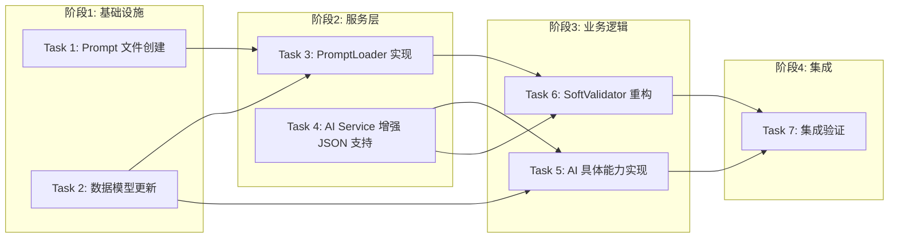

# Tasks: AI Core Capabilities

## 概览

| 指标 | 值 |
|------|-----|
| 总任务数 | 7 |
| 涉及模块 | ai, content, validator, prompt |
| 涉及端 | Server |
| 预计总时间 | 90 分钟 |

## 任务依赖关系图

### 依赖关系速查表

| 任务 | 前置依赖 | 可并行 |
|------|----------|--------|
| Task 1: Prompt 文件创建 | 无 | ✅ 与 Task 2 并行 |
| Task 2: 数据模型更新 | 无 | ✅ 与 Task 1 并行 |
| Task 3: PromptLoader 实现 | Task 1, Task 2 | - |
| Task 4: AI Service 增强 JSON 支持 | 无 | ✅ 与 T1, T2 并行 |
| Task 5: AI 具体能力实现 | Task 2, Task 4 | ✅ 与 Task 6 并行 |
| Task 6: SoftValidator 重构 | Task 3, Task 4 | ✅ 与 Task 5 并行 |
| Task 7: 集成验证 | Task 5, Task 6 | - |

## 任务清单

### 阶段1: 基础设施

#### Task 1: Prompt 文件创建 (Completed)

| 属性 | 值 |
|------|-----|
| 文件 | `backend/app/prompts/soft_validation.yaml` `backend/app/prompts/summary_generation.yaml` `backend/app/prompts/concept_extraction.yaml` `backend/app/prompts/tag_generation.yaml` |
| 操作 | 新增 |
| 内容 | 创建中文 Prompt 模板文件，定义 version, content, input_variables。 |
| 验证 | 命令: `ls backend/app/prompts/*.yaml` |
|      | 预期: 列出 4 个 yaml 文件 |
| 预计 | 10 分钟 |
| 依赖 | 无 |

#### Task 2: 数据模型更新 (Completed)

| 属性 | 值 |
|------|-----|
| 文件 | `backend/app/models/content.py` `backend/alembic/versions/xxxx_add_ai_fields.py` |
| 操作 | 修改/新增 |
| 内容 | `ContentItem` 新增 `summary`, `tags`, `concepts`, `ai_processed` 字段。生成迁移脚本。 |
| 验证 | 命令: `cd backend && alembic upgrade head` |
|      | 预期: 退出码 0，数据库更新成功 |
| 预计 | 10 分钟 |
| 依赖 | 无 |

### 阶段2: 服务层

#### Task 3: PromptLoader 实现 (Completed)

| 属性 | 值 |
|------|-----|
| 文件 | `backend/app/services/prompt_loader.py` |
| 操作 | 新增 |
| 内容 | 实现 `load_initial_prompts` 函数，读取 `app/prompts` 下的 yaml 文件并调用 `PromptManager` 存入数据库。 |
| 验证 | 命令: `cd backend && python -c "from app.services.prompt_loader import load_initial_prompts; import asyncio; asyncio.run(load_initial_prompts())"` |
|      | 预期: 退出码 0，日志显示 Prompts 加载成功 |
| 预计 | 15 分钟 |
| 依赖 | Task 1, Task 2 (依赖 DB) |

#### Task 4: AI Service 增强 JSON 支持 (Completed)

| 属性 | 值 |
|------|-----|
| 文件 | `backend/app/services/ai_service.py` |
| 操作 | 修改 |
| 内容 | 实现 `chat_completion_json` 方法，支持 System Prompt 强制 JSON 约束和简单的 JSON 提取/解析。 |
| 验证 | 命令: `cd backend && python -m pytest tests/unit/test_ai_service.py` (需新建测试) |
|      | 预期: 测试通过，能正确解析 JSON 响应 |
| 预计 | 15 分钟 |
| 依赖 | 无 |

### 阶段3: 业务逻辑

#### Task 5: AI 具体能力实现 (Completed)

| 属性 | 值 |
|------|-----|
| 文件 | `backend/app/services/ai_service.py` |
| 操作 | 修改 |
| 内容 | 实现 `generate_summary`, `extract_concepts`, `generate_tags` 方法，调用 `chat_completion_json`。 |
| 验证 | 命令: `cd backend && python -m pytest tests/unit/test_ai_capabilities.py` (需新建测试) |
|      | 预期: 测试通过 |
| 预计 | 15 分钟 |
| 依赖 | Task 4 |

#### Task 6: SoftValidator 重构 (Completed)

| 属性 | 值 |
|------|-----|
| 文件 | `backend/app/services/validator/soft_validator.py` |
| 操作 | 修改 |
| 内容 | 重构 `validate` 方法，使用 `PromptManager` 获取模板，调用 `AIService` 获取评分和理由，基于 JSON 结果判定。 |
| 验证 | 命令: `cd backend && python -m pytest tests/unit/test_soft_validator.py` (需新建测试) |
|      | 预期: 测试通过 |
| 预计 | 15 分钟 |
| 依赖 | Task 3 (Prompt), Task 4 (AI JSON) |

### 阶段4: 集成

#### Task 7: 集成验证 (Completed)

| 属性 | 值 |
|------|-----|
| 文件 | `backend/tests/integration/test_ai_flow.py` |
| 操作 | 新增 |
| 内容 | 编写集成测试，模拟从 Prompt 加载到 AI 处理的完整流程。 |
| 验证 | 命令: `cd backend && python -m pytest tests/integration/test_ai_flow.py` |
|      | 预期: 测试通过 |
| 预计 | 10 分钟 |
| 依赖 | Task 5, Task 6 |

### 阶段5: 前端展示

#### Task 5: 前端类型定义更新 (Completed)

| 属性 | 值 |
|------|-----|
| 文件 | `frontend/src/types/index.ts` |
| 操作 | 修改 |
| 内容 | 更新 `ContentItem` 和 `Approval` 接口，增加 AI 相关字段。 |
| 验证 | 代码检查 |
| 预计 | 5 分钟 |
| 依赖 | Task 2, Task 4 |

#### Task 6: 信息流卡片组件升级 (Completed)

| 属性 | 值 |
|------|-----|
| 文件 | `frontend/src/app/(dashboard)/feed/page.tsx` |
| 操作 | 修改 |
| 内容 | 在信息流卡片中展示 AI 摘要、标签、概念预览、AI 处理状态徽章。 |
| 验证 | 前端编译通过 |
| 预计 | 15 分钟 |
| 依赖 | Task 5 |

#### Task 7: 内容详情/审批页展示 AI 分析结果 (Completed)

| 属性 | 值 |
|------|-----|
| 文件 | `frontend/src/components/approval/ApprovalList.tsx` |
| 操作 | 修改 |
| 内容 | 在审批列表中展示 AI 置信度（颜色区分）和更清晰的提案数据展示。 |
| 验证 | 前端编译通过 |
| 预计 | 15 分钟 |
| 依赖 | Task 5 |

#### Task 8: 执行集成测试 (Completed)

| 属性 | 值 |
|------|-----|
| 文件 | `backend/tests/integration/test_ai_flow_manual.py` |
| 操作 | 新增 |
| 内容 | 编写手动集成测试脚本，Mock 外部依赖，验证 ContentProcessor -> AIService -> Database 的完整数据流。 |
| 验证 | 命令: `cd backend && python -m pytest tests/integration/test_ai_flow_manual.py` |
|      | 预期: 测试通过 |
| 预计 | 10 分钟 |
| 依赖 | Task 7 |

## 检查点策略

| 时机 | 操作 |
|------|------|
| Task 3 完成后 | 确保 Prompt 模板已入库，系统可正常启动 |
| Task 6 完成后 | 确保软性校验逻辑已切换为 AI 驱动 |
| Task 7 完成后 | 确保所有 AI 能力协同工作正常 |
