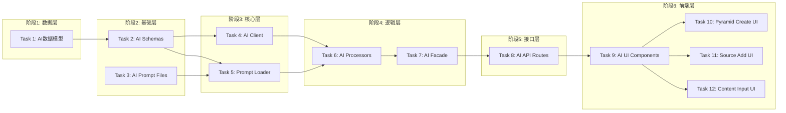

# Tasks: AI-First Architecture Refactoring [Completed]

## 概览

| 指标 | 值 |
|------|-----|
| 状态 | ✅ 已完成 |
| 总任务数 | 12 |
| 涉及模块 | backend/core/ai, backend/models, frontend/components |
| 涉及端 | Backend, Frontend |
| 预计总时间 | 180 分钟 |

## 任务依赖关系图

### 依赖关系速查表

| 任务 | 前置依赖 | 可并行 |
|------|----------|--------|
| Task 1: AI数据模型 | 无 | - |
| Task 2: AI Schemas | Task 1 | ✅ 与 Task 3 并行 |
| Task 3: AI Prompt Files | 无 | ✅ 与 Task 2 并行 |
| Task 4: AI Client | Task 2 | ✅ 与 Task 5 并行 |
| Task 5: Prompt Loader | Task 3 | ✅ 与 Task 4 并行 |
| Task 6: AI Processors | Task 4, Task 5 | - |
| Task 7: AI Facade | Task 6 | - |
| Task 8: AI API Routes | Task 7 | - |
| Task 9: AI UI Components | Task 8 | - |
| Task 10: Pyramid Create UI | Task 9 | ✅ 与 T11, T12 并行 |
| Task 11: Source Add UI | Task 9 | ✅ 与 T10, T12 并行 |
| Task 12: Content Input UI | Task 9 | ✅ 与 T10, T11 并行 |

## 任务清单

### 阶段1: 数据层

#### Task 1: AI数据模型

| 属性 | 值 |
|------|-----|
| 文件 | `backend/app/models/ai_suggestion.py`, `backend/app/models/content.py` |
| 操作 | 新增/修改 |
| 内容 | 创建 `AISuggestion` 模型，更新 `ContentItem` 增加 `ai_metadata` |
| 验证 | 命令: `cd backend && alembic check` |
|      | 预期: 退出码 0，模型定义正确 |
| 预计 | 10 分钟 |
| 依赖 | 无 |

### 阶段2: 基础层

#### Task 2: AI Schemas

| 属性 | 值 |
|------|-----|
| 文件 | `backend/app/schemas/ai.py` |
| 操作 | 新增 |
| 内容 | 定义 `AISuggestionCreate`, `PyramidSuggestion`, `ContentClassification` 等 Pydantic 模型 |
| 验证 | 命令: `cd backend && python -c "from app.schemas.ai import *"` |
|      | 预期: 退出码 0，无导入错误 |
| 预计 | 10 分钟 |
| 依赖 | Task 1 |

#### Task 3: AI Prompt Files

| 属性 | 值 |
|------|-----|
| 文件 | `backend/app/core/ai/prompts/*.md` |
| 操作 | 新增 |
| 内容 | 创建 `pyramid_structure.md`, `content_classification.md`, `source_analysis.md`, `search_intent.md` |
| 验证 | 命令: `ls backend/app/core/ai/prompts/*.md` |
|      | 预期: 列出所有创建的 Markdown 文件 |
| 预计 | 15 分钟 |
| 依赖 | 无 |

### 阶段3: 核心层

#### Task 4: AI Client

| 属性 | 值 |
|------|-----|
| 文件 | `backend/app/core/ai/client.py` |
| 操作 | 新增 |
| 内容 | 封装 AsyncOpenAI 调用，支持 Cloud/Local 切换和重试机制 |
| 验证 | 命令: `cd backend && python -m pytest tests/unit/test_ai_client.py` (需创建对应测试) |
|      | 预期: 单元测试通过 |
| 预计 | 20 分钟 |
| 依赖 | Task 2 |

#### Task 5: Prompt Loader

| 属性 | 值 |
|------|-----|
| 文件 | `backend/app/core/ai/prompt_loader.py` |
| 操作 | 新增 |
| 内容 | 实现 Markdown Prompt 加载器，解析 Frontmatter 和 Jinja2 模板 |
| 验证 | 命令: `cd backend && python -m pytest tests/unit/test_prompt_loader.py` (需创建对应测试) |
|      | 预期: 能正确加载和渲染 Markdown Prompt |
| 预计 | 15 分钟 |
| 依赖 | Task 3 |

### 阶段4: 逻辑层

#### Task 6: AI Processors

| 属性 | 值 |
|------|-----|
| 文件 | `backend/app/core/ai/processors/*.py` |
| 操作 | 新增 |
| 内容 | 实现 `pyramid.py`, `content.py`, `search.py` 的具体业务逻辑 |
| 验证 | 命令: `cd backend && python -c "from app.core.ai.processors.pyramid import *"` |
|      | 预期: 退出码 0，无导入错误 |
| 预计 | 25 分钟 |
| 依赖 | Task 4, Task 5 |

#### Task 7: AI Facade

| 属性 | 值 |
|------|-----|
| 文件 | `backend/app/core/ai/facade.py` |
| 操作 | 新增 |
| 内容 | 实现 `AIFacade` 类，作为业务层调用的统一入口 |
| 验证 | 命令: `cd backend && python -c "from app.core.ai.facade import AIFacade"` |
|      | 预期: 退出码 0，无导入错误 |
| 预计 | 10 分钟 |
| 依赖 | Task 6 |

### 阶段5: 接口层

#### Task 8: AI API Routes

| 属性 | 值 |
|------|-----|
| 文件 | `backend/app/api/pyramids.py`, `backend/app/api/sources.py` |
| 操作 | 修改 |
| 内容 | 新增 `suggest`, `confirm`, `analyze` 等路由接口 |
| 验证 | 命令: `cd backend && python -m pytest tests/api/test_ai_routes.py` |
|      | 预期: API 接口返回正确的响应结构 |
| 预计 | 20 分钟 |
| 依赖 | Task 7 |

### 阶段6: 前端层

#### Task 9: AI UI Components

| 属性 | 值 |
|------|-----|
| 文件 | `frontend/src/components/ai/AIReasoningDisplay.tsx`, `frontend/src/components/ai/PyramidPreview.tsx` |
| 操作 | 新增 |
| 内容 | 实现 AI 思考过程展示组件和金字塔预览组件 |
| 验证 | 命令: `cd frontend && npm run build` |
|      | 预期: 编译成功，无类型错误 |
| 预计 | 25 分钟 |
| 依赖 | Task 8 |

#### Task 10: Pyramid Create UI

| 属性 | 值 |
|------|-----|
| 文件 | `frontend/src/app/(dashboard)/pyramid/create/page.tsx` |
| 操作 | 修改 |
| 内容 | 集成 AI 辅助创建流程 (Suggest -> Confirm) |
| 验证 | 命令: `cd frontend && npm run build` |
|      | 预期: 编译成功 |
| 预计 | 15 分钟 |
| 依赖 | Task 9 |

#### Task 11: Source Add UI

| 属性 | 值 |
|------|-----|
| 文件 | `frontend/src/app/(dashboard)/sources/add/page.tsx` |
| 操作 | 修改 |
| 内容 | 集成信息源智能分析流程 |
| 验证 | 命令: `cd frontend && npm run build` |
|      | 预期: 编译成功 |
| 预计 | 15 分钟 |
| 依赖 | Task 9 |

#### Task 12: Content Input UI

| 属性 | 值 |
|------|-----|
| 文件 | `frontend/src/components/feed/InputBox.tsx` |
| 操作 | 修改 |
| 内容 | 集成内容实时分类反馈 |
| 验证 | 命令: `cd frontend && npm run build` |
|      | 预期: 编译成功 |
| 预计 | 15 分钟 |
| 依赖 | Task 9 |

## 检查点策略

| 时机 | 操作 |
|------|------|
| Task 3 完成后 | 确认 Prompt 文件结构和内容 |
| Task 7 完成后 | 验证后端 AI 核心链路连通性 |
| Task 9 完成后 | 验证前端组件展示效果 |
| 全部完成后 | 执行集成测试，验证完整的人机协作流程 |

## 风险提醒

| 任务 | 风险 | 应对 |
|------|------|------|
| Task 4 (Client) | 本地模型与云端模型接口差异 | 做好适配层，统一输入输出格式 |
| Task 5 (Loader) | Markdown 解析容错性 | 增加对 Frontmatter 格式错误的健壮性处理 |
