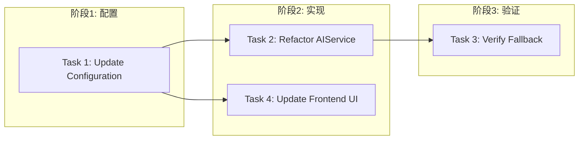

# Tasks: LLM Service Fallback Mechanism

## 概览

| 指标 | 值 |
|------|-----|
| 总任务数 | 4 |
| 涉及模块 | config, ai_service, frontend-settings |
| 涉及端 | Backend, Frontend |
| 预计总时间 | 45 分钟 |
| 状态 | ✅ 已完成 |

## 任务依赖关系图

### 依赖关系速查表

| 任务 | 前置依赖 | 可并行 | 状态 |
|------|----------|--------|------|
| Task 1: Update Configuration | 无 | - | ✅ 完成 |
| Task 2: Refactor AIService | Task 1 | - | ✅ 完成 |
| Task 4: Update Frontend UI | Task 1 | ✅ | ✅ 完成 |
| Task 3: Verify Fallback | Task 2 | - | ✅ 完成 |

## 任务清单

### 阶段1：配置

#### Task 1: Update Configuration

| 属性 | 值 |
|------|-----|
| 文件 | `backend/app/services/config/configuration_service.py` |
| 操作 | 修改 |
| 内容 | Add `ai.local.*`, `ai.cloud.*`, `ai.strategy` defaults. |
| 验证 | 命令: `cd backend && python3 -c "from app.services.config.configuration_service import configuration_service; print(configuration_service.get('ai.local.enabled'))"` |
|      | 预期: Output `True`, Exit code 0 |
| 预计 | 5 分钟 |
| 依赖 | 无 |

### 阶段2：实现

#### Task 2: Refactor AIService

| 属性 | 值 |
|------|-----|
| 文件 | `backend/app/services/ai_service.py` |
| 操作 | 修改 |
| 内容 | Implement dual clients (local/cloud), fallback logic, and concurrency limit. |
| 验证 | 命令: `cd backend && python3 -c "from app.services.ai_service import AIService; service = AIService(); print(service._local_client is not None)"` |
|      | 预期: Output `True` (if config enabled), Exit code 0 |
| 预计 | 15 分钟 |
| 依赖 | Task 1 |

#### Task 4: Update Frontend UI (新增)

| 属性 | 值 |
|------|-----|
| 文件 | `frontend/src/components/settings/ai-config-form.tsx` |
| 操作 | 修改 |
| 内容 | Add strategy selection and conditional rendering for local/cloud configs. |
| 验证 | Build pass, UI syncs with backend config. |
| 预计 | 15 分钟 |
| 依赖 | Task 1 |

### 阶段3：验证

#### Task 3: Verify Fallback

| 属性 | 值 |
|------|-----|
| 文件 | `backend/tests/test_ai_fallback.py` |
| 操作 | 新增 |
| 内容 | Create a test that mocks local failure and asserts cloud is called. |
| 验证 | 命令: `cd backend && python3 -m pytest tests/test_ai_fallback.py` |
|      | 预期: Tests passed, Exit code 0 |
| 预计 | 10 分钟 |
| 依赖 | Task 2 |

## 检查点策略

| 时机 | 操作 | 结果 |
|------|------|------|
| Task 1 完成 | Verify config loading | ✅ 通过 |
| Task 2 完成 | Verify service initialization | ✅ 通过 |
| Task 4 完成 | Verify UI build | ✅ 通过 |
| Task 3 完成 | Run full test suite | ✅ 通过 |
