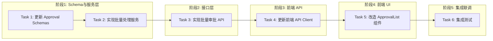

# Tasks: 审批中心增强 (Approval Center Enhancement)

## 概览

| 指标 | 值 |
|------|-----|
| 总任务数 | 6 |
| 涉及模块 | approval, frontend/approval |
| 涉及端 | Server, Web |
| 预计总时间 | 90 分钟 |
| 测试场景总数 | 10 个 |
| 测试层级分布 | 单元: 4, API: 3, 组件: 2, E2E: 1 |

## 任务依赖关系图

### 依赖关系速查表

| 任务 | 前置依赖 | 可并行 |
|------|----------|--------|
| Task 1: 更新 Approval Schemas | 无 | - |
| Task 2: 实现批量处理服务 | Task 1 | - |
| Task 3: 实现批量审批 API | Task 2 | - |
| Task 4: 更新前端 API Client | Task 3 | - |
| Task 5: 改造 ApprovalList 组件 | Task 4 | - |
| Task 6: 集成测试 | Task 5 | - |

## 任务清单

### 阶段1：Schema与服务层

#### Task 1: 更新 Approval Schemas

| 属性 | 值 |
|------|-----|
| 文件 | `backend/app/schemas/approval.py` |
| 操作 | 修改 |
| 内容 | 新增 `BatchReviewRequest`, `BatchReviewResult`, `CleanupRequest`, `CleanupResult` 定义 |
| 验证 | 命令: `cd backend && python -c "from app.schemas.approval import BatchReviewRequest, CleanupRequest"` |
|      | 预期: 退出码 0，无导入错误 |
| 预计 | 5 分钟 |
| 依赖 | 无 |
| 测试 | 层级: 单元测试 |
|      | 场景: ① 验证 BatchReviewRequest 必填字段 (ids, action) ② 验证 CleanupRequest 默认参数 |

#### Task 2: 实现批量处理服务

| 属性 | 值 |
|------|-----|
| 文件 | `backend/app/services/approval_service.py` |
| 操作 | 修改 |
| 内容 | 新增 `batch_review` (支持 approve/reject) 和 `cleanup_pending_approvals` 方法 |
| 验证 | 命令: `cd backend && python -m pytest tests/unit/services/test_approval_service.py -k "batch or cleanup"` |
|      | 预期: 所有测试通过，退出码 0 |
| 预计 | 20 分钟 |
| 依赖 | Task 1 |
| 测试 | 层级: 单元测试 |
|      | 场景: ① 批量通过：状态更新为 Approved ② 批量拒绝：物理删除记录 ③ 批量拒绝部分 ID 不存在：忽略并继续 ④ 清理所有 Pending：物理删除所有 Pending 记录 |
|      | Mock: 使用 SQLite 内存数据库，无需 Mock 外部服务 |
|      | TDD节奏: 先写测试 `tests/unit/services/test_approval_service.py` → 红灯 → 实现 Service → 绿灯 |

### 阶段2：接口层

#### Task 3: 实现批量审批 API

| 属性 | 值 |
|------|-----|
| 文件 | `backend/app/routers/approvals.py` |
| 操作 | 修改 |
| 内容 | 新增 `POST /batch/review` 和 `POST /cleanup` 接口 |
| 验证 | 命令: `cd backend && python -m pytest tests/api/test_approvals.py -k "batch or cleanup"` |
|      | 预期: 所有测试通过，退出码 0 |
| 预计 | 15 分钟 |
| 依赖 | Task 2 |
| 测试 | 层级: API 测试 |
|      | 场景: ① 调用 /batch/review 成功返回统计信息 ② 调用 /cleanup 成功返回清理数量 ③ 参数校验失败返回 422 |
|      | Mock: Mock ApprovalService |

### 阶段3：前端 API

#### Task 4: 更新前端 API Client

| 属性 | 值 |
|------|-----|
| 文件 | `frontend/src/lib/api.ts` |
| 操作 | 修改 |
| 内容 | 在 `approvalApi` 对象中新增 `batchReview` 和 `cleanup` 方法 |
| 验证 | 命令: `cd frontend && npm run build` |
|      | 预期: 编译成功，无类型错误 |
| 预计 | 5 分钟 |
| 依赖 | Task 3 |
| 测试 | 层级: 无 (纯类型定义和透传) |

### 阶段4：前端 UI

#### Task 5: 改造 ApprovalList 组件

| 属性 | 值 |
|------|-----|
| 文件 | `frontend/src/components/approval/ApprovalList.tsx` |
| 操作 | 修改 |
| 内容 | 1. 增加 checkbox 多选支持 2. 底部增加批量操作栏 3. 顶部增加清理按钮 4. 修复 Dark Mode 样式 |
| 验证 | 命令: `cd frontend && npm run build` |
|      | 预期: 编译成功，退出码 0 |
| 预计 | 30 分钟 |
| 依赖 | Task 4 |
| 测试 | 层级: 组件测试 |
|      | 场景: ① 点击全选选中所有项 ② 选中项数量变化时批量栏显示/隐藏 ③ 点击批量通过触发 API 调用 ④ 点击清理按钮弹出确认框 |

### 阶段5：集成联调

#### Task 6: 集成测试

| 属性 | 值 |
|------|-----|
| 内容 | 验证完整的批量处理和清理流程 |
| 验证 | 命令: `cd backend && python -m pytest tests/integration/test_approval_flow.py` |
|      | 预期: 所有测试通过，退出码 0 |
| 预计 | 15 分钟 |
| 依赖 | Task 5 |
| 测试 | 层级: E2E 测试 |
|      | 场景: ① 创建多个提案 -> 批量通过 -> 验证状态 ② 创建多个提案 -> 批量拒绝 -> 验证物理删除 ③ 创建多个提案 -> 一键清理 -> 验证列表为空 |

## 检查点策略

| 时机 | 操作 |
|------|------|
| Task 2 完成后 | 确保 Service 层单元测试通过 |
| Task 3 完成后 | 确保 API 接口测试通过 |
| Task 5 完成后 | 确保前端编译通过，手动验证 UI 交互 |
| 全部完成后 | 运行集成测试，提交代码 |
