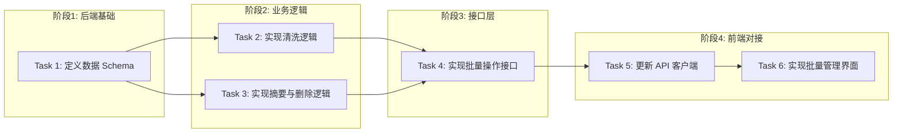

# Tasks: 内容清洗与批量摘要增强

## 概览

| 指标 | 值 |
|------|-----|
| 总任务数 | 6 |
| 涉及模块 | content, ai, frontend |
| 涉及端 | Backend, Frontend |
| 预计总时间 | 60 分钟 |

## 任务依赖关系图

### 依赖关系速查表

| 任务 | 前置依赖 | 可并行 |
|------|----------|--------|
| Task 1 | 无 | - |
| Task 2 | Task 1 | ✅ 与 Task 3 并行 |
| Task 3 | Task 1 | ✅ 与 Task 2 并行 |
| Task 4 | Task 2, Task 3 | - |
| Task 5 | Task 4 | - |
| Task 6 | Task 5 | - |

## 任务清单

### 阶段1: 后端基础

#### Task 1: 定义数据 Schema

| 属性 | 值 |
|------|-----|
| 文件 | `backend/app/schemas/content_management.py` |
| 操作 | 新增 |
| 内容 | 定义 `BatchCleanRequest`, `BatchSummarizeRequest`, `BatchDeleteRequest` 及响应模型 |
| 验证 | 命令: `cd backend && python -c "from app.schemas.content_management import *"` |
|      | 预期: 退出码 0，无导入错误 |
| 预计 | 5 分钟 |
| 依赖 | 无 |

### 阶段2: 业务逻辑

#### Task 2: 实现清洗逻辑

| 属性 | 值 |
|------|-----|
| 文件 | `backend/app/services/content_management_service.py` |
| 操作 | 新增 |
| 内容 | 实现 `ContentManagementService.batch_clean`，包含正则过滤和AI软校验 |
| 验证 | 命令: `cd backend && python -c "from app.services.content_management_service import ContentManagementService; print(ContentManagementService)"` |
|      | 预期: 退出码 0，无语法错误 |
| 预计 | 15 分钟 |
| 依赖 | Task 1 |

#### Task 3: 实现摘要与删除逻辑

| 属性 | 值 |
|------|-----|
| 文件 | `backend/app/services/content_management_service.py` |
| 操作 | 修改 |
| 内容 | 实现 `batch_summarize` (异步任务) 和 `batch_delete` (物理删除) |
| 验证 | 命令: `cd backend && python -c "from app.services.content_management_service import ContentManagementService; print(hasattr(ContentManagementService, 'batch_summarize'))"` |
|      | 预期: 输出 `True` |
| 预计 | 10 分钟 |
| 依赖 | Task 1 |

### 阶段3: 接口层

#### Task 4: 实现批量操作接口

| 属性 | 值 |
|------|-----|
| 文件 | `backend/app/routers/content_management.py`, `backend/app/main.py` |
| 操作 | 新增/修改 |
| 内容 | 创建 Router，定义 3 个 POST 接口，并在 main.py 注册 |
| 验证 | 命令: `curl -s -X POST http://localhost:8000/api/v1/contents/batch/clean -H "Content-Type: application/json" -d '{"dry_run": true}'` |
|      | 预期: HTTP 200/401 (取决于鉴权), 返回 JSON |
| 预计 | 10 分钟 |
| 依赖 | Task 2, Task 3 |

### 阶段4: 前端对接

#### Task 5: 更新 API 客户端

| 属性 | 值 |
|------|-----|
| 文件 | `frontend/src/lib/api.ts` |
| 操作 | 修改 |
| 内容 | `contentApi` 增加 `batchClean`, `batchSummarize`, `batchDelete` 方法 |
| 验证 | 命令: `cd frontend && npm run build` |
|      | 预期: 编译成功 |
| 预计 | 5 分钟 |
| 依赖 | Task 4 |

#### Task 6: 实现批量管理界面

| 属性 | 值 |
|------|-----|
| 文件 | `frontend/src/app/[locale]/(dashboard)/contents/page.tsx` |
| 操作 | 修改 |
| 内容 | 增加 Checkbox 多选状态，顶部批量操作栏，绑定 API 调用 |
| 验证 | 命令: `cd frontend && npm run build` |
|      | 预期: 编译成功 |
| 预计 | 15 分钟 |
| 依赖 | Task 5 |

## 检查点策略

| 时机 | 操作 |
|------|------|
| Task 3 完成后 | 验证后端逻辑 `pytest` (可选) |
| Task 6 完成后 | 完整功能验证 |
