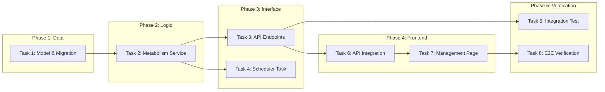

# Tasks: Content Metabolism System

## 概览

| 指标 | 值 |
|------|-----|
| 总任务数 | 8 |
| 涉及模块 | backend, frontend |
| 状态 | ✅ 已完成 |

## 任务依赖关系图

## 任务清单

### Phase 1: Data (Completed)

#### Task 1: Model & Migration ✅

| 属性 | 值 |
|------|-----|
| 文件 | `backend/app/models/content.py`, `backend/alembic/versions/*` |
| 操作 | 修改 + 迁移 |
| 内容 | 添加 `lifecycle_status`, `metabolism_score`, `last_accessed_at`, `access_count` 字段 |
| 验证 | `alembic upgrade head` |

### Phase 2: Logic (Completed)

#### Task 2: Metabolism Service ✅

| 属性 | 值 |
|------|-----|
| 文件 | `backend/app/services/metabolism_service.py` |
| 操作 | 新增 |
| 内容 | 实现评分公式、状态流转逻辑、建议列表生成 |
| 验证 | `tests/unit/test_metabolism_service.py` |

### Phase 3: Interface (Completed)

#### Task 3: API Endpoints ✅

| 属性 | 值 |
|------|-----|
| 文件 | `backend/app/routers/content_management.py` |
| 操作 | 新增 |
| 内容 | 添加 `/api/v1/content-management/metabolism/*` 接口 |
| 验证 | `curl -X POST ...` |

#### Task 4: Scheduler Task ✅

| 属性 | 值 |
|------|-----|
| 文件 | `backend/app/services/scheduler.py` |
| 操作 | 修改 |
| 内容 | 注册每日 02:30 跑批任务 |
| 验证 | 应用启动日志 |

### Phase 4: Frontend (Completed)

#### Task 6: API Integration ✅

| 属性 | 值 |
|------|-----|
| 文件 | `frontend/src/lib/api.ts` |
| 操作 | 修改 |
| 内容 | 添加 `metabolismApi` 对象 |
| 验证 | 编译通过 |

#### Task 7: Management Page ✅

| 属性 | 值 |
|------|-----|
| 文件 | `frontend/src/app/[locale]/(dashboard)/maintenance/metabolism/page.tsx` |
| 操作 | 新增 |
| 内容 | 实现手动触发、建议列表查看、清理操作 |
| 验证 | 页面访问正常 |

### Phase 5: Verification (Completed)

#### Task 5: Integration Test ✅

| 属性 | 值 |
|------|-----|
| 文件 | `backend/tests/integration/test_metabolism_flow.py` (simulated via script) |
| 操作 | 新增 |
| 内容 | 模拟数据 -> 触发跑批 -> 验证状态变更 |
| 验证 | `python scripts/verify_metabolism.py` |

#### Task 8: E2E Verification ✅

| 属性 | 值 |
|------|-----|
| 文件 | N/A |
| 操作 | 验证 |
| 内容 | 全链路测试 |
| 验证 | 通过 |
