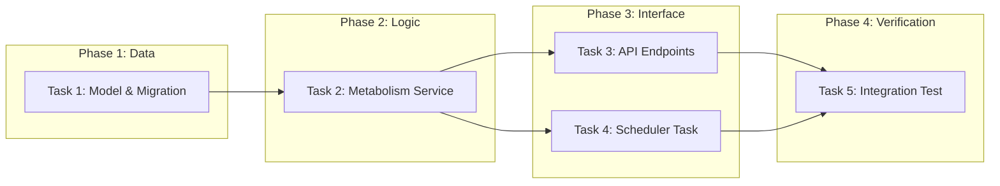

# Tasks: Content Metabolism System

## 概览

| 指标 | 值 |
|------|-----|
| 总任务数 | 5 |
| 涉及模块 | backend |
| 预计总时间 | 60 分钟 |

## 任务依赖关系图

## 任务清单

### Phase 1: Data

#### Task 1: Model & Migration

| 属性 | 值 |
|------|-----|
| 文件 | `backend/app/models/content.py`, `backend/alembic/versions/*` |
| 操作 | 修改 + 迁移 |
| 内容 | 添加 `lifecycle_status`, `metabolism_score`, `last_accessed_at`, `access_count` 字段 |
| 验证 | 命令: `cd backend && alembic upgrade head` |
|      | 预期: 退出码 0，数据库更新成功 |
| 预计 | 10 分钟 |

### Phase 2: Logic

#### Task 2: Metabolism Service

| 属性 | 值 |
|------|-----|
| 文件 | `backend/app/services/metabolism_service.py` |
| 操作 | 新增 |
| 内容 | 实现评分公式、状态流转逻辑、建议列表生成 |
| 验证 | 命令: `cd backend && python -m pytest tests/unit/test_metabolism.py` (需创建测试) |
|      | 预期: 评分计算准确，流转逻辑符合预期 |
| 预计 | 25 分钟 |

### Phase 3: Interface

#### Task 3: API Endpoints

| 属性 | 值 |
|------|-----|
| 文件 | `backend/app/routers/system.py` |
| 操作 | 修改 |
| 内容 | 添加 `/api/v1/system/metabolism/*` 接口 |
| 验证 | 命令: `curl -X POST http://localhost:8000/api/v1/system/metabolism/run` |
|      | 预期: HTTP 200/202 |
| 预计 | 10 分钟 |

#### Task 4: Scheduler Task

| 属性 | 值 |
|------|-----|
| 文件 | `backend/app/services/scheduler/tasks.py` |
| 操作 | 修改 |
| 内容 | 注册每日跑批任务 |
| 验证 | 命令: 查看应用启动日志 |
|      | 预期: 包含 "Scheduled task: content_metabolism" |
| 预计 | 5 分钟 |

### Phase 4: Verification

#### Task 5: Integration Test

| 属性 | 值 |
|------|-----|
| 文件 | `backend/tests/integration/test_metabolism_flow.py` |
| 操作 | 新增 |
| 内容 | 模拟数据 -> 触发跑批 -> 验证状态变更 |
| 验证 | 命令: `cd backend && python -m pytest tests/integration/test_metabolism_flow.py` |
|      | 预期: 测试通过 |
| 预计 | 10 分钟 |
