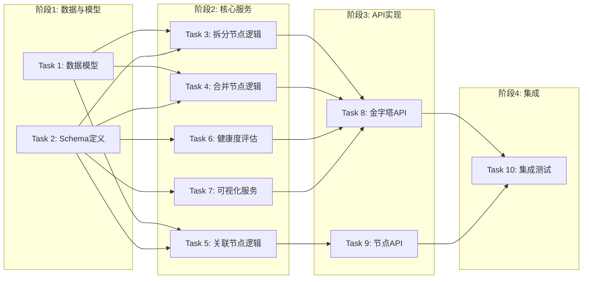

# Tasks: 知识金字塔核心管理增强

## 概览

| 指标 | 值 |
|------|-----|
| 总任务数 | 10 |
| 涉及模块 | pyramid, node, health, visualization |
| 涉及端 | Backend |
| 预计总时间 | 90 分钟 |

## 任务依赖关系图

### 依赖关系速查表

| 任务 | 前置依赖 | 可并行 |
|------|----------|--------|
| Task 1: 数据模型 | 无 | - |
| Task 2: Schema定义 | 无 | ✅ 与 T1 |
| Task 3: 拆分节点逻辑 | T1, T2 | ✅ 与 T4, T5, T6, T7 |
| Task 4: 合并节点逻辑 | T1, T2 | ✅ 与 T3, T5, T6, T7 |
| Task 5: 关联节点逻辑 | T1, T2 | ✅ 与 T3, T4, T6, T7 |
| Task 6: 健康度评估 | T1, T2 | ✅ 与 T3, T4, T5, T7 |
| Task 7: 可视化服务 | T1, T2 | ✅ 与 T3, T4, T5, T6 |
| Task 8: 金字塔API | T3, T4, T6, T7 | - |
| Task 9: 节点API | T5 | ✅ 与 T8 |
| Task 10: 集成测试 | T8, T9 | - |

## 任务清单

### 阶段1：数据与模型

#### Task 1: 数据模型 (NodeRelation)

| 属性 | 值 |
|------|-----|
| 文件 | `backend/app/models/node_relation.py` `backend/app/models/__init__.py` |
| 操作 | 新增/修改 |
| 内容 | 创建 `NodeRelation` 模型，导出模型，并在 `PyramidNode` 检查是否需要字段更新 |
| 验证 | 命令: `cd backend && python3 -c "from app.models.node_relation import NodeRelation; print(NodeRelation.__tablename__)"` |
|      | 预期: 输出 `node_relations`，无报错 |
| 预计 | 10 分钟 |
| 依赖 | 无 |

#### Task 2: Schema定义

| 属性 | 值 |
|------|-----|
| 文件 | `backend/app/schemas/node_ops.py` `backend/app/schemas/visualization.py` `backend/app/schemas/health.py` |
| 操作 | 新增 |
| 内容 | 定义拆分/合并/关联请求 Schema，可视化/健康度响应 Schema |
| 验证 | 命令: `cd backend && python3 -c "from app.schemas.node_ops import NodeSplitRequest; from app.schemas.visualization import VisualizationData; from app.schemas.health import HealthScore"` |
|      | 预期: 无报错 |
| 预计 | 10 分钟 |
| 依赖 | 无 |

### 阶段2：核心服务

#### Task 3: 拆分节点逻辑

| 属性 | 值 |
|------|-----|
| 文件 | `backend/app/services/pyramid_service.py` |
| 操作 | 修改 |
| 内容 | 实现 `split_node` 方法：创建子节点，更新原节点状态 |
| 验证 | 命令: `cd backend && python3 -m pytest tests/unit/test_pyramid_service.py` (需新建测试或模拟调用) |
|      | 预期: 测试通过 |
| 预计 | 15 分钟 |
| 依赖 | T1, T2 |

#### Task 4: 合并节点逻辑

| 属性 | 值 |
|------|-----|
| 文件 | `backend/app/services/pyramid_service.py` |
| 操作 | 修改 |
| 内容 | 实现 `merge_nodes` 方法：创建新节点，迁移子节点和内容，删除旧节点 |
| 验证 | 命令: `cd backend && python3 -m pytest tests/unit/test_pyramid_service.py` |
|      | 预期: 测试通过 |
| 预计 | 15 分钟 |
| 依赖 | T1, T2 |

#### Task 5: 关联节点逻辑

| 属性 | 值 |
|------|-----|
| 文件 | `backend/app/services/node_service.py` (或 `pyramid_service.py`) |
| 操作 | 修改 |
| 内容 | 实现 `link_nodes` 方法：创建 `NodeRelation` 记录 |
| 验证 | 命令: `cd backend && python3 -m pytest tests/unit/test_node_service.py` |
|      | 预期: 测试通过 |
| 预计 | 10 分钟 |
| 依赖 | T1, T2 |

#### Task 6: 健康度评估服务

| 属性 | 值 |
|------|-----|
| 文件 | `backend/app/services/health_evaluator.py` |
| 操作 | 新增 |
| 内容 | 实现 `evaluate_pyramid_health` 方法：计算深度平衡、覆盖度、活跃度 |
| 验证 | 命令: `cd backend && python3 -m pytest tests/unit/test_health_evaluator.py` |
|      | 预期: 测试通过 |
| 预计 | 15 分钟 |
| 依赖 | T1, T2 |

#### Task 7: 可视化服务

| 属性 | 值 |
|------|-----|
| 文件 | `backend/app/services/visualization_service.py` |
| 操作 | 新增 |
| 内容 | 实现 `generate_visualization_data` 方法：转换节点结构为 ReactFlow 格式 |
| 验证 | 命令: `cd backend && python3 -m pytest tests/unit/test_visualization_service.py` |
|      | 预期: 测试通过 |
| 预计 | 10 分钟 |
| 依赖 | T1, T2 |

### 阶段3：API实现

#### Task 8: 金字塔API (Split, Merge, Health, Vis)

| 属性 | 值 |
|------|-----|
| 文件 | `backend/app/routers/pyramids.py` |
| 操作 | 修改 |
| 内容 | 添加 `split_node`, `merge_nodes`, `get_health`, `get_visualization` 路由 |
| 验证 | 命令: `curl -v http://localhost:8000/docs` (查看 OpenAPI 文档是否包含新接口) |
|      | 预期: 包含新接口 |
| 预计 | 15 分钟 |
| 依赖 | T3, T4, T6, T7 |

#### Task 9: 节点API (Link)

| 属性 | 值 |
|------|-----|
| 文件 | `backend/app/routers/nodes.py` |
| 操作 | 修改 |
| 内容 | 添加 `link_node` 路由 |
| 验证 | 命令: `curl -v http://localhost:8000/docs` |
|      | 预期: 包含 `/nodes/{id}/links` |
| 预计 | 5 分钟 |
| 依赖 | T5 |

### 阶段4：集成

#### Task 10: 集成测试

| 属性 | 值 |
|------|-----|
| 文件 | `backend/tests/integration/test_pyramid_operations.py` |
| 操作 | 新增 |
| 内容 | 编写测试用例覆盖拆分、合并、健康度、可视化接口 |
| 验证 | 命令: `cd backend && python3 -m pytest tests/integration/test_pyramid_operations.py` |
|      | 预期: 全部通过 |
| 状态 | ✅ 已完成 |
| 预计 | 15 分钟 |
| 依赖 | T8, T9 |

## 检查点策略

- 每个 Service 任务完成后，建议编写简单的单元测试验证逻辑。
- API 实现后，通过集成测试验证端到端流程。
