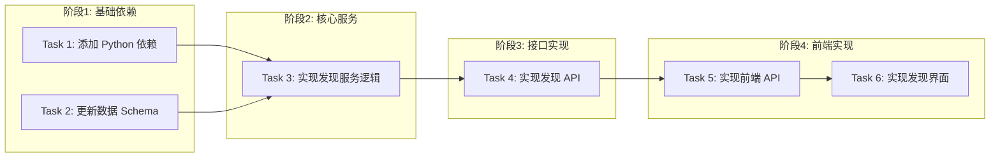

# Tasks: 基于金字塔的信息源自动发现

## 概览

| 指标 | 值 |
|------|-----|
| 总任务数 | 6 |
| 涉及模块 | `source`, `approval`, `discovery` |
| 涉及端 | Server, Web |
| 预计总时间 | 45 分钟 |

## 任务依赖关系图

### 依赖关系速查表

| 任务 | 前置依赖 | 可并行 |
|------|----------|--------|
| Task 1: 添加 Python 依赖 | 无 | ✅ 与 Task 2 并行 |
| Task 2: 更新数据 Schema | 无 | ✅ 与 Task 1 并行 |
| Task 3: 实现发现服务逻辑 | Task 1, Task 2 | - |
| Task 4: 实现发现 API | Task 3 | - |
| Task 5: 实现前端 API | Task 4 | - |
| Task 6: 实现发现界面 | Task 5 | - |

## 任务清单

### 阶段1: 基础依赖

#### Task 1: 添加 Python 依赖

| 属性 | 值 |
|------|-----|
| 文件 | `backend/requirements.txt` |
| 操作 | 修改 |
| 内容 | 添加 `duckduckgo-search>=5.0.0` |
| 验证 | 命令: `cd backend && pip install -r requirements.txt && python -c "import duckduckgo_search"` |
|      | 预期: 退出码 0，无导入错误 |
| 预计 | 5 分钟 |

#### Task 2: 更新数据 Schema

| 属性 | 值 |
|------|-----|
| 文件 | `backend/app/schemas/source.py` |
| 操作 | 修改 |
| 内容 | 添加 `DiscoverRequest`, `DiscoveredSource` Pydantic 模型 |
| 验证 | 命令: `cd backend && python -c "from app.schemas.source import DiscoverRequest, DiscoveredSource"` |
|      | 预期: 退出码 0，无导入错误 |
| 预计 | 5 分钟 |

### 阶段2: 核心服务

#### Task 3: 实现发现服务逻辑

| 属性 | 值 |
|------|-----|
| 文件 | `backend/app/services/source_discovery.py` |
| 操作 | 新增 |
| 内容 | 实现 `SourceDiscoveryService` 类，包含 `discover` 方法（搜索、过滤、生成 Approval） |
| 验证 | 命令: `cd backend && python -m pytest tests/unit/test_source_discovery.py` (需先创建测试) |
|      | 预期: 需先创建测试文件，运行测试通过 |
| 备注 | 包含测试文件创建 `backend/tests/unit/test_source_discovery.py` |
| 预计 | 15 分钟 |

### 阶段3: 接口实现

#### Task 4: 实现发现 API

| 属性 | 值 |
|------|-----|
| 文件 | `backend/app/routers/sources.py` |
| 操作 | 修改 |
| 内容 | 添加 `POST /discover` 和 `GET /discovered` 路由 |
| 验证 | 命令: `cd backend && python -m pytest tests/api/test_sources.py` (需补充测试用例) |
|      | 预期: API 测试通过 |
| 预计 | 10 分钟 |

### 阶段4: 前端实现

#### Task 5: 实现前端 API

| 属性 | 值 |
|------|-----|
| 文件 | `frontend/src/lib/api.ts` |
| 操作 | 修改 |
| 内容 | 在 `sourceApi` 中添加 `discover` 和 `getDiscovered` 方法 |
| 验证 | 命令: `cd frontend && npm run build` |
|      | 预期: 编译通过 |
| 预计 | 5 分钟 |

#### Task 6: 实现发现界面

| 属性 | 值 |
|------|-----|
| 文件 | `frontend/src/app/[locale]/(dashboard)/sources/page.tsx` `frontend/src/components/sources/DiscoveredSourceList.tsx` |
| 操作 | 修改/新增 |
| 内容 | 在 Sources 页面添加 Tab，展示发现列表，支持批准/忽略操作 |
| 验证 | 命令: `cd frontend && npm run build` |
|      | 预期: 编译通过 |
| 预计 | 20 分钟 |

## 检查点策略

| 时机 | 操作 |
|------|------|
| 每个任务完成后 | 验证 → git commit |
| 全部完成后 | 完整功能验证 |

## 风险提醒

| 任务 | 风险 | 应对 |
|------|------|------|
| Task 3 | DuckDuckGo 连接不稳定 | 增加重试机制和错误捕获，避免 crash |
