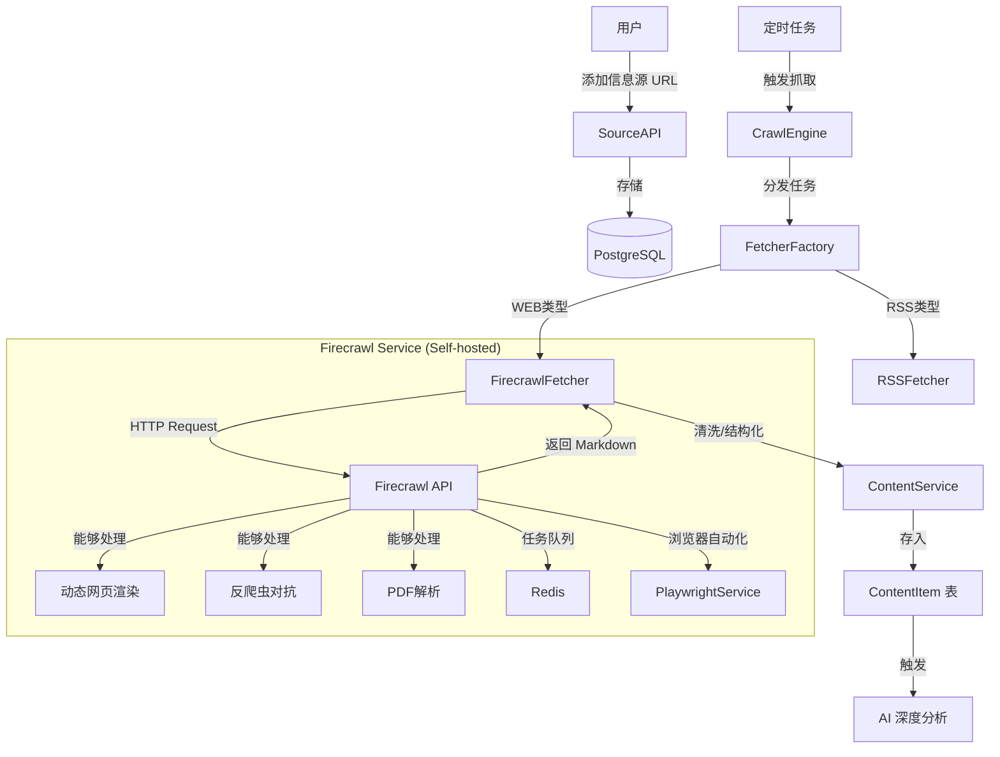

# Crawl Engine Design

## Overview
Crawl Engine 是 Knowledge Radar 的核心组件，负责从互联网抓取数据。
目前集成了 Firecrawl 作为主要抓取引擎，用于处理 `WEB` 类型的信息源。

## Architecture

## Components

### FirecrawlFetcher
- **职责**: 封装 Firecrawl SDK 调用逻辑，处理 HTTP 请求和响应映射。
- **输入**: URL
- **输出**: ContentItem (Markdown)
- **配置**: `FIRECRAWL_API_URL`, `FIRECRAWL_API_KEY`

### CrawlEngine
- **职责**: 根据 Source 类型选择 Fetcher，执行抓取任务。
- **Web Source**: 使用 `FirecrawlFetcher`。
- **RSS Source**: 使用 `RSSFetcher`。

## Deployment
Firecrawl 服务通过 Docker Compose 部署在本地，包含 API、Worker、Playwright 和 Redis 服务。
详情请参考 [Deployment Guide](../../deployment.md)。
