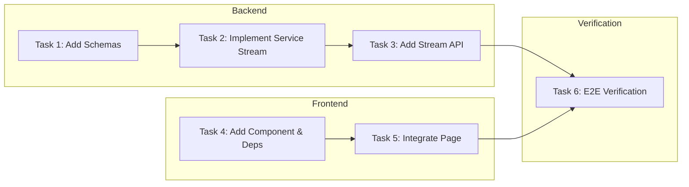

# Tasks: 发现流程可视化 (Discovery Process Visualization)

## 概览

| 指标 | 值 |
|------|-----|
| 总任务数 | 6 |
| 涉及模块 | sources |
| 涉及端 | Backend, Frontend |
| 预计总时间 | 60 分钟 |

## 任务依赖关系图

### 依赖关系速查表

| 任务 | 前置依赖 | 可并行 |
|------|----------|--------|
| Task 1: Add Schemas | 无 | - |
| Task 2: Implement Service Stream | Task 1 | - |
| Task 3: Add Stream API | Task 2 | ✅ 与 Task 4 并行 |
| Task 4: Add Component & Deps | 无 | ✅ 与 Task 1-3 并行 |
| Task 5: Integrate Page | Task 4 | - |
| Task 6: E2E Verification | Task 3, Task 5 | - |

## 任务清单

### 阶段1：后端开发

#### Task 1: 定义 SSE 数据模型

| 属性 | 值 |
|------|-----|
| 文件 | `backend/app/schemas/source.py` |
| 操作 | 修改 |
| 内容 | 新增 `DiscoveryStage`, `DiscoveryStatus`, `DiscoveryEvent` 等 Pydantic 模型 |
| 验证 | 命令: `cd backend && python -c "from app.schemas.source import DiscoveryEvent; print('Schema valid')"` |
|      | 预期: 输出 "Schema valid"，无报错 |
| 预计 | 5 分钟 |
| 依赖 | 无 |

#### Task 2: 实现流式发现服务

| 属性 | 值 |
|------|-----|
| 文件 | `backend/app/services/source_discovery.py` |
| 操作 | 修改 |
| 内容 | 新增 `discover_stream` 方法 (Async Generator)，重构原有逻辑以支持 `yield` 进度事件 |
| 验证 | 命令: `cd backend && python -m pytest tests/test_discovery_stream.py` (需先创建测试文件) |
|      | 预期: 测试通过，能正确接收到流式事件 |
| 预计 | 20 分钟 |
| 依赖 | Task 1 |

#### Task 3: 新增 SSE API 接口

| 属性 | 值 |
|------|-----|
| 文件 | `backend/app/routers/sources.py` |
| 操作 | 修改 |
| 内容 | 新增 `GET /discover/stream` Endpoint，使用 `StreamingResponse` 返回 SSE 流 |
| 验证 | 命令: `curl -v http://localhost:8000/api/v1/sources/discover/stream` (需带 Token 或暂时绕过 Auth 测试) |
|      | 预期: 收到 `Content-Type: text/event-stream` 和初始事件 |
| 预计 | 10 分钟 |
| 依赖 | Task 2 |

### 阶段2：前端开发

#### Task 4: 创建可视化组件

| 属性 | 值 |
|------|-----|
| 文件 | `frontend/package.json` `frontend/src/components/sources/DiscoveryProgress.tsx` |
| 操作 | 修改/新增 |
| 内容 | 安装 `@microsoft/fetch-event-source`，实现 `DiscoveryProgress` 组件 (Steps, Log, Progress) |
| 验证 | 命令: `cd frontend && npm run build` |
|      | 预期: 编译成功，无类型错误 |
| 预计 | 15 分钟 |
| 依赖 | 无 |

#### Task 5: 集成到信息源页面

| 属性 | 值 |
|------|-----|
| 文件 | `frontend/src/app/[locale]/(dashboard)/sources/page.tsx` |
| 操作 | 修改 |
| 内容 | 引入 `DiscoveryProgress` 组件，点击发现按钮时显示组件并建立连接 |
| 验证 | 命令: `cd frontend && npm run build` |
|      | 预期: 编译成功 |
| 预计 | 5 分钟 |
| 依赖 | Task 4 |

### 阶段3：验证

#### Task 6: 端到端验证

| 属性 | 值 |
|------|-----|
| 内容 | 启动前后端，点击发现按钮，观察流程图和日志是否实时更新 |
| 验证 | 命令: `人工验证` |
|      | 预期: 流程顺畅，无报错，日志实时滚动 |
| 预计 | 5 分钟 |
| 依赖 | Task 3, Task 5 |
