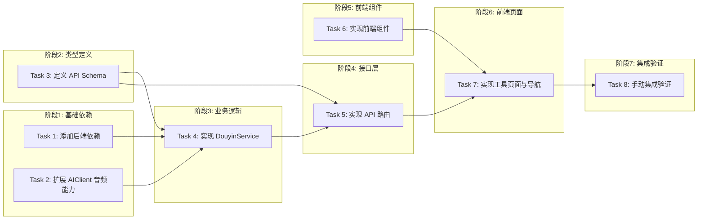

# Tasks: 抖音视频转文档组件

## 概览

| 指标 | 值 |
|------|-----|
| 总任务数 | 8 |
| 涉及模块 | tools, ai-core |
| 涉及端 | Server, Web |
| 预计总时间 | 100 分钟 |
| 测试场景总数 | 12 个 |
| 测试层级分布 | 单元: 6, API: 4, 组件: 2, E2E: 0 (集成测试在单独阶段) |

## 任务依赖关系图

### 依赖关系速查表

| 任务 | 前置依赖 | 可并行 |
|------|----------|--------|
| Task 1: 添加后端依赖 | 无 | ✅ 与 Task 2, 3 并行 |
| Task 2: 扩展 AIClient 音频能力 | 无 | ✅ 与 Task 1, 3 并行 |
| Task 3: 定义 API Schema | 无 | ✅ 与 Task 1, 2 并行 |
| Task 4: 实现 DouyinService | Task 1, 2, 3 | - |
| Task 5: 实现 API 路由 | Task 4 | - |
| Task 6: 实现前端组件 | 无 | ✅ 与 Task 1-5 并行 |
| Task 7: 实现工具页面与导航 | Task 5, 6 | - |
| Task 8: 手动集成验证 | Task 7 | - |

## 任务清单

### 阶段1: 基础依赖

#### Task 1: 添加后端依赖

| 属性 | 值 |
|------|-----|
| 文件 | `backend/requirements.txt` |
| 操作 | 修改 |
| 内容 | 添加 `yt-dlp` |
| 验证 | 命令: `cd backend && pip install -r requirements.txt && python -c "import yt_dlp; print('ok')"` |
|      | 预期: 输出 `ok`，无报错 |
| 预计 | 5 分钟 |
| 依赖 | 无 |
| 测试 | 层级: 无 |
|      | 场景: 无需独立测试 |

#### Task 2: 扩展 AIClient 音频能力

| 属性 | 值 |
|------|-----|
| 文件 | `backend/app/core/ai/client.py` |
| 操作 | 修改 |
| 内容 | 新增 `audio_transcriptions` 方法，调用 SiliconFlow (OpenAI 兼容) `/audio/transcriptions` 接口 |
| 验证 | 命令: `cd backend && python -m pytest tests/unit/core/ai/test_client_audio.py` |
|      | 预期: 测试通过 |
| 预计 | 15 分钟 |
| 依赖 | 无 |
| 测试 | 层级: 单元测试 |
|      | 场景: ① 成功调用音频转录接口 ② API 返回错误时的异常处理 |
|      | Mock: Mock OpenAI 客户端响应 |
|      | TDD节奏: 先写测试 `tests/unit/core/ai/test_client_audio.py` |

### 阶段2: 类型定义

#### Task 3: 定义 API Schema

| 属性 | 值 |
|------|-----|
| 文件 | `backend/app/schemas/tools.py` |
| 操作 | 新增 |
| 内容 | 定义 `DouyinConvertRequest`, `DouyinConvertResponse` |
| 验证 | 命令: `cd backend && python -c "from app.schemas.tools import DouyinConvertRequest, DouyinConvertResponse; print('ok')"` |
|      | 预期: 输出 `ok` |
| 预计 | 5 分钟 |
| 依赖 | 无 |
| 测试 | 层级: 单元测试 |
|      | 场景: ① 验证 URL 必填 ② 验证响应结构正确 |
|      | TDD节奏: 简单 Schema 可跳过 TDD，直接验证导入 |

### 阶段3: 业务逻辑

#### Task 4: 实现 DouyinService

| 属性 | 值 |
|------|-----|
| 文件 | `backend/app/services/douyin_service.py` |
| 操作 | 新增 |
| 内容 | 实现 `download_video`, `transcribe_audio`, `generate_doc` 逻辑 |
| 验证 | 命令: `cd backend && python -m pytest tests/unit/services/test_douyin_service.py` |
|      | 预期: 测试通过 |
| 预计 | 30 分钟 |
| 依赖 | Task 1, 2, 3 |
| 测试 | 层级: 单元测试 |
|      | 场景: ① 完整流程：下载->转录->生成文档 ② 下载失败处理 ③ 转录失败处理 ④ LLM生成失败处理 |
|      | Mock: Mock `yt_dlp.YoutubeDL`, Mock `AIClient` |
|      | TDD节奏: 先写测试 `tests/unit/services/test_douyin_service.py` |

### 阶段4: 接口层

#### Task 5: 实现 API 路由

| 属性 | 值 |
|------|-----|
| 文件 | `backend/app/routers/tools.py`, `backend/app/main.py` |
| 操作 | 新增/修改 |
| 内容 | 添加 `POST /douyin/convert` 接口，并在 main.py 注册 |
| 验证 | 命令: `cd backend && python -m pytest tests/api/test_tools_douyin.py` |
|      | 预期: 测试通过 |
| 预计 | 15 分钟 |
| 依赖 | Task 4 |
| 测试 | 层级: API 测试 |
|      | 场景: ① 200 OK 成功返回文档 ② 422 参数错误 (URL为空) ③ 500 服务端错误 (下载失败等) |
|      | Mock: Mock `DouyinService` 的方法 |
|      | TDD节奏: 先写测试 `tests/api/test_tools_douyin.py` |

### 阶段5: 前端组件

#### Task 6: 实现前端组件

| 属性 | 值 |
|------|-----|
| 文件 | `frontend/src/components/tools/DouyinInput.tsx`, `frontend/src/components/tools/DocViewer.tsx` |
| 操作 | 新增 |
| 内容 | 输入框组件（含加载状态），Markdown展示组件 |
| 验证 | 命令: `cd frontend && npm run build` |
|      | 预期: 编译通过 |
| 预计 | 15 分钟 |
| 依赖 | 无 |
| 测试 | 层级: 组件测试 (可选，简单组件可跳过) |
|      | 场景: ① 输入框状态变化 ② 文档渲染正确 |

### 阶段6: 前端页面

#### Task 7: 实现工具页面与导航

| 属性 | 值 |
|------|-----|
| 文件 | `frontend/src/app/[locale]/(dashboard)/tools/douyin/page.tsx`, `frontend/src/app/[locale]/(dashboard)/layout.tsx`, `frontend/messages/*.json` |
| 操作 | 新增/修改 |
| 内容 | 组装页面，添加导航菜单，添加多语言文案 |
| 验证 | 命令: `cd frontend && npm run build` |
|      | 预期: 编译通过 |
| 预计 | 15 分钟 |
| 依赖 | Task 5, 6 |
| 测试 | 层级: 无 |
|      | 场景: 页面加载正常 |

### 阶段7: 集成验证

#### Task 8: 手动集成验证

| 属性 | 值 |
|------|-----|
| 内容 | 启动前后端，真实跑通一个流程 |
| 验证 | 命令: `curl -X POST http://localhost:8000/api/v1/tools/douyin/convert -H "Content-Type: application/json" -d '{"url":"https://v.douyin.com/kcvMfv/"}'` (需确保 backend 运行且有网络) |
|      | 预期: 返回成功 JSON |
| 预计 | 5 分钟 |
| 依赖 | Task 7 |

## 检查点策略

| 时机 | 操作 |
|------|------|
| Task 2, 4, 5 完成后 | 运行对应的 pytest 确保逻辑正确 |
| Task 7 完成后 | 运行 npm run build 确保前端无报错 |
| 全部完成后 | 手动运行一次完整流程 |

## 风险提醒

| 任务 | 风险 | 应对 |
|------|------|------|
| Task 4 | `yt-dlp` 下载速度慢或超时 | 设置超时时间，前端增加 Loading 提示 |
| Task 4 | 抖音链接格式多变 | Service 层增加 URL 预处理逻辑 |
