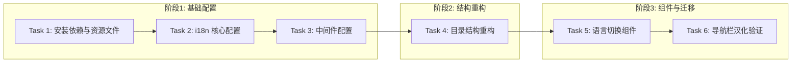

# Tasks: i18n 基础设施建设

## 概览

| 指标 | 值 |
|------|-----|
| 总任务数 | 6 |
| 涉及模块 | frontend/i18n, frontend/app |
| 涉及端 | Web |
| 预计总时间 | 60 分钟 |

## 任务依赖关系图

### 依赖关系速查表

| 任务 | 前置依赖 | 可并行 |
|------|----------|--------|
| Task 1: 安装依赖与资源文件 | 无 | - |
| Task 2: i18n 核心配置 | Task 1 | - |
| Task 3: 中间件配置 | Task 2 | - |
| Task 4: 目录结构重构 | Task 3 | - |
| Task 5: 语言切换组件 | Task 4 | - |
| Task 6: 导航栏汉化验证 | Task 5 | - |

## 任务清单

### 阶段1：基础配置

#### Task 1: 安装依赖与资源文件

| 属性 | 值 |
|------|-----|
| 文件 | `frontend/package.json` `frontend/messages/zh.json` `frontend/messages/en.json` |
| 操作 | 安装依赖 & 新增文件 |
| 内容 | 1. 安装 `next-intl` 2. 创建中英文资源文件，包含 Common 和 Navigation 命名空间 |
| 验证 | 命令: `cd frontend && npm list next-intl && test -f messages/zh.json && test -f messages/en.json` |
|      | 预期: 显示 next-intl 版本，且资源文件存在，退出码 0 |
| 预计 | 5 分钟 |
| 依赖 | 无 |

#### Task 2: i18n 核心配置

| 属性 | 值 |
|------|-----|
| 文件 | `frontend/src/i18n/routing.ts` `frontend/src/i18n/request.ts` `frontend/next.config.ts` |
| 操作 | 新增 & 修改 |
| 内容 | 1. 定义 locales 和 defaultLocale 2. 配置 request 获取 locale 3. 在 next.config.ts 中启用插件 |
| 验证 | 命令: `cd frontend && npm run build` (此时可能会因缺少中间件或文件结构未调整而失败，主要验证配置文件本身无语法错误) -> *修正策略: 使用 tsc 检查配置* 命令: `cd frontend && npx tsc --noEmit src/i18n/routing.ts src/i18n/request.ts` |
|      | 预期: 无 TypeScript 错误，退出码 0 |
| 预计 | 10 分钟 |
| 依赖 | Task 1 |

#### Task 3: 中间件配置

| 属性 | 值 |
|------|-----|
| 文件 | `frontend/src/middleware.ts` |
| 操作 | 新增 |
| 内容 | 创建 Middleware 处理 locale 匹配和重定向 |
| 验证 | 命令: `cd frontend && npx tsc --noEmit src/middleware.ts` |
|      | 预期: 无 TypeScript 错误，退出码 0 |
| 预计 | 5 分钟 |
| 依赖 | Task 2 |

### 阶段2：结构重构

#### Task 4: 目录结构重构

| 属性 | 值 |
|------|-----|
| 文件 | `frontend/src/app/[locale]/layout.tsx` `frontend/src/app/[locale]/page.tsx` `frontend/src/app/(dashboard)` (移动) `frontend/src/app/layout.tsx` (删除) |
| 操作 | 重构 |
| 内容 | 1. 创建动态路由 `[locale]` 2. 移动 dashboard 到 `[locale]` 下 3. 新建 RootLayout 并包裹 `NextIntlClientProvider` 4. 删除旧 RootLayout |
| 验证 | 命令: `cd frontend && npm run build` |
|      | 预期: 编译成功，退出码 0 (此时应用应能正常构建) |
| 预计 | 20 分钟 |
| 依赖 | Task 3 |

### 阶段3：组件与迁移

#### Task 5: 语言切换组件

| 属性 | 值 |
|------|-----|
| 文件 | `frontend/src/components/LanguageSwitcher.tsx` `frontend/src/app/[locale]/(dashboard)/layout.tsx` |
| 操作 | 新增 & 修改 |
| 内容 | 1. 创建切换组件 (使用 `usePathname`, `useRouter` from `src/i18n/routing`) 2. 集成到 Dashboard Layout |
| 验证 | 命令: `cd frontend && npm run build` |
|      | 预期: 编译成功，退出码 0 |
| 预计 | 10 分钟 |
| 依赖 | Task 4 |

#### Task 6: 导航栏汉化验证

| 属性 | 值 |
|------|-----|
| 文件 | `frontend/src/app/[locale]/(dashboard)/layout.tsx` |
| 操作 | 修改 |
| 内容 | 将侧边栏导航文本替换为 `t('Navigation.xxx')`，验证 i18n 链路 |
| 验证 | 命令: `cd frontend && npm run build` |
|      | 预期: 编译成功，退出码 0 |
| 预计 | 10 分钟 |
| 依赖 | Task 5 |

## 检查点策略

| 时机 | 操作 |
|------|------|
| Task 4 完成后 | 核心结构重构完成，必须确保 `npm run build` 通过 |
| Task 6 完成后 | 整体功能验证，建议启动开发服务器手动验证语言切换 |

## 风险提醒

| 任务 | 风险 | 应对 |
|------|------|------|
| Task 4 | 移动大量文件可能导致 Git 追踪丢失 | 使用 `git mv` 或在 IDE 中小心操作 |
| Task 4 | 路由变更导致硬编码的 Link 失效 | 暂时只关注结构，Link 修复作为后续 Bug Fix |
