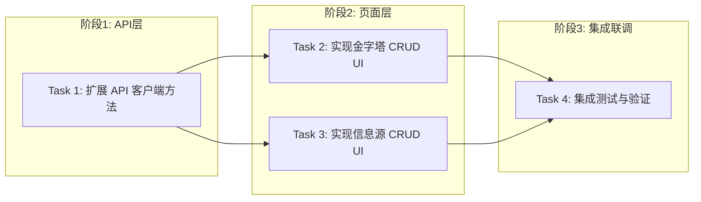

# Tasks: 手动增删改查 (Pyramids & Sources)

## 概览

| 指标 | 值 |
|------|-----|
| 总任务数 | 4 |
| 涉及模块 | frontend |
| 涉及端 | Web |
| 预计总时间 | 60 分钟 |

## 任务依赖关系图

### 依赖关系速查表

| 任务 | 前置依赖 | 可并行 |
|------|----------|--------|
| Task 1 | 无 | - |
| Task 2 | Task 1 | ✅ 与 Task 3 并行 |
| Task 3 | Task 1 | ✅ 与 Task 2 并行 |
| Task 4 | Task 2, Task 3 | - |

## 任务清单

### 阶段1：API层

#### Task 1: 扩展 API 客户端方法

| 属性 | 值 |
|------|-----|
| 文件 | `frontend/src/lib/api.ts` |
| 操作 | 修改 |
| 内容 | 增加 `pyramidApi.update`, `pyramidApi.delete`, `sourceApi.update`, `sourceApi.delete` 方法 |
| 验证 | 命令: `cd frontend && npm run build` |
|      | 预期: 编译成功，无类型错误 |
| 预计 | 10 分钟 |
| 依赖 | 无 |

### 阶段2：页面层

#### Task 2: 实现金字塔 CRUD UI

| 属性 | 值 |
|------|-----|
| 文件 | `frontend/src/app/(dashboard)/pyramid/page.tsx` |
| 操作 | 修改 |
| 内容 | 1. 完善“新建金字塔”弹窗及提交逻辑 2. 增加“编辑金字塔”按钮及弹窗 3. 增加“删除金字塔”按钮及二次确认逻辑 |
| 验证 | 命令: `cd frontend && npm run build` |
|      | 预期: 编译成功，页面交互正常 |
| 预计 | 25 分钟 |
| 依赖 | Task 1 |

#### Task 3: 实现信息源 CRUD UI

| 属性 | 值 |
|------|-----|
| 文件 | `frontend/src/app/(dashboard)/sources/page.tsx` |
| 操作 | 修改 |
| 内容 | 1. 增加“编辑信息源”按钮及弹窗 2. 增加“删除信息源”按钮及二次确认逻辑 |
| 验证 | 命令: `cd frontend && npm run build` |
|      | 预期: 编译成功，页面交互正常 |
| 预计 | 20 分钟 |
| 依赖 | Task 1 |

### 阶段3：集成联调

#### Task 4: 集成测试与验证

| 属性 | 值 |
|------|-----|
| 内容 | 手动验证金字塔和信息源的增删改查完整流程 |
| 验证 | 命令: `cd frontend && npm run build` |
|      | 预期: 所有功能点符合需求文档 AC |
| 预计 | 5 分钟 |
| 依赖 | Task 2, Task 3 |

## 检查点策略

| 时机 | 操作 |
|------|------|
| 每个任务完成后 | 验证 → git commit |
| 全部完成后 | 集成测试 → git push |

## 风险提醒

| 任务 | 风险 | 应对 |
|------|------|------|
| Task 2/3 | 删除操作无误删防护 | 增加明确的二次确认弹窗 |
