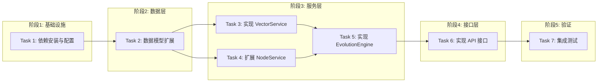

# Tasks: AI 辅助金字塔进化 (Pyramid Evolution)

## 概览

| 指标 | 值 |
|------|-----|
| 总任务数 | 7 |
| 涉及模块 | evolution, node, vector |
| 涉及端 | Server |
| 预计总时间 | 120 分钟 |

## 任务依赖关系图

### 依赖关系速查表

| 任务 | 前置依赖 | 可并行 |
|------|----------|--------|
| Task 1 | 无 | - |
| Task 2 | Task 1 | - |
| Task 3 | Task 2 | ✅ 与 Task 4 并行 |
| Task 4 | Task 2 | ✅ 与 Task 3 并行 |
| Task 5 | Task 3, Task 4 | - |
| Task 6 | Task 5 | - |
| Task 7 | Task 6 | - |

## 任务清单

### 阶段1: 基础设施

#### Task 1: 依赖安装与配置

| 属性 | 值 |
|------|-----|
| 文件 | `backend/requirements.txt` |
| 操作 | 修改 |
| 内容 | 新增 `chromadb`, `sentence-transformers` 依赖 |
| 验证 | 命令: `cd backend && pip install -r requirements.txt && python -c "import chromadb"` |
|      | 预期: 安装成功，无导入错误 |
| 预计 | 10 分钟 |
| 依赖 | 无 |

### 阶段2: 数据层

#### Task 2: 数据模型扩展

| 属性 | 值 |
|------|-----|
| 文件 | `backend/app/models/pyramid.py`, `backend/app/models/content.py`, `backend/alembic/versions/*` |
| 操作 | 修改 + 新增迁移 |
| 内容 | `PyramidNode` 增加统计字段，`ContentNodeRelation` 优化字段，生成并执行迁移 |
| 验证 | 命令: `cd backend && python -m alembic upgrade head && python -c "from app.models.pyramid import PyramidNode"` |
|      | 预期: 迁移成功，模型字段正确 |
| 预计 | 15 分钟 |
| 依赖 | Task 1 |

### 阶段3: 服务层

#### Task 3: 实现 VectorService

| 属性 | 值 |
|------|-----|
| 文件 | `backend/app/services/vector_service.py` |
| 操作 | 新增 |
| 内容 | 封装 ChromaDB 客户端，实现文本向量化(Embedding)和相似度检索 |
| 验证 | 命令: `cd backend && python -m pytest tests/unit/test_vector_service.py` (需新建测试) |
|      | 预期: 测试通过，能正确存取向量 |
| 预计 | 25 分钟 |
| 依赖 | Task 2 |

#### Task 4: 扩展 NodeService

| 属性 | 值 |
|------|-----|
| 文件 | `backend/app/services/node_service.py` |
| 操作 | 修改 |
| 内容 | 实现 `link_content`, `unlink_content`，包含事务处理和统计同步 |
| 验证 | 命令: `cd backend && python -m pytest tests/unit/test_node_service.py` (需新建测试) |
|      | 预期: 关联操作正确，统计字段自动更新 |
| 预计 | 20 分钟 |
| 依赖 | Task 2 |

#### Task 5: 实现 EvolutionEngine

| 属性 | 值 |
|------|-----|
| 文件 | `backend/app/services/evolution_engine.py` |
| 操作 | 新增 |
| 内容 | 实现 `auto_classify_content` (自动归类) 和 `discover_clusters` (聚类发现) |
| 验证 | 命令: `cd backend && python -m pytest tests/unit/test_evolution_engine.py` (需新建测试) |
|      | 预期: 自动归类逻辑正确调用 VectorService 和 NodeService |
| 预计 | 25 分钟 |
| 依赖 | Task 3, Task 4 |

### 阶段4: 接口层

#### Task 6: 实现 API 接口

| 属性 | 值 |
|------|-----|
| 文件 | `backend/app/routers/evolution.py`, `backend/app/routers/nodes.py`, `backend/app/main.py` |
| 操作 | 新增/修改 |
| 内容 | 暴露进化操作接口和节点内容管理接口，注册 Router |
| 验证 | 命令: `curl -X POST http://localhost:8000/api/v1/evolution/classify` |
|      | 预期: 接口响应 200 OK |
| 预计 | 15 分钟 |
| 依赖 | Task 5 |

### 阶段5: 验证

#### Task 7: 集成测试

| 属性 | 值 |
|------|-----|
| 文件 | `backend/tests/integration/test_evolution_flow.py` |
| 操作 | 新增 |
| 内容 | 编写 E2E 测试：抓取 -> 向量化 -> 自动归类 -> 验证关联 -> 验证统计 |
| 验证 | 命令: `cd backend && python -m pytest tests/integration/test_evolution_flow.py` |
|      | 预期: 全流程测试通过 |
| 预计 | 10 分钟 |
| 依赖 | Task 6 |

## 检查点策略

| 时机 | 操作 |
|------|------|
| 每个任务完成后 | 验证 → git commit |
| Task 5 完成后 | 重点验证自动归类准确性 |
| 全部完成后 | 集成测试 → git push |
