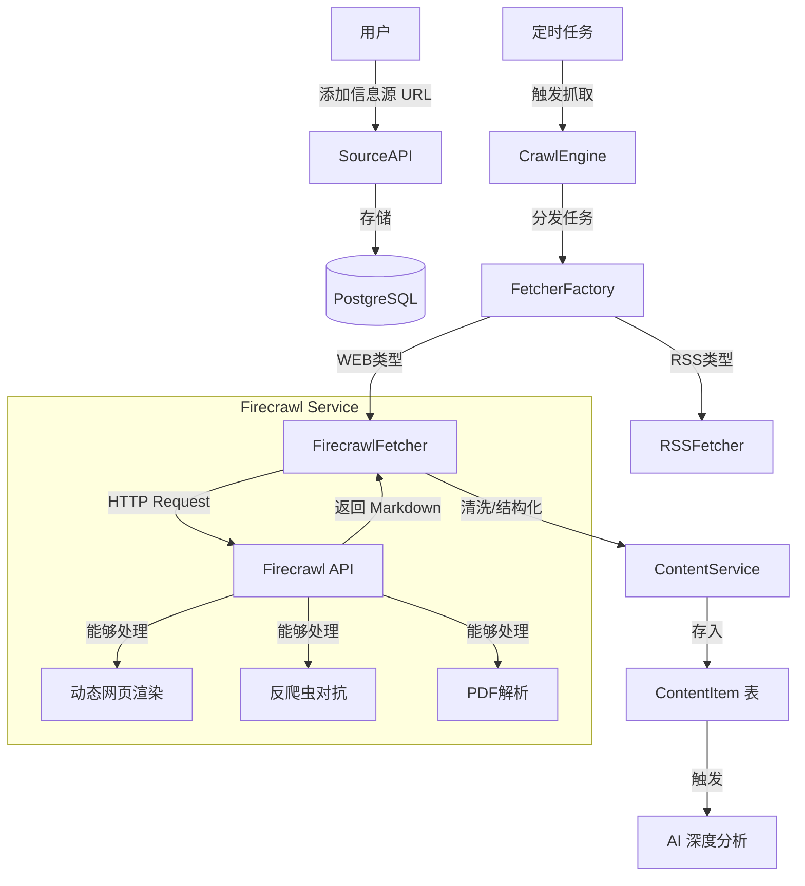

# Firecrawl 集成方案

## 1. 集成架构

Firecrawl 将作为 Knowledge Radar 的核心 **抓取与解析引擎 (Crawl & Parse Engine)**，接管所有 `WEB` 类型信息源的抓取任务。



## 2. 核心价值

引入 Firecrawl 解决当前项目的核心痛点：
1.  **高质量内容提取**：直接获取 `Markdown` 格式，完美适配后续的大模型处理（LLM-ready），省去了复杂的 HTML 清洗步骤。
2.  **动态网页支持**：解决 React/Vue 等单页应用（SPA）无法通过简单 `requests` 抓取的问题。
3.  **统一接口**：无论是网页、PDF 还是图片，Firecrawl 都提供统一的 API 接口。

## 3. 实施步骤

### 第一步：引入依赖

在 `backend/requirements.txt` 中添加官方 Python SDK：

```text
firecrawl-py>=0.0.20
```

### 第二步：配置环境变量

在 `backend/.env` (及 `.env.local`) 中添加：

```bash
# Firecrawl 配置
# 选项 1: 使用官方云服务 (推荐初期使用，快速验证)
FIRECRAWL_API_URL=https://api.firecrawl.dev
FIRECRAWL_API_KEY=fc-YOUR_API_KEY

# 选项 2: 自托管 (后期成本优化)
# FIRECRAWL_API_URL=http://localhost:3002
# FIRECRAWL_API_KEY=
```

### 第三步：实现 Fetcher

新建 `backend/app/services/fetchers/firecrawl_fetcher.py`：

```python
from firecrawl import FirecrawlApp
from app.core.config import settings

class FirecrawlFetcher:
    def __init__(self):
        self.app = FirecrawlApp(api_key=settings.FIRECRAWL_API_KEY, api_url=settings.FIRECRAWL_API_URL)

    async def fetch(self, url: str) -> dict:
        # 使用 scrape 获取单页内容，或者 crawl 获取全站
        params = {
            'pageOptions': {
                'onlyMainContent': True  # 智能提取正文
            }
        }
        # Firecrawl SDK 目前主要是同步的，建议在异步中运行或使用 async 客户端(如有)
        # 这里演示逻辑
        result = self.app.scrape_url(url, params=params)
        return self._map_to_content_item(result)

    def _map_to_content_item(self, data: dict) -> dict:
        return {
            "title": data.get("metadata", {}).get("title"),
            "content_text": data.get("markdown"),  # 核心价值：直接拿 Markdown
            "summary": data.get("metadata", {}).get("description"),
            "url": data.get("metadata", {}).get("sourceURL"),
            # ... 其他字段映射
        }
```

### 第四步：集成到 CrawlEngine

修改 `backend/app/services/crawl_engine.py`，在 `get_fetcher` 工厂中接入：

```python
def get_fetcher(source_type: str):
    if source_type == "WEB":
        return FirecrawlFetcher()
    # ... 其他类型
```

## 4. 两种部署模式对比

| 特性 | SaaS 模式 (Cloud) | 自托管模式 (Self-hosted) | 建议 |
| :--- | :--- | :--- | :--- |
| **部署成本** | 零 | 高 (需 Redis, Playwright 服务) | **初期选 SaaS** |
| **运维难度** | 低 | 高 (需维护浏览器集群) | **初期选 SaaS** |
| **数据隐私** | 数据经过第三方 | 数据完全私有 | **敏感数据选自托管** |
| **费用** | 按量付费 (有免费额度) | 服务器资源费用 | **量大时自托管更优** |

## 5. 建议路径

1.  **快速验证 (MVP)**：直接申请 Firecrawl API Key，使用 **SaaS 模式** 完成代码集成，跑通 `URL -> Markdown -> AI` 的全链路。
2.  **成本优化**：当抓取量级上来后，或有特殊隐私需求时，使用 Docker Compose 在本地部署 Firecrawl，只需修改 `.env` 中的 `FIRECRAWL_API_URL` 即可无缝切换。
