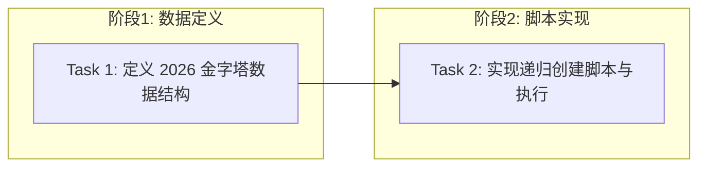

# Tasks: Seed Data Expansion (2026 Frontier Edition)

## 概览

| 指标 | 值 |
|------|-----|
| 总任务数 | 2 |
| 涉及模块 | backend |
| 涉及端 | Backend |
| 预计总时间 | 30 分钟 |
| 测试场景总数 | 4 个 |
| 测试层级分布 | 单元: 0, 集成: 2, E2E: 0, 脚本: 2 |

## 任务依赖关系图

### 依赖关系速查表

| 任务 | 前置依赖 | 可并行 |
|------|----------|--------|
| Task 1 | 无 | - |
| Task 2 | Task 1 | - |

## 任务清单

### 阶段1：数据定义

#### Task 1: 定义 2026 金字塔数据结构

| 属性 | 值 |
|------|-----|
| 文件 | `backend/app/data/seed_content_2026.py`, `backend/app/data/__init__.py` |
| 操作 | 新增 |
| 内容 | 创建包含4个新金字塔的完整 Python 字典列表 |
| 验证 | 命令: `cd backend && python -c "from app.data.seed_content_2026 import SEEDED_PYRAMIDS; print(len(SEEDED_PYRAMIDS))"` |
|      | 预期: 输出 `4`，退出码 0 |
| 预计 | 15 分钟 |
| 依赖 | 无 |
| 测试 | 层级: 无需独立测试 |
|      | 场景: 数据文件验证通过导入检查即可 |

### 阶段2：脚本实现

#### Task 2: 实现递归创建脚本与执行

| 属性 | 值 |
|------|-----|
| 文件 | `backend/scripts/seed_data.py` |
| 操作 | 修改 |
| 内容 | 实现 `create_node_recursive` 函数，引入 `SEEDED_PYRAMIDS`，添加幂等性检查，执行数据注入 |
| 验证 | 命令: `cd backend && python scripts/seed_data.py` |
|      | 预期: 日志显示 "Created Pyramid: ..." 且无报错，退出码 0 |
| 预计 | 15 分钟 |
| 依赖 | Task 1 |
| 测试 | 层级: 脚本验证 |
|      | 场景: ① 正常注入：4个金字塔全部创建成功 ② 幂等性：再次运行脚本，提示 "Skipping existing pyramid" ③ 层级检查：验证子节点的 path 字段是否正确 |
|      | TDD节奏: 先实现逻辑，后运行验证 |

## 检查点策略

| 时机 | 操作 |
|------|------|
| Task 1 完成后 | 验证数据导入无误 → git commit |
| Task 2 完成后 | 执行脚本注入数据 → 验证数据库内容 → git commit |
| 全部完成后 | 启动应用查看金字塔列表 → git push |

## 风险提醒

| 任务 | 风险 | 应对 |
|------|------|------|
| Task 2 | Path 字段拼接错误 | 在脚本中添加断言，确保 `path` 以 `/` 结尾且包含父节点 ID |
