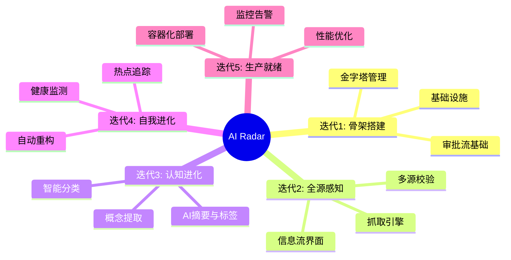
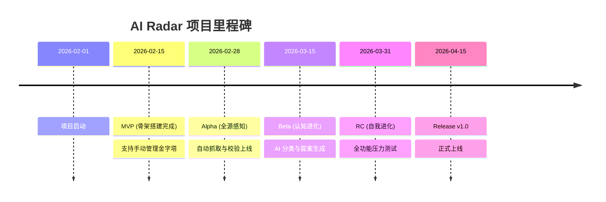
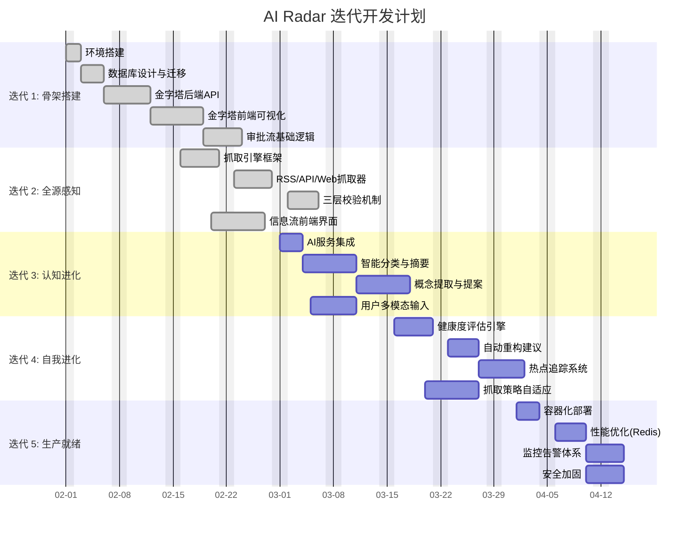
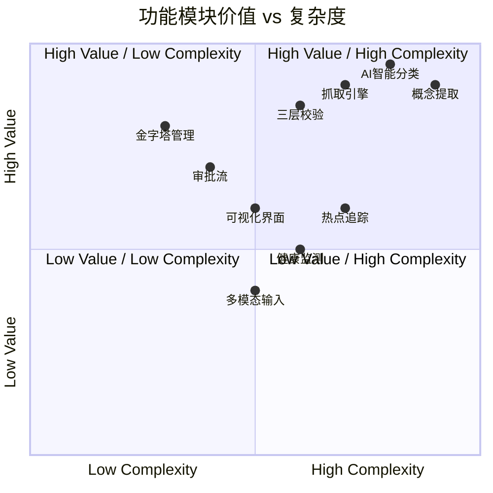
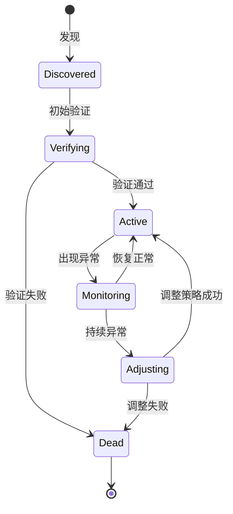
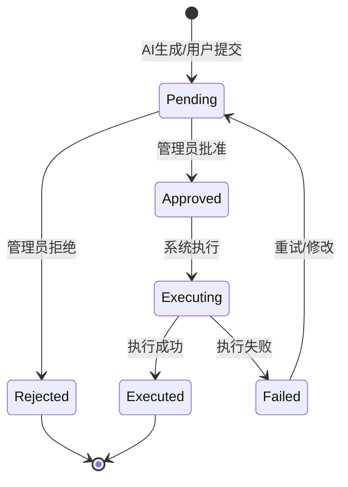

# 项目路线图

## 总体规划

### 核心演进路线 (Mindmap)

### 里程碑时间轴 (Timeline)

## 详细迭代计划 (Gantt)

## 价值与复杂度分析 (Quadrant)

## 状态流转图 (State Diagram)

### 信息源生命周期

### 变更提案审批流

## 风险评估 (Risk Assessment)

| 风险类别 | 风险描述 | 可能性 | 影响程度 | 缓解措施 |
|----------|----------|--------|----------|----------|
| **技术风险** | AI 幻觉导致错误分类或摘要 | 中 | 高 | 引入人工审批流 (Human-in-the-loop)；多模型交叉验证 |
| **法律风险** | 抓取数据侵犯版权或违反 robots.txt | 低 | 高 | 严格遵守 robots.txt；建立白名单机制；仅抓取摘要/元数据 |
| **性能风险** | 随着信息源增加，抓取和处理延迟过高 | 高 | 中 | 引入分布式任务队列 (Celery)；实现增量抓取；缓存热点数据 |
| **依赖风险** | 硅基流动 API 不稳定或涨价 | 中 | 中 | 设计适配器模式支持多 LLM 切换；建立本地缓存 |

## 资源需求 (Resource Requirements)

### 人力资源
- **后端开发**: 1人 (Python/FastAPI)
- **前端开发**: 1人 (Next.js/React)
- **产品/测试**: 0.5人 (兼任)

### 基础设施
- **开发环境**: 本地 Docker Desktop
- **生产环境**: 
  - 应用服务器: 2核 4G * 2
  - 数据库: PostgreSQL (云托管或自建)
  - 缓存: Redis (可选)
- **外部服务**:
  - 硅基流动 API (LLM)
  - 代理池 (可选，用于反爬虫)

## 成功度量 (Success Metrics)

| 维度 | 指标 | 目标值 (v1.0) |
|------|------|---------------|
| **覆盖度** | 接入高质量信息源数量 | > 50 个 |
| **准确度** | 自动分类准确率 | > 85% |
| **效率** | 从信息发现到入库的平均延迟 | < 10 分钟 |
| **活跃度** | 每日生成有效提案数量 | > 20 个 |
| **稳定性** | 系统可用性 | > 99.5% |
