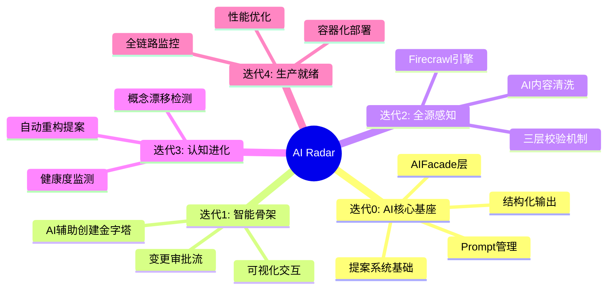
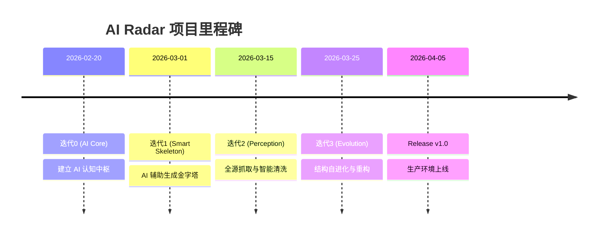
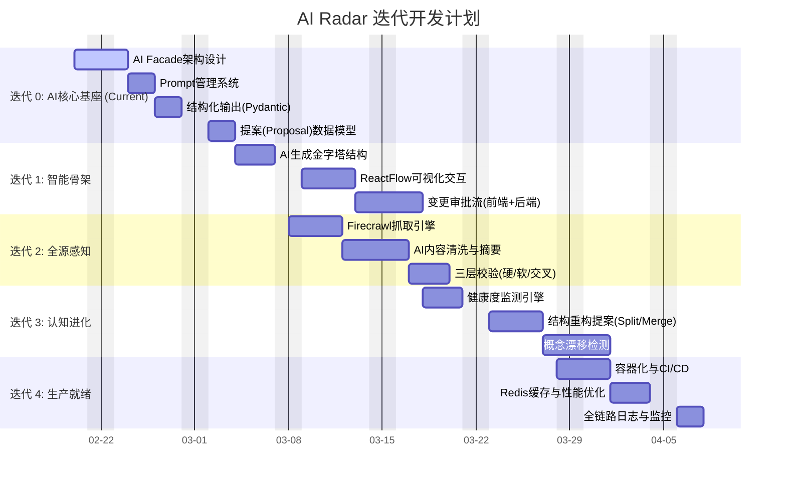
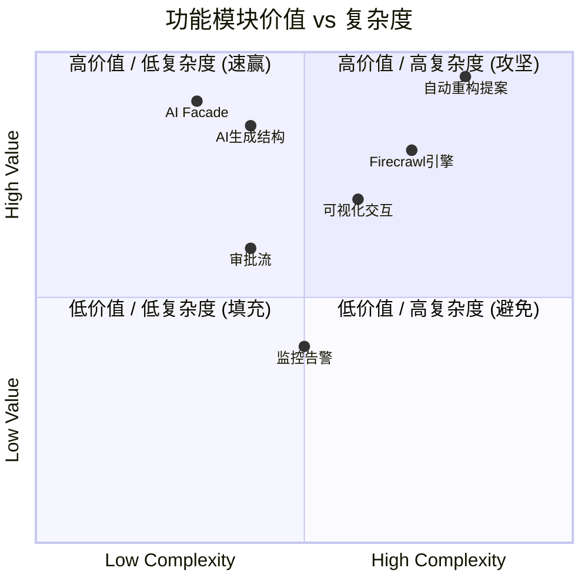

# 项目路线图 (Project Roadmap)

> **最后更新**: 2026-02-20
> **核心原则**: AI-First (AI优先), Evolution-Driven (进化驱动)
> **状态**: 🟢 进行中

## 总体规划 (Master Plan)

### 核心演进路线 (Mindmap)

### 里程碑时间轴 (Timeline)

## 详细迭代计划 (Gantt)

## 迭代详情

### 迭代 0: AI核心基座 (AI Core Infrastructure)
> **目标**: 建立"AI-First"的技术底座，确保所有业务功能都能调用统一的 AI 能力。

- **核心任务**:
    - [ ] **AI Facade**: 封装 LLM 调用，支持多模型切换 (SiliconFlow/DeepSeek)。
    - [ ] **Prompt Manager**: 建立 Prompt 模板版本管理机制。
    - [ ] **Structured Output**: 封装 `Instructor` 或类似库，确保 AI 输出严格符合 Pydantic Schema。
    - [ ] **Proposal System**: 定义 `ChangeProposal` 和 `AISuggestion` 的数据库模型。

### 迭代 1: 智能骨架 (Smart Skeleton)
> **目标**: 实现"AI 提议 -> 人类决策"的交互闭环，完成金字塔的智能创建。

- **核心任务**:
    - [ ] **AI-Assisted Creation**: 用户输入意图 -> AI 生成金字塔结构 JSON。
    - [ ] **Visual Interaction**: 前端使用 ReactFlow 展示 AI 生成的结构，允许用户微调。
    - [ ] **Approval Workflow**: 实现"提案-审批-执行"的状态流转。

### 迭代 2: 全源感知 (Intelligent Perception)
> **目标**: 接入外部信息源，并利用 AI 进行高质量清洗。

- **核心任务**:
    - [ ] **Crawl Engine**: 集成 Firecrawl，处理动态网页。
    - [ ] **AI Processing**: 对抓取内容进行摘要、标签提取、情感分析。
    - [ ] **Validation Pipeline**: 实现硬性规则 + AI 软性校验。

### 迭代 3: 认知进化 (Cognitive Evolution)
> **目标**: 让系统具备生命力，能主动发现结构问题。

- **核心任务**:
    - [ ] **Health Monitor**: 定期扫描金字塔，计算节点健康度 (信息熵/拥挤度)。
    - [ ] **Evolution Strategy**: 实现节点拆分 (Split) 和合并 (Merge) 的算法策略。
    - [ ] **Drift Detection**: 识别新出现的概念热点。

## 价值与复杂度分析

## 资源需求

- **LLM Token**: 预计开发期每日消耗 1M Tokens (DeepSeek-V3)。
- **Crawl Service**: Firecrawl API额度或自建服务。
- **Database**: PostgreSQL (生产) / SQLite (开发)。

## 风险评估

| 风险类别 | 风险描述 | 缓解措施 |
|----------|----------|----------|
| **AI 幻觉** | AI 生成错误的金字塔结构或分类 | 必须经过**可视化确认**和**人工审批** (HitL)。 |
| **结构稳定性** | 频繁的自动重构导致用户迷失 | 限制重构频率，保留历史版本快照。 |
| **抓取反爬** | 目标站点反爬策略升级 | 使用 Firecrawl 代理池，设置礼貌抓取间隔。 |
