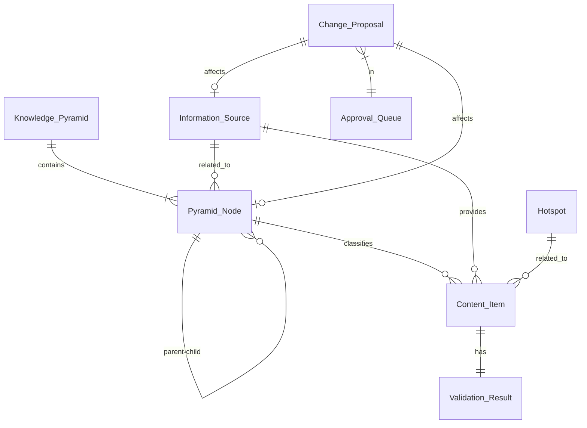

# 需求分析

## 核心价值分析

AI Radar 旨在构建一个**自进化的知识聚合平台**，解决大模型领域知识爆炸、更新快、碎片化的问题。其核心价值在于：

1. **结构化**：通过知识金字塔将碎片信息组织成体系
2. **进化性**：系统能感知新概念并自动调整知识结构
3. **可靠性**：通过三层校验机制确保信息质量
4. **协作性**：AI 负责繁琐的收集整理，人类负责高阶决策

## 用户角色分析

| 角色 | 职责 | 核心需求 |
|------|------|----------|
| **终端用户** | 浏览信息、学习知识、贡献内容 | 获取最新、最准的 AI 知识；直观查看知识体系；便捷贡献 |
| **系统管理员** | 管理系统、审批变更、监控健康 | 维护系统稳定；把控知识结构演进方向；管理信息源 |
| **AI Agent** | 抓取、校验、分类、生成提案 | 自动化执行任务；准确理解内容；生成高质量建议 |

## 核心实体关系分析



## 关键流程分析

### 1. 信息获取与处理流程
```
信息源 -> 抓取引擎 -> 去重 -> 硬性校验 -> 软性校验 -> 交叉验证 -> 摘要/标签 -> 分类 -> 入库
```

### 2. 系统进化流程
```
新内容 -> 概念提取 -> 发现新概念/关系 -> 生成变更提案 -> 审批队列 -> 管理员审批 -> 执行变更 -> 知识金字塔更新
```

### 3. 信息源生命周期
```
发现 -> 验证 -> 活跃 <-> 监测 -> 调整 -> 淘汰
```

## 技术难点与风险

1. **信息源稳定性**：外部源结构变化可能导致抓取失败 -> 需建立健康监测和自动调整机制
2. **内容质量控制**：AI 幻觉可能导致校验失效 -> 需引入多源交叉验证和人工抽检
3. **概念漂移检测**：准确判断术语含义变化较难 -> 需积累历史上下文数据
4. **大规模图数据**：金字塔节点增多后查询性能 -> 需优化递归查询和缓存策略

## 迭代策略建议

建议采用 **"骨架 -> 血肉 -> 灵魂"** 的演进路线：

1. **迭代 1 (骨架)**：实现金字塔管理、基础内容存储、人工审批流
2. **迭代 2 (血肉)**：实现抓取引擎、基础校验、信息流展示
3. **迭代 3 (灵魂)**：实现 AI 深度分析、概念提取、自动进化建议
