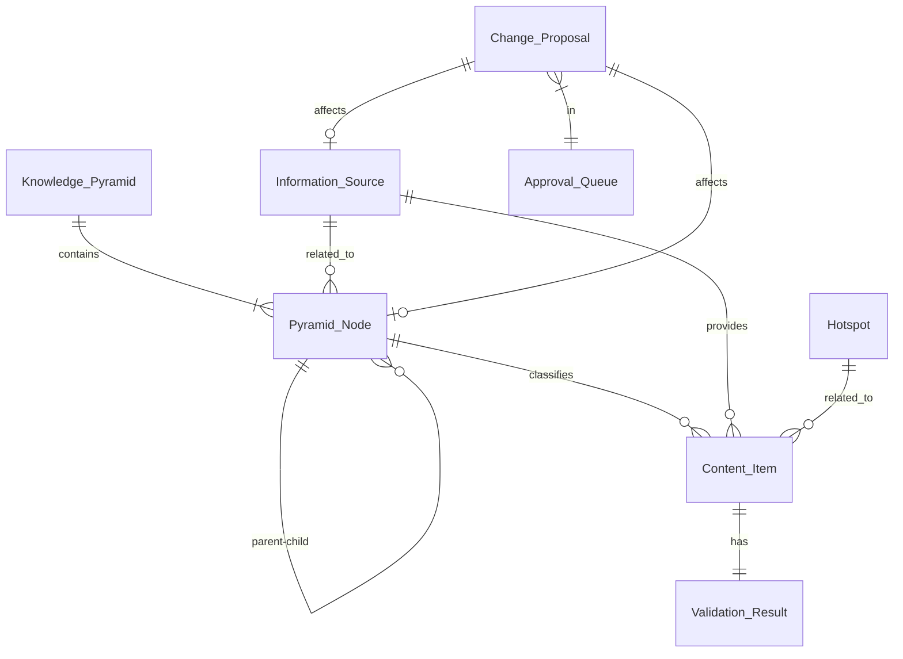

# 需求分析

> **基于**：[核心哲学文档](./core-philosophy.md)  
> **原则**：AI-First, Human-in-the-Loop, Evolution-Driven

## 核心价值重新定义

AI Radar 是一个**AI驱动的认知系统**，而不是传统的知识管理工具。

### 价值主张

**传统知识管理系统的问题**：
- 需要人工组织知识结构
- 需要人工分类每条内容
- 需要人工发现知识缺口
- 系统是被动的工具

**AI Radar的解决方案**：
- AI理解用户意图并生成知识结构
- AI自动分析和分类内容
- AI主动发现知识缺口并建议优化
- 系统是主动的认知体

### 核心价值

1. **智能化**：AI完成所有信息加工工作
   - 用户只需描述意图，AI生成完整结构
   - 用户只需提交内容，AI自动分析分类
   - 用户只需审批决策，AI处理繁琐工作

2. **即时性**：用户立即看到AI的理解和建议
   - 不是"提交后等待"，而是"提交即分析"
   - 不是"后台处理"，而是"实时反馈"
   - 不是"黑盒操作"，而是"透明展示"

3. **进化性**：系统持续自我优化
   - 主动发现结构问题
   - 主动生成优化建议
   - 从用户反馈中学习

4. **协作性**：最佳的人机协作模式
   - AI负责理解和建议
   - 人类负责确认和决策
   - 双方各司其职，优势互补

## 用户角色重新定义

基于AI-First原则，用户角色发生了根本变化：

| 角色 | 传统定位 | AI-First定位 | 核心需求 |
|------|---------|-------------|----------|
| **终端用户** | 信息消费者 | **决策参与者** | 看到AI的理解、确认AI的建议、修正AI的判断 |
| **系统管理员** | 系统维护者 | **方向把控者** | 审批AI提案、制定规则、监控系统健康 |
| **AI系统** | 辅助工具 | **认知核心** | 理解所有输入、生成所有建议、主动发现问题 |

### 角色职责详解

#### 终端用户（从操作者到决策者）

**不再做**：
- ❌ 手动创建每个节点
- ❌ 手动分类每条内容
- ❌ 手动组织知识结构

**现在做**：
- ✅ 描述意图，让AI生成结构
- ✅ 确认AI的分类建议
- ✅ 修正AI的理解偏差

**交互模式**：
```
用户：我想创建一个关于MCP的知识图谱
AI：我理解MCP是Model Context Protocol，建议创建以下结构...
用户：确认 / 修改 / 重新生成
```

#### 系统管理员（从维护者到把控者）

**不再做**：
- ❌ 手动调整系统配置
- ❌ 手动发现系统问题
- ❌ 手动优化知识结构

**现在做**：
- ✅ 审批AI生成的变更提案
- ✅ 制定系统进化的方向和规则
- ✅ 监控AI的工作质量

**决策场景**：
- AI建议拆分某个节点 → 管理员审批
- AI建议淘汰某个信息源 → 管理员审批
- AI建议调整抓取策略 → 管理员审批

#### AI系统（从工具到核心）

**职责**：
- ✅ 理解所有用户输入的语义
- ✅ 分析所有内容并提取结构化信息
- ✅ 生成所有分类和优化建议
- ✅ 主动发现系统问题
- ✅ 从用户反馈中学习

**不做**：
- ❌ 不自动执行结构变更（需人类审批）
- ❌ 不自动删除内容（需人类确认）
- ❌ 不自动调整重要配置（需人类决策）

## 核心实体关系分析



## 关键流程重新设计（基于AI-First）

### 1. 用户创建金字塔（AI辅助模式）

**传统流程**（错误）：
```
用户填表单 → 保存到数据库 → 返回成功 → 用户手动创建节点
```

**AI-First流程**（正确）：
```
用户输入描述 → AI理解语义 → AI生成完整结构 → 
展示给用户（可视化） → 用户确认/修改 → 创建金字塔
```

**关键点**：
- AI必须参与理解用户意图
- 用户必须能看到AI生成的结构
- 用户必须能修改AI的建议

### 2. 用户提交内容（即时处理模式）

**传统流程**（错误）：
```
用户提交URL → 保存为PENDING → 返回"已提交" → 
后台异步处理 → 用户看不到结果
```

**AI-First流程**（正确）：
```
用户提交URL → 立即抓取 → AI立即分析 → 
返回分析结果（摘要、概念、分类建议） → 
用户确认分类 → 保存到知识库
```

**关键点**：
- AI处理必须同步（<5秒）
- 用户必须立即看到AI分析结果
- 用户必须能修正AI的分类

### 3. 信息源抓取与处理（AI全程参与）

**流程**：
```
定时触发 → 抓取内容 → 
AI质量评估 → AI生成摘要 → AI提取概念 → 
AI推荐分类 → 自动分类（高置信度）或人工确认（低置信度）
```

**关键点**：
- 每条内容都经过AI处理
- AI评估质量并过滤低质内容
- AI自动分类，人工兜底

### 4. 系统进化流程（AI主动发现）

**流程**：
```
AI持续监测 → 发现问题（结构不平衡、内容过载、知识缺口） → 
生成优化提案 → 提交审批队列 → 
管理员审批 → 执行变更 → 记录效果 → AI学习
```

**关键点**：
- AI主动发现问题（不等人类发现）
- AI生成具体的优化方案
- 人类审批把控方向
- 系统从反馈中学习

## 技术挑战与应对（基于AI-First）

### 挑战1：AI响应时间

**问题**：AI处理需要时间，可能影响用户体验

**应对**：
- 设置严格超时（5秒）
- 使用流式响应提升体验
- 实现智能缓存
- 提供降级方案

### 挑战2：AI准确率

**问题**：AI可能理解错误或生成不合理建议

**应对**：
- 人类审批机制（Human-in-the-Loop）
- 显示置信度和备选方案
- 允许用户修正AI理解
- 从用户反馈中学习

### 挑战3：AI成本

**问题**：频繁调用AI服务成本较高

**应对**：
- 智能缓存相似请求
- 批量处理优化
- 使用更便宜的模型处理简单任务
- 本地模型处理部分任务

### 挑战4：系统复杂度

**问题**：AI-First架构比传统CRUD复杂

**应对**：
- 清晰的架构分层
- 统一的AI能力门面
- 完善的文档和示例
- 渐进式实现

### 挑战5：用户信任

**问题**：用户可能不信任AI的建议

**应对**：
- 透明展示AI推理过程
- 显示置信度
- 提供备选方案
- 允许用户修改
- 记录并展示AI的准确率

## 迭代策略（基于AI-First原则）

### 总体策略

**不是**："骨架 → 血肉 → 灵魂"  
**而是**："AI核心 → 人机协作 → 持续进化"

### 迭代重新规划

#### 迭代 0：AI核心能力建设（新增）
**目标**：建立AI-First的基础设施

**内容**：
- 创建AI Core层（AIFacade）
- 实现基础AI能力（理解、分析、生成）
- 设计两阶段API模式
- 建立AI推理记录机制

**验收标准**：
- AI能理解用户描述并生成结构
- AI能分析内容并提取概念
- 所有AI调用都记录推理过程

#### 迭代 1：人机协作基础
**目标**：实现核心的人机协作流程

**内容**：
- 金字塔AI辅助创建（suggest + confirm）
- 内容即时AI处理
- 审批流程基础
- 前端AI交互组件

**验收标准**：
- 用户能看到AI生成的建议
- 用户能修改AI的建议
- 用户能确认并执行

#### 迭代 2：全源感知（保持）
**目标**：建立信息获取能力

**内容**：
- 抓取引擎（AI质量评估）
- 三层校验（AI软性校验）
- 信息源AI分析
- 自动分类（AI推荐）

**验收标准**：
- 所有内容都经过AI处理
- AI自动分类准确率>85%

#### 迭代 3：主动进化
**目标**：系统主动发现问题并建议优化

**内容**：
- AI健康检测
- AI生成重构建议
- 热点追踪
- 概念漂移检测

**验收标准**：
- AI能主动发现结构问题
- AI能生成具体优化方案
- 管理员能审批AI提案

#### 迭代 4：持续优化
**目标**：从反馈中学习，持续提升

**内容**：
- 用户反馈收集
- AI模型优化
- Prompt优化
- 性能优化

**验收标准**：
- AI准确率持续提升
- 用户满意度>4.0/5.0

### 关键差异

| 维度 | 传统迭代 | AI-First迭代 |
|------|---------|-------------|
| 起点 | 数据模型和CRUD | AI核心能力 |
| 重点 | 功能完整性 | 人机协作体验 |
| 验收 | 功能可用 | AI参与度和准确率 |
| 目标 | 完成功能列表 | 实现智能协作 |
