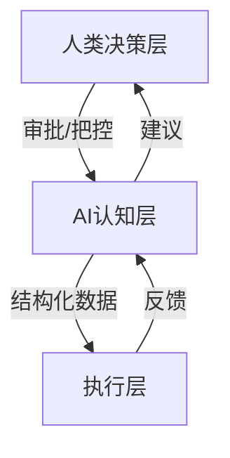

# 需求文档 (System Requirements)

> **重要**：本文档是 Knowledge Radar 的顶层需求总纲，基于 [核心哲学文档](./core-philosophy.md) 编写。
> 
> **SSOT 导航**: 具体的功能需求细节，请查阅 [功能矩阵 (Features Matrix)](./features/README.md)。

## 1. 系统愿景

AI Radar 是一个**AI驱动的认知系统**，用于组织和理解AI应用领域的知识。系统的核心是AI认知能力，人类通过审批和决策来把控方向。

**本质定义**：
- 不是：传统知识管理系统 + AI增强
- 而是：AI认知系统 + 人类决策 + 知识存储

## 2. 核心原则

### 2.1 AI-First（AI优先）
- 凡是涉及"信息加工"的操作都必须经过AI处理
- 信息加工包括：理解、分析、判断、生成、评估

### 2.2 Human-in-the-Loop（人类在环）
- AI负责理解和建议，人类负责确认和决策
- 交互模式：用户输入 → AI理解 → 生成建议 → 用户确认 → 执行

### 2.3 Evolution-Driven（进化驱动）
- 系统是持续进化的有机体，不是静态数据库
- 进化循环：感知 → 认知 → 评估 → 建议 → 决策 → 执行 → 反馈

## 3. 核心功能域

### 3.1 核心业务域 (Core Domain)
> 详情请见 [docs/features/core](./features/README.md#1-核心业务域-core-domain)

- **知识金字塔管理**: 核心数据结构，支持分层管理。
- **信息源管理**: 全源感知，支持 RSS、Web 等多渠道。
- **内容处理**: 自动清洗、摘要、去重。
- **金字塔进化**: 结构自适应优化。

### 3.2 AI 能力域 (AI Domain)
> 详情请见 [docs/features/ai](./features/README.md#2-ai-能力域-ai-domain)

- **认知能力**: 自动分类、打分、提取概念。
- **执行增强**: 智能重试、降级策略。
- **建议系统**: 统一的 AI 建议生成与执行框架。
- **监控与可观测**: AI 行为实时监控。

### 3.3 系统支撑域 (System Domain)
> 详情请见 [docs/features/system](./features/README.md#3-系统支撑域-system-domain)

- **抓取引擎**: 基于 Firecrawl 的高性能抓取。
- **国际化**: 多语言支持。
- **任务调度**: 异步任务与定时作业。

## 4. 系统能力模型



**关键变化**：
1. AI认知层是核心，不是可选的辅助层
2. 所有信息加工操作都必须经过AI认知层
3. 人类决策层在上层，负责审批和把控方向
4. 执行层只负责存储和调度，不做决策

## 5. 信息可信度模型

每条信息的可信度由以下因素综合决定：

```
可信度 = f(来源权威性, 校验通过率, 多源确认度, 时效性)
```

- **来源权威性**：官方 > 学术 > 权威媒体 > 社区 > 个人
- **校验通过率**：硬性校验 × 软性校验 × 交叉验证
- **多源确认度**：独立信息源确认数量
- **时效性**：信息发布时间与当前时间的关系
